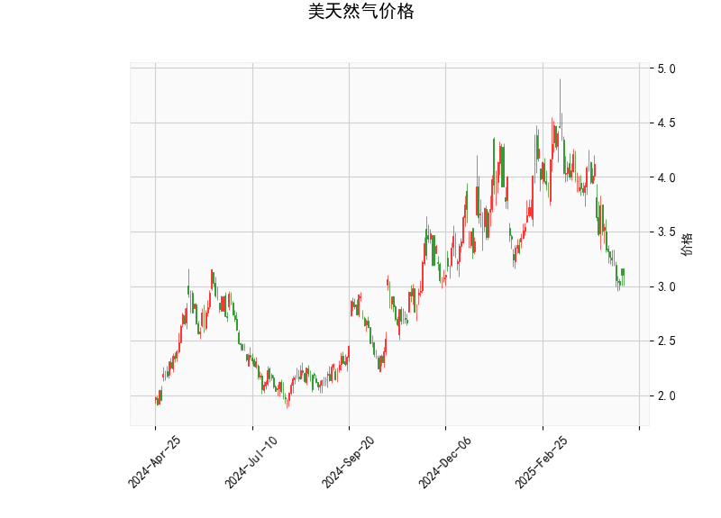

### 美国天然气价格技术分析结果解读

#### 1. 技术指标分析
- **当前价（3.106）**：价格处于布林带下轨（3.011）附近，接近支撑位，可能处于短期超卖区域。
- **RSI（34.6）**：RSI低于50但未进入超卖区（通常30以下为超卖），表明市场情绪偏空但未极端悲观。
- **MACD（-0.237）与信号线（-0.2028）**：MACD线位于信号线下方，柱状图（-0.034）为负值，显示短期下跌动能占优，但两者差值较小，可能接近反转。
- **布林带**：价格接近下轨（3.011），中轨（3.816）与上轨（4.620）形成下行通道，当前价格处于低位，需关注是否触底反弹。
- **K线形态**：
  - **CDLBELTHOLD**：看涨反转形态，通常出现在下跌趋势中，暗示空方力量衰竭。
  - **CDLMATCHINGLOW**：看涨信号，表明价格在低位企稳，可能形成双底结构。

#### 2. 近期投资机会与策略
##### **潜在机会**
1. **超跌反弹机会**：
   - **逻辑**：价格接近布林带下轨，RSI未极端超卖但接近低位，叠加看涨K线形态（CDLBELTHOLD和CDLMATCHINGLOW），可能触发技术性反弹。
   - **策略**：
     - **多头入场**：若价格站稳布林带下轨（3.011）并伴随成交量放大，可轻仓试多，目标中轨（3.816）。
     - **止损**：跌破下轨（如3.0以下）时止损。
   - **风险**：若MACD持续下行或基本面利空（如库存增加），可能进一步破位。

2. **趋势反转确认**：
   - **逻辑**：若MACD柱状图由负转正（金叉），且价格突破中轨（3.816），可能确认短期趋势反转。
   - **策略**：
     - **加仓信号**：MACD金叉且价格站稳中轨后，可追加多头仓位，目标上轨（4.620）。
     - **止盈**：接近上轨时逐步减仓。

3. **套利机会**：
   - **跨期套利**：若近月合约价格显著低于远月（Contango结构），可做多近月、做空远月，但需结合库存和季节性因素。
   - **波动率套利**：布林带收窄后可能伴随波动率上升，可布局期权策略（如Long Straddle）。

##### **风险提示**
- **基本面风险**：天然气价格受天气、库存、地缘政治等因素影响较大，需关注EIA库存报告及极端天气事件。
- **技术面失效**：若价格持续跌破布林带下轨且RSI进入超卖区（<30），可能进一步下跌，需严格止损。

### 总结
当前技术面显示天然气价格处于短期超卖区域，存在反弹可能性，但需结合MACD金叉和价格突破中轨确认趋势反转。投资者可轻仓布局超跌反弹，同时关注基本面数据以规避风险。套利策略需结合期限结构和波动率变化灵活调整。