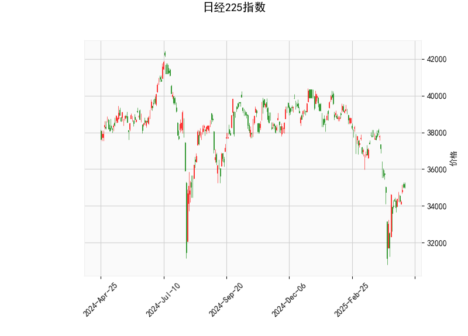

### 日经225指数技术分析结果解读

#### 1. 技术指标分析
- **当前价与布林轨道**：  
  当前价（35,039.15）显著低于布林带中轨（36,699.17），且接近下轨（32,648.11），表明指数处于短期弱势区间，存在超卖可能。布林带开口向下扩张（上轨40,750.22，下轨32,648.11），反映近期波动率较高，但价格可能接近短期支撑位。

- **RSI（49.16）**：  
  处于中性区域（接近50），未进入超买（>70）或超卖（<30）区间，显示多空力量暂时均衡，但略偏空头。需结合其他指标判断趋势反转可能性。

- **MACD（-510.72）与信号线（-766.96）**：  
  MACD柱状图（256.25）由负转正且快线上穿慢线（潜在金叉），暗示短期动能转向偏多，但MACD绝对值较大，需警惕修复性反弹后再次回落。

- **K线形态**：  
  - **CDLMATCHINGLOW**：出现在下跌趋势中的看涨反转信号，需第二根阳线确认。  
  - **CDLSHORTLINE**：短实体K线，表明市场犹豫，可能预示趋势衰竭。  
  两者结合提示短期反弹可能，但需量能配合。

---

#### 2. 潜在机会与策略

##### **投资机会**
- **短期反弹策略**：  
  - **逻辑**：价格接近布林带下轨+MACD潜在金叉+K线看涨形态，短期可能反弹至中轨（36,699）。  
  - **操作**：轻仓试多，止损设于下轨下方（如32,500），目标中轨附近。  
  - **风险**：若布林带持续扩张且跌破下轨，可能加速下行。

- **趋势反转确认策略**：  
  - **逻辑**：若价格突破中轨且RSI站稳50上方，可能开启中期修复行情。  
  - **操作**：突破中轨后加仓，目标上轨（40,750），止损中轨下方。

##### **套利机会**
- **波动率收敛套利**：  
  - **逻辑**：布林带开口较大，若波动率收缩（价格震荡收窄），可布局跨式期权组合（Long Straddle）。  
  - **操作**：买入平值看涨和看跌期权，押注波动率回升。  

- **价差回归策略**：  
  - **逻辑**：当前价偏离中轨幅度约4.5%，历史统计显示均值回归概率较高。  
  - **操作**：做多日经225期货+做空关联性较高的成分股组合，对冲系统性风险。

---

#### 3. 风险提示
- **趋势延续风险**：若MACD金叉失败或RSI跌破45，可能进一步下探布林带下轨。  
- **外部冲击**：日元汇率波动、美联储政策变化或地缘事件可能加剧指数波动。  
- **量能配合不足**：反弹需成交量放大确认，否则可能为假突破。

---

**结论**：短期技术面偏向超跌反弹，但中期趋势需观察中轨突破情况。建议以轻仓参与反弹为主，严格止损，并关注基本面（如企业盈利、政策宽松预期）对趋势的验证。