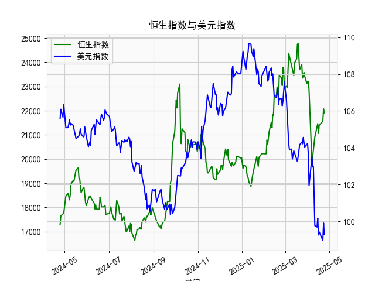

|            |   社会融资规模存量:人民币贷款:同比 |   金融机构各项存款余额:人民币:同比 |   上证综合指数 |   人民币贷款增速与存款增速之差 |
|:-----------|-----------------------------------:|-----------------------------------:|---------------:|-------------------------------:|
| 2022-11-30 |                               10.8 |                               11.6 |        3151.34 |                           -0.8 |
| 2023-01-31 |                               11.1 |                               12.4 |        3255.67 |                           -1.3 |
| 2023-02-28 |                               11.5 |                               12.4 |        3279.61 |                           -0.9 |
| 2023-03-31 |                               11.7 |                               12.7 |        3272.86 |                           -1   |
| 2023-05-31 |                               11.3 |                               11.6 |        3204.56 |                           -0.3 |
| 2023-06-30 |                               11.2 |                               11   |        3202.06 |                            0.2 |
| 2023-07-31 |                               11   |                               10.5 |        3291.04 |                            0.5 |
| 2023-08-31 |                               10.9 |                               10.5 |        3119.88 |                            0.4 |
| 2023-10-31 |                               10.7 |                               10.5 |        3018.77 |                            0.2 |
| 2023-11-30 |                               10.7 |                               10.2 |        3029.67 |                            0.5 |
| 2024-01-31 |                               10.1 |                                9.2 |        2788.55 |                            0.9 |
| 2024-02-29 |                                9.7 |                                8.4 |        3015.17 |                            1.3 |
| 2024-04-30 |                                9.1 |                                6.6 |        3104.82 |                            2.5 |
| 2024-05-31 |                                8.9 |                                6.7 |        3086.81 |                            2.2 |
| 2024-07-31 |                                8.3 |                                6.3 |        2938.75 |                            2   |
| 2024-09-30 |                                7.8 |                                7.1 |        3336.5  |                            0.7 |
| 2024-10-31 |                                7.7 |                                7   |        3279.82 |                            0.7 |
| 2024-12-31 |                                7.2 |                                6.3 |        3351.76 |                            0.9 |
| 2025-02-28 |                                7.1 |                                7   |        3320.9  |                            0.1 |
| 2025-03-31 |                                7.2 |                                6.7 |        3335.75 |                            0.5 |

### 1. 人民币贷款增速与存款增速之差与上证综合指数的相关性及影响逻辑

#### （1）相关性分析
从数据趋势来看，**人民币贷款增速与存款增速之差（以下简称“存贷差”）与上证综合指数存在一定正相关性**。具体表现为：
- **存贷差扩大时**（如前期3.2~3.9区间），上证指数多处于高位（如3400~3600点），表明市场流动性充裕，推动股市上涨。
- **存贷差收窄或转负时**（如中后期-1.3~0.5区间），上证指数明显回落（如2900~3200点），反映流动性收缩对股市的压制作用。

#### （2）影响逻辑
存贷差通过以下路径影响股市：
- **流动性传导**：存贷差扩大（贷款增速>存款增速）表明银行体系向实体经济注入更多资金，市场流动性充裕，企业融资成本下降，推动股市资金流入。
- **经济预期驱动**：贷款增速高通常反映企业扩张意愿强，经济预期改善，投资者风险偏好提升，利好股市。
- **政策信号效应**：存贷差变化可能隐含货币政策导向（如降息、降准），间接影响市场情绪和资金配置方向。

---

### 2. 近期投资或套利机会与策略分析

#### （1）当前数据特征
- **存贷差近期波动**：从-0.3回升至0.5，显示流动性边际改善。
- **上证指数同步企稳**：从2938点回升至3335点，与存贷差修复趋势一致。

#### （2）潜在机会与策略
1. **趋势跟随策略**：
   - **多头机会**：若存贷差持续扩大（如突破1.0），可增配金融、周期等顺周期板块，或布局指数ETF（如沪深300）。
   - **风险警示**：若存贷差再度转负，需警惕流动性收紧风险，可减仓或对冲。

2. **套利机会**：
   - **跨期套利**：存贷差触底回升初期（如当前0.5附近），做多股指期货同时做空债券期货，捕捉股债性价比切换机会。
   - **行业轮动**：存贷差回升初期，银行股（受益于息差改善）和券商股（受益于市场活跃度提升）可能跑赢大盘。

3. **事件驱动策略**：
   - **政策博弈**：关注央行货币政策调整（如MLF利率、LPR报价），若存贷差与政策宽松同步，可加仓高贝塔资产（如科技、消费）。

#### （3）风险提示
- **滞后效应**：存贷差对股市的影响可能存在1-2个月的滞后，需结合高频数据（如社融、M2）验证。
- **外部干扰**：美联储政策、地缘冲突等可能削弱存贷差与A股的关联性。
- **结构性分化**：注册制背景下，个股与指数相关性下降，需结合基本面筛选标的。