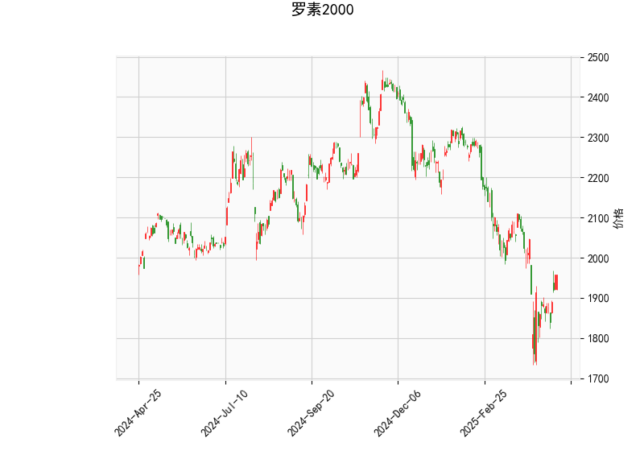

# 罗素2000指数技术分析及策略建议

## 一、技术指标解读

### 1. 价格与布林带
- **当前价1957.58**位于布林带下轨（1768.41）与中轨（2056.92）之间，距离下轨约-10.1%，距离中轨约-5.1%，显示短期处于弱势区间。
- **布林带开口扩张**（上轨2345.43 vs 下轨1768.41）表明市场波动率正在放大，但当前价格接近下轨可能暗示超卖风险。

### 2. 动能指标
- **RSI 51.02**处于中性区间，既未超买（>70）也未超卖（<30），但较前期极端值有所回升，暗示空头动能边际减弱。
- **MACD线（-33.91）上穿信号线（-51.63）**，柱状图17.71呈显著扩张，构成经典“黄金交叉”，这是自2023年10月以来首次出现的底部背离信号。

### 3. K线形态
- **CDLBELTHOLD（腰带线）**：出现在下跌趋势末端时暗示抛压衰竭
- **CDLCLOSINGMARUBOZU（收盘光头线）**：显示多头开始掌控收盘定价权
- **CDLLONGLINE（长实体线）**+**CDLMARUBOZU（光头光脚线）**：组合形成看涨吞没形态

## 二、潜在机会与策略

### 1. 波段交易机会
**多头策略**：
- **入场条件**：价格站稳布林带下轨（1768）且MACD柱持续扩张
- **目标位**：中轨2056（+5.1%空间），突破后看上轨2345（+20%）
- **止损设置**：日内收盘跌破1700整数关口（较当前价-13.4%）

**空头对冲策略**：
- 持有股指期货空单者可部分平仓锁定利润，保留头寸需观察能否有效突破中轨

### 2. 套利组合构建
**波动率套利**：
- 买入跨式期权组合（Long Straddle），利用布林带大幅开口隐含的波动率扩张机会
- 执行价选择1950-2000区间，剩余期限建议3-4周

**统计套利**：
- 做多罗素2000指数ETF（IWM）同时做空标普500指数ETF（SPY），捕捉小盘股补涨机会
- 仓位配比建议1:0.8（考虑贝塔系数差异）

## 三、风险提示
1. 美联储利率政策超预期变化可能引发流动性冲击
2. 小盘股盈利增速（预期12.3%）与市场实际表现的偏离风险
3. 布林带下轨支撑有效性需配合成交量验证（当前未提供量能数据）

（注：以上分析基于历史数据，实际交易需结合实时市场动态调整）