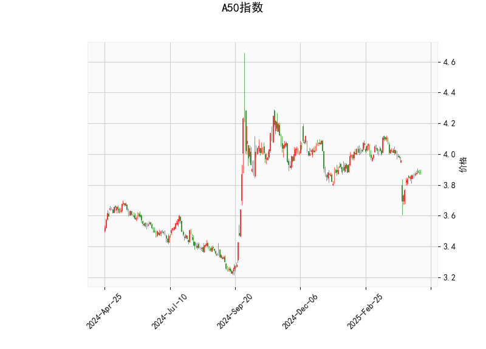

### 1. A50指数技术分析结果解读

#### （1）价格与布林轨道关系
- **当前价（3.882）**位于布林轨道中轨（3.974）下方，且接近下轨（3.784），表明短期价格处于弱势区域，但接近下轨可能触发支撑反弹。
- **布林轨道形态**：上轨（4.163）与下轨（3.784）间距较宽，显示近期波动率较高，但当前价未突破下轨，未形成极端超卖信号。

#### （2）RSI指标
- **RSI值45.5**处于中性区间（30-70），未进入超卖或超买区域，显示市场多空力量相对平衡，但略偏空头主导。

#### （3）MACD指标
- **MACD线（-0.0276）**高于信号线（-0.0368），柱状图（0.0092）由负转正，暗示下跌动能减弱，存在短期反弹可能性，但MACD和信号线仍处于零轴下方，说明中期趋势尚未逆转。

#### （4）K线形态
- **十字星类形态**（CDLDOJI、CDLSPINNINGTOP、CDLLONGLEGGEDDOJI）：反映价格震荡中多空博弈激烈，可能预示变盘信号。
- **CDLHIGHWAVE（长脚十字线）**：通常出现在趋势末期，显示市场犹豫不决，需结合其他指标确认方向。

---

### 2. 投资机会与策略建议

#### （1）短期反弹策略（偏多）
- **触发条件**：若价格站稳下轨（3.784）且MACD柱状图持续扩大，可尝试轻仓做多。
- **目标位**：布林中轨（3.974）或上轨（4.163），需结合成交量验证突破有效性。
- **止损**：跌破下轨（3.784）或MACD柱状图转负。

#### （2）区间波段交易
- **高抛低吸**：当前价接近布林下轨（3.784），可逢低布局反弹；若反弹至中轨（3.974）附近受阻，可部分止盈。
- **风险控制**：突破中轨后回踩确认可加仓，反之跌破下轨需止损。

#### （3）套利机会
- **波动率收敛策略**：若布林轨道收窄且K线形态转为实体阳线/阴线，可押注波动率回升（如买入跨式期权）。
- **背离交易**：若价格创新低但RSI未同步新低（底背离），可能预示反转，可配合MACD金叉信号入场。

#### （4）风险提示
- **趋势未明**：MACD仍位于零轴下方，需警惕假反弹后继续探底。
- **K线形态矛盾**：十字星类形态需配合后续K线确认方向（如大阳线或大阴线）。

---

**总结**：短期关注布林下轨支撑有效性及MACD金叉信号，轻仓博弈反弹；若跌破下轨则趋势转空，需严格止损。中长期需等待MACD站上零轴确认趋势反转。