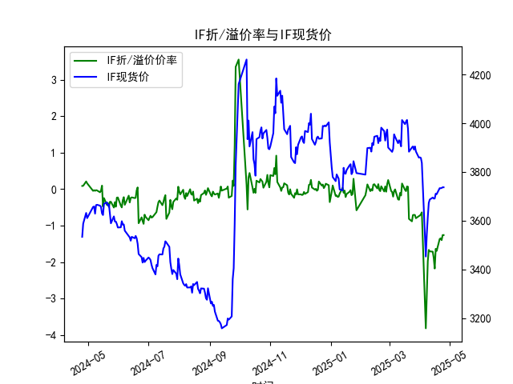
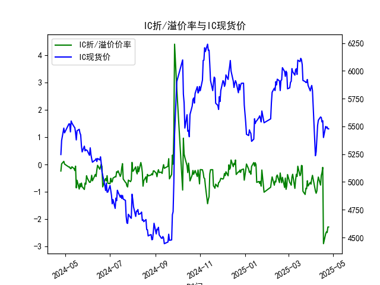
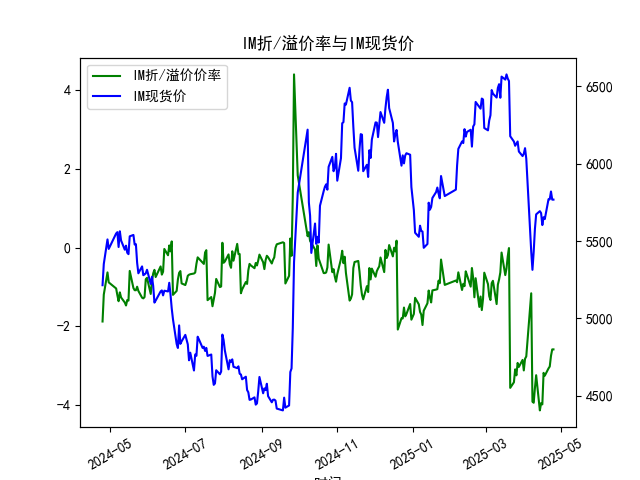

|            |   IF折/溢价率 |   IF现货价 |   IH折/溢价率 |   IH现货价 |   IC折/溢价率 |   IC现货价 |   IH折/溢价率 |   IH现货价 |
|:-----------|--------------:|-----------:|--------------:|-----------:|--------------:|-----------:|--------------:|-----------:|
| 2025-03-28 |     -0.796038 |     3884   |     -0.78484  |     5869.6 |     -0.78484  |     5869.6 |      -3.02986 |     6078.4 |
| 2025-03-31 |     -0.738445 |     3858.6 |     -0.651649 |     5819.6 |     -0.651649 |     5819.6 |      -2.85304 |     6049   |
| 2025-04-01 |     -0.722386 |     3859.6 |     -0.716974 |     5850.6 |     -0.716974 |     5850.6 |      -3.11981 |     6064.2 |
| 2025-04-02 |     -0.689576 |     3857.6 |     -0.5168   |     5868.6 |     -0.5168   |     5868.6 |      -2.82374 |     6100   |
| 2025-04-03 |     -0.634556 |     3837   |     -0.395252 |     5822.4 |     -0.395252 |     5822.4 |      -2.76398 |     6031.8 |
| 2025-04-07 |     -3.81231  |     3452.6 |     -0.961471 |     5236.2 |     -0.961471 |     5236.2 |      -1.16153 |     5432.6 |
| 2025-04-08 |     -2.92977  |     3543.8 |     -1.04965  |     5271   |     -1.04965  |     5271   |      -3.91353 |     5313.6 |
| 2025-04-09 |     -1.97446  |     3614   |     -0.96643  |     5387.2 |     -0.96643  |     5387.2 |      -3.9405  |     5429.6 |
| 2025-04-10 |     -1.663    |     3673   |     -0.632471 |     5509   |     -0.632471 |     5509   |      -3.56785 |     5578.2 |
| 2025-04-11 |     -1.70421  |     3686.6 |     -0.457211 |     5555.8 |     -0.457211 |     5555.8 |      -3.2409  |     5672.2 |
| 2025-04-14 |     -1.71162  |     3694.8 |     -0.752381 |     5584.8 |     -0.752381 |     5584.8 |      -4.13446 |     5693   |
| 2025-04-15 |     -1.88329  |     3690.4 |     -0.402211 |     5580   |     -0.402211 |     5580   |      -3.95041 |     5680.4 |
| 2025-04-16 |     -2.17398  |     3690.8 |     -0.296286 |     5540.4 |     -0.296286 |     5540.4 |      -3.98173 |     5603   |
| 2025-04-17 |     -1.63358  |     3710.6 |     -0.104562 |     5551.2 |     -0.104562 |     5551.2 |      -3.18113 |     5653.8 |
| 2025-04-18 |     -1.68913  |     3708.8 |     -2.89029  |     5400   |     -2.89029  |     5400   |      -3.25269 |     5642   |
| 2025-04-21 |     -1.36545  |     3733.2 |     -2.52696  |     5499.8 |     -2.52696  |     5499.8 |      -3.06818 |     5770   |
| 2025-04-22 |     -1.34653  |     3733   |     -2.45739  |     5486   |     -2.45739  |     5486   |      -3.02072 |     5769.6 |
| 2025-04-23 |     -1.39646  |     3734   |     -2.48358  |     5495   |     -2.48358  |     5495   |      -2.75012 |     5820   |
| 2025-04-24 |     -1.25668  |     3736.8 |     -2.28117  |     5478   |     -2.28117  |     5478   |      -2.58556 |     5767.4 |
| 2025-04-25 |     -1.25668  |     3736.8 |     -2.28117  |     5478   |     -2.28117  |     5478   |      -2.58556 |     5767.4 |

# 股指期货折/溢价率与现货价相关性分析及投资策略

---

## 一、股指期货折/溢价率与现货价的相关性及影响逻辑

### 1. **折/溢价率的定义与市场信号**
   - **折价（贴水）**：期货价格低于现货价格，反映市场对未来的悲观预期或套利机会缺失（如分红除息、资金成本高企）。
   - **溢价（升水）**：期货价格高于现货价格，体现市场对未来乐观或存在正向套利空间（如低资金成本、高持仓收益）。

### 2. **相关性逻辑**
   - **短期动态关系**：折/溢价率变化通常领先于现货价格。例如：
     - **溢价扩大**可能吸引套利者买入现货、卖出期货，推动现货上涨。
     - **贴水加深**可能引发对冲资金抛售现货，压制现货价格。
   - **长期均衡关系**：折/溢价率受无风险利率、分红率、市场情绪等影响，长期围绕理论值波动。例如：
     - **IH（上证50）**贴水率较低（-2.5%以内），反映大盘股分红预期稳定。
     - **IM（中证1000）**贴水更深（-3%左右），因小盘股分红不确定性强且市场风险偏好低。

### 3. **数据验证**
   - **IF（沪深300）**：2024年4月溢价转贴水（0.21%→-0.04%），同期现货价从3631.6升至3656.2，显示贴水未抑制短期上涨（可能由政策利好驱动）。
   - **IM**：贴水率长期高于其他品种，反映小盘股流动性溢价不足及市场避险情绪。

---

## 二、近期投资及套利机会分析

### 1. **跨品种套利机会**
   - **贴水收敛策略**：IH与IM贴水差异显著（-2.28% vs -3.07%），可做多IM期货+做空IH期货，博弈小盘股情绪修复带来的贴水收敛。
   - **逻辑支持**：政策利好科技创新（如新质生产力），可能提振中证1000表现。

### 2. **期现套利机会**
   - **反向套利（贴水修复）**：
     - **标的**：IC（中证500）贴水-2.48%，若现货组合可通过ETF精准复制，可买入IC期货+卖空现货，赚取贴水收敛收益。
     - **风险点**：需覆盖融券成本（约年化5-6%），贴水需快速收窄至合理区间（-1%以内）。
   - **正向套利（溢价套利）**：当前市场普遍贴水，暂无显著机会。

### 3. **跨期套利**
   - **期限结构策略**：观察IF远月合约贴水更深（如2025年4月贴水-1.25%），可做多近月合约（贴水较浅）+做空远月合约，赚取期限结构平坦化收益。
   - **适用场景**：需资金成本低于期限价差收益，适合机构投资者。

### 4. **多头替代策略**
   - **贴水保护效应**：IM贴水率-3.07%，若长期看多小盘股，持有IM期货替代现货可额外获得年化3%的“安全垫”。
   - **优势**：规避个股风险，适合beta型配置。

---

## 三、风险提示
1. **流动性风险**：IM合约成交活跃度较低，大额套利单可能冲击价格。
2. **政策风险**：T+0交易、融券规则变化可能影响套利成本。
3. **市场情绪突变**：若极端行情导致贴水持续扩大，策略需动态止损。

