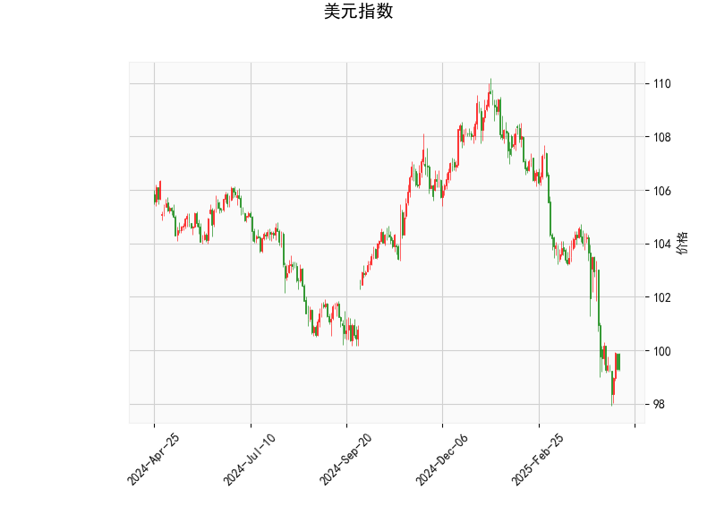

### 一、美元指数技术分析解读

#### 1. **关键指标解析**
- **当前价（99.288）**：明显低于布林带中轨（103.90），靠近下轨（98.32），显示美元处于弱势区间，短期可能面临超卖反弹需求，但中期趋势偏空。
- **RSI（35.26）**：接近超卖区域（通常30以下为超卖），但尚未极端超卖，暗示短期下跌动能可能趋缓，但未确认反转。
- **MACD（-1.38）与信号线（-1.35）**：MACD线下穿信号线且均为负值，柱状图（-0.026）为负但幅度较小，表明空头动能略有减弱，但未形成金叉前仍偏空。
- **布林带形态**：价格贴近下轨，若持续偏离中轨则可能延续下行，但短期需警惕技术性反弹。
- **K线形态**：
  - **CDLMATCHINGLOW**（匹配低点）：暗示下跌后出现企稳信号，需配合成交量确认。
  - **CDLSHORTLINE**（短蜡烛线）：反映市场犹豫，可能为反转前兆，但需后续阳线验证。

#### 2. **综合结论**
美元指数短期可能超卖反弹，但中期趋势偏弱。若未站稳中轨（103.90），下行风险仍存，可能进一步测试布林带下轨支撑（98.32）。

---

### 二、A股/港股潜在机会与策略

#### 1. **美元走弱对市场的传导逻辑**
- **汇率效应**：美元走弱通常推动人民币升值，降低外资持有A股/H股的成本，吸引北向资金流入。
- **风险偏好提升**：美元弱势常伴随全球资金转向新兴市场，港股（联系汇率制）和A股（外资配置需求）或受益。
- **大宗商品联动**：美元下跌利好大宗商品价格，间接提振资源类股票（如能源、有色）。

#### 2. **投资机会与策略**
- **港股弹性品种**：
  - **恒生科技指数**：美元弱势叠加美联储宽松预期，港股科技股（如腾讯、美团）或受益于外资回流及估值修复。
  - **高股息资产**：若市场波动加剧，公用事业、电信等防御性高股息标的（如中移动、长江基建）可能受避险资金青睐。
- **A股外资偏好板块**：
  - **消费/医药蓝筹**：外资长期配置的白马股（如茅台、恒瑞医药）可能因汇率红利获得增量资金。
  - **新能源/高端制造**：若美元走弱推动大宗商品反弹，光伏、锂电等中游制造板块成本压力缓解。
- **跨市场套利**：
  - **A/H溢价收敛**：寻找A股相对H股折价较大的标的（如中信证券、中芯国际），做多H股同时做空A股对冲。
  - **汇率对冲工具**：利用离岸人民币（CNH）期货或期权锁定汇率波动风险。

#### 3. **风险提示**
- **政策风险**：中国稳汇率政策可能抑制人民币短期升值空间；美联储政策转向快于预期或引发美元反弹。
- **技术面背离**：若美元指数超跌反弹，可能压制新兴市场短期表现。
- **仓位管理**：建议分批布局，设置止损（如A股跌破20日均线或港股失守前低）。

---

### 三、总结
**短期策略**：关注港股超跌科技股反弹、A股外资回流受益板块，警惕美元技术性反弹带来的波动。  
**中期布局**：若美元确认破位下行，可加大资源股及成长股配置，同时监控A/H溢价收敛机会。