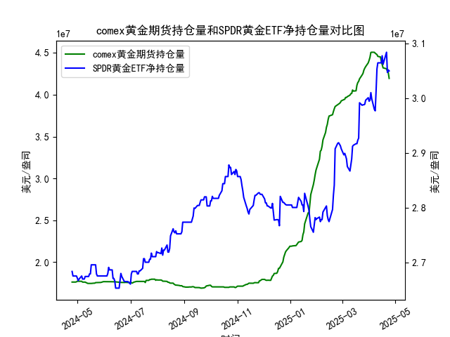

|            |   comex黄金期货持仓量 |   SPDR黄金ETF净持仓量 |
|:-----------|----------------------:|----------------------:|
| 2025-03-27 |           4.31683e+07 |           2.98891e+07 |
| 2025-03-28 |           4.33476e+07 |           2.99628e+07 |
| 2025-03-31 |           4.38069e+07 |           3.0009e+07  |
| 2025-04-01 |           4.41117e+07 |           2.99444e+07 |
| 2025-04-02 |           4.4464e+07  |           2.99628e+07 |
| 2025-04-03 |           4.50467e+07 |           3.01012e+07 |
| 2025-04-04 |           4.50717e+07 |           2.99905e+07 |
| 2025-04-07 |           4.50642e+07 |           2.97969e+07 |
| 2025-04-08 |           4.49537e+07 |           2.97692e+07 |
| 2025-04-09 |           4.4872e+07  |           3.01284e+07 |
| 2025-04-10 |           4.47928e+07 |           3.05341e+07 |
| 2025-04-11 |           4.4576e+07  |           3.06448e+07 |
| 2025-04-14 |           4.45116e+07 |           3.06448e+07 |
| 2025-04-15 |           4.40124e+07 |           3.06448e+07 |
| 2025-04-16 |           4.36175e+07 |           3.07739e+07 |
| 2025-04-17 |           4.32097e+07 |           3.06171e+07 |
| 2025-04-21 |           4.30949e+07 |           3.08384e+07 |
| 2025-04-22 |           4.28033e+07 |           3.04696e+07 |
| 2025-04-23 |           4.26341e+07 |           3.05157e+07 |
| 2025-04-24 |           4.19499e+07 |           3.04973e+07 |

### 1. MSCI新兴市场指数和铜价的相关性及影响逻辑

#### **相关性**  
MSCI新兴市场指数与铜价通常呈现**正相关**，这一关系主要由以下逻辑驱动：  
1. **经济周期联动性**：  
   - 新兴市场国家（如中国、印度、巴西）是铜的主要消费国，其经济增长依赖基建、制造业和房地产投资，而这些领域对铜的需求占全球总量的60%以上。  
   - 当MSCI新兴市场指数上涨时，往往反映市场对新兴市场经济增长的乐观预期，进而推升铜的需求预期，拉动铜价上涨。  

2. **美元与风险情绪传导**：  
   - 铜以美元计价，美元走弱时铜价通常上涨。新兴市场股市（MSCI指数）在美元贬值周期中更易吸引外资流入，形成“弱美元→新兴市场资产上涨→铜价上涨”的传导链。  
   - 反之，若美元走强或新兴市场出现风险（如地缘政治、债务危机），两者可能同步下跌。  

3. **通胀预期驱动**：  
   - 铜作为工业金属，价格对通胀敏感。新兴市场经济增长加速时，可能引发通胀预期升温，推高铜价；而MSCI新兴市场指数中的周期股（如能源、材料板块）也会受益于通胀预期。  

#### **影响逻辑的关键链条**  
- **需求端**：新兴市场基建投资增加→铜需求上升→铜价上涨→资源国（如智利、秘鲁）股市表现改善→MSCI新兴市场指数受提振。  
- **资金端**：全球流动性宽松→资本流入新兴市场→股市上涨→工业活动预期增强→铜价上涨。  

---

### 2. 近期投资或套利机会与策略分析

#### **当前市场背景**  
- **COMEX黄金持仓数据**：近期持仓量从低位（约1.7亿盎司）快速攀升至历史高位（约4.3亿盎司），显示机构对黄金的配置需求激增，可能反映避险情绪升温或通胀对冲需求。  
- **SPDR黄金ETF净持仓**：数据波动较小，但近期小幅下降（如从3000万盎司降至3049万盎司），可能与散户或短期投资者获利了结有关。  

#### **潜在机会与策略**  

##### **机会一：黄金期货与ETF的跨市场套利**  
- **逻辑**：COMEX持仓激增而ETF持仓下降，表明期货市场投机多头占主导，但实物需求疲软。若期货溢价（Contango）扩大，可做空期货、买入ETF进行价差收敛套利。  
- **风险**：需关注美联储政策转向风险（如降息预期落空可能打压黄金）。  

##### **机会二：新兴市场与铜的联动交易**  
- **逻辑**：若MSCI新兴市场指数企稳反弹（如中国经济刺激政策生效），可同步做多铜期货（如LME铜）及相关新兴市场股票ETF。  
- **数据支持**：近期中国PMI回升至扩张区间，叠加铜库存处于低位，铜价或存在补涨空间。  

##### **机会三：黄金/铜比价交易**  
- **逻辑**：黄金代表避险资产，铜代表风险资产。若比价（金价/铜价）处于历史高位（如当前水平），可做空黄金、做多铜，押注经济复苏预期升温。  
- **触发条件**：关注美国非农就业、中国社融数据等宏观经济指标。  

#### **风险提示**  
- **地缘政治风险**：俄乌冲突、中东局势可能打破大宗商品与股市的常规相关性。  
- **流动性收紧**：若美联储推迟降息，美元走强可能压制新兴市场资产和铜价。  

---

### 总结  
短期建议关注**黄金期货与ETF价差收敛**及**新兴市场-铜的联动反弹**机会，中期需警惕宏观政策转向风险。交易中需结合高频数据（如库存变化、持仓结构）动态调整头寸。