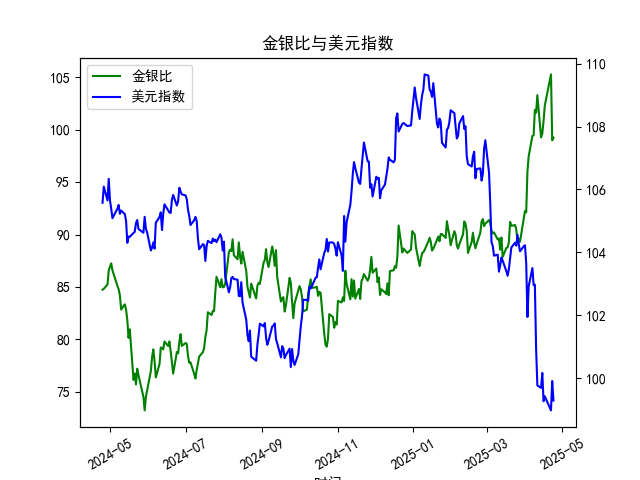

|            |    金价 |   银价 |   美元指数 |   金银比 |
|:-----------|--------:|-------:|-----------:|---------:|
| 2025-03-26 | 3013.25 | 33.76  |   104.559  |  89.255  |
| 2025-03-27 | 3056.55 | 34.11  |   104.26   |  89.6086 |
| 2025-03-28 | 3071.6  | 34.395 |   104.034  |  89.3037 |
| 2025-03-31 | 3115.1  | 34.055 |   104.192  |  91.4726 |
| 2025-04-01 | 3133.7  | 33.97  |   104.226  |  92.249  |
| 2025-04-02 | 3119.75 | 33.87  |   103.661  |  92.1095 |
| 2025-04-03 | 3118.1  | 32.475 |   101.945  |  96.0154 |
| 2025-04-04 | 3054.5  | 31.34  |   102.919  |  97.4633 |
| 2025-04-07 | 3014.75 | 30.325 |   103.501  |  99.4147 |
| 2025-04-08 | 3015.4  | 30.315 |   102.956  |  99.4689 |
| 2025-04-09 | 3075.5  | 30.18  |   102.971  | 101.905  |
| 2025-04-10 | 3143.15 | 30.925 |   100.937  | 101.638  |
| 2025-04-11 | 3230.5  | 31.27  |    99.769  | 103.31   |
| 2025-04-14 | 3204.2  | 32.275 |    99.692  |  99.2781 |
| 2025-04-15 | 3219.6  | 32.31  |   100.167  |  99.6472 |
| 2025-04-16 | 3322.9  | 32.955 |    99.2667 | 100.831  |
| 2025-04-17 | 3305.65 | 32.31  |    99.424  | 102.31   |
| 2025-04-22 | 3433.55 | 32.61  |    98.9757 | 105.291  |
| 2025-04-23 | 3262.95 | 32.96  |    99.9096 |  98.9973 |
| 2025-04-24 | 3314.75 | 33.395 |    99.288  |  99.2589 |

### 1. 金银比与美元指数的相关性及影响逻辑

#### **相关性分析**
金银比（黄金价格/白银价格）与美元指数的相关性在不同市场环境下可能呈现以下特征：
- **负相关**：当美元指数走弱时，以美元计价的黄金和白银通常上涨。但若白银因工业属性受经济复苏预期提振而涨幅更大，金银比会下降，形成负相关。
- **正相关**：在避险情绪主导时，黄金的避险属性强于白银，可能导致黄金涨幅超过白银（或白银跌幅更深），金银比上升；若此时美元因避险需求同步走强，两者呈现正相关。

#### **影响逻辑**
- **美元指数对金银价格的传导**：美元走强会压制金银价格（因计价货币升值），反之则提振。但黄金的避险属性可能使其在美元走强时仍上涨（如地缘冲突期间）。
- **金银比的驱动因素**：
  - **经济周期**：经济衰退预期下，白银的工业需求减弱，金银比易走阔；经济复苏时，白银需求回升可能压缩金银比。
  - **避险情绪**：极端风险事件中，黄金涨幅通常高于白银，推升金银比。
  - **货币政策**：美元指数受美联储政策影响显著，加息周期中美元走强可能压制白银更甚于黄金（因白银金融属性较弱）。

---

### 2. 近期投资或套利机会与策略

#### **数据观察**
- **金银比走势**：近一年金银比从约**85升至100以上**（如近期峰值103.3），处于历史高位区间。
- **美元指数走势**：美元指数从**105~108高位回落至99.3**，呈现明显下行趋势。

#### **机会判断**
1. **金银比均值回归策略**：
   - **逻辑**：当前金银比接近历史高位（通常阈值90~100），若经济预期改善或工业需求回暖，白银可能补涨，推动金银比回落。
   - **策略**：做空金银比（买入白银期货/ETF，同时做空黄金期货/ETF）。
   - **风险点**：需排除持续避险情绪（如地缘冲突升级）导致黄金继续跑赢白银。

2. **美元走弱驱动的贵金属多头**：
   - **逻辑**：美元指数跌破100关口后，若美联储加息周期结束或降息预期升温，贵金属或整体走强。
   - **策略**：同时做多黄金和白银，但超配白银（押注其弹性更高）。
   - **增强策略**：结合金银比回归，动态调整黄金/白银仓位比例。

3. **跨市场套利**：
   - **逻辑**：美元指数与金银比的负相关性若延续，可构建“做多白银+做空美元指数”组合（如通过美元指数期货对冲）。
   - **适用场景**：经济软着陆预期下，工业金属需求回升+美元温和贬值。

#### **风险提示**
- **地缘政治风险**：若避险情绪再度升温，黄金或持续压制白银，导致金银比进一步走阔。
- **美联储政策反复**：若通胀反弹迫使美联储重新鹰派，美元可能反弹并压制贵金属。
- **白银工业需求不及预期**：新能源等领域需求若放缓，可能削弱白银上涨动力。

---

### **结论**
近期可重点关注**金银比均值回归机会**，辅以美元走弱背景下的贵金属多头配置。策略需动态跟踪宏观经济数据（如PMI、非农就业）及美联储政策信号，并设置严格止损以规避尾部风险。