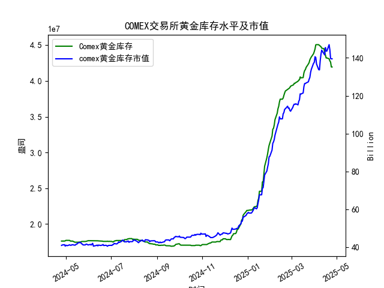

|            |   comex黄金库存量 |   comex黄金库存市值(billion) |   伦敦金现货价 |   上海金交所黄金现货价 |   美元兑人民币汇率 |
|:-----------|------------------:|-----------------------------:|---------------:|-----------------------:|-------------------:|
| 2025-03-31 |       4.38069e+07 |                       3130.9 |        3115.1  |                 730.8  |             7.1782 |
| 2025-04-01 |       4.41117e+07 |                       3120.6 |        3133.7  |                 735.84 |             7.1775 |
| 2025-04-02 |       4.4464e+07  |                       3162.3 |        3119.75 |                 732.5  |             7.1793 |
| 2025-04-03 |       4.50467e+07 |                       3112.6 |        3118.1  |                 738.94 |             7.1889 |
| 2025-04-04 |       4.50717e+07 |                       3035.6 |        3054.5  |                 738.94 |             7.1889 |
| 2025-04-07 |       4.50642e+07 |                       2968   |        3014.75 |                 713.98 |             7.198  |
| 2025-04-08 |       4.49537e+07 |                       2973.3 |        3015.4  |                 717.5  |             7.2038 |
| 2025-04-09 |       4.4872e+07  |                       3087.2 |        3075.5  |                 728.88 |             7.2066 |
| 2025-04-10 |       4.47928e+07 |                       3166   |        3143.15 |                 741.26 |             7.2092 |
| 2025-04-11 |       4.4576e+07  |                       3233   |        3230.5  |                 757.1  |             7.2087 |
| 2025-04-14 |       4.45116e+07 |                       3195   |        3204.2  |                 762.47 |             7.211  |
| 2025-04-15 |       4.40124e+07 |                       3216.5 |        3219.6  |                 762.9  |             7.2096 |
| 2025-04-16 |       4.36175e+07 |                       3334.3 |        3322.9  |                 781.62 |             7.2133 |
| 2025-04-17 |       4.32097e+07 |                       3323.1 |        3305.65 |                 786    |             7.2085 |
| 2025-04-18 |       4.32097e+07 |                       3323.1 |        3305.65 |                 788.62 |             7.2069 |
| 2025-04-21 |       4.30949e+07 |                       3411.1 |        3305.65 |                 804.11 |             7.2055 |
| 2025-04-22 |       4.28033e+07 |                       3371.6 |        3433.55 |                 825.8  |             7.2074 |
| 2025-04-23 |       4.26341e+07 |                       3276.9 |        3262.95 |                 786.99 |             7.2116 |
| 2025-04-24 |       4.19499e+07 |                       3325.5 |        3314.75 |                 792.47 |             7.2098 |
| 2025-04-25 |       4.19499e+07 |                       3325.5 |        3314.75 |                 792.47 |             7.2066 |

### 近期COMEX黄金市场套利机会分析

#### **1. 库存与市值背离的潜在信号**
- **库存变化**：最近一个月（2025年4月21日至4月25日），COMEX黄金库存量从4309万盎司降至4195万盎司，降幅约2.6%，但同期库存市值从约139.5亿小幅波动至139.5亿（数据末端）。这一现象表明**库存下降未伴随市值同步减少**，可能反映市场对短期供给紧张的预期。
- **策略建议**：关注库存减少是否持续，若市值未同步下跌，可能隐含市场对现货黄金的溢价预期，可通过买入近月期货合约、卖出远月合约进行跨期套利。

#### **2. 伦敦与上海市场的跨市套利**
- **价格对比**：以2025年4月25日数据为例：
  - **伦敦金价**：3314.75美元/盎司  
  - **上海金价**：792.47元/克（按当日汇率7.2066换算为1141.8美元/盎司）  
  - **理论价差**：伦敦金价显著高于上海市场，隐含**伦敦溢价**。但需考虑人民币汇率波动（近一年汇率从7.10升至7.20）对套利成本的抵消。
- **策略建议**：若两地价差持续扩大且汇率稳定，可考虑在伦敦市场卖出黄金、上海市场买入，锁定汇率风险后套利。但需警惕人民币贬值对套利收益的侵蚀。

#### **3. 美元汇率与黄金现货联动**
- **汇率影响**：美元兑人民币汇率近一年从7.10升至7.20，人民币贬值约1.4%，推升以人民币计价的上海金价（如2025年4月上海金价较2024年4月上涨44.5%），而伦敦金价同期涨幅为43.0%。**上海金价相对涨幅更高**，可能与汇率及本地需求相关。
- **策略建议**：结合汇率对冲工具（如远期合约），在人民币贬值预期下优先参与上海市场多头头寸，或通过黄金ETF跨境套利。

#### **4. COMEX库存与现货价格的背离**
- **库存与价格关系**：近一年COMEX库存量从1762万盎司增至4195万盎司（增幅138%），但伦敦金价从2318美元涨至3315美元（涨幅43%）。**库存激增伴随价格上涨**，可能反映市场对长期通胀或避险需求的定价，而非短期供需失衡。
- **策略建议**：短期避免单边做空，可关注库存增速放缓时的回调机会，或通过期权组合（如卖出看跌期权）捕捉波动率溢价。

---

### **综合建议**
- **跨市套利优先级**：伦敦与上海市场的价差波动（尤其汇率影响）是近期较明确的套利机会，建议通过实物流转或期货合约对冲。
- **风险提示**：需监控美联储政策对美元流动性的冲击，以及中国黄金进口政策的潜在调整（如配额限制）。
- **短期操作**：在COMEX库存边际下降阶段，结合技术面信号（如突破关键阻力位）轻仓参与多单，止损设于伦敦金价3250美元/盎司下方。