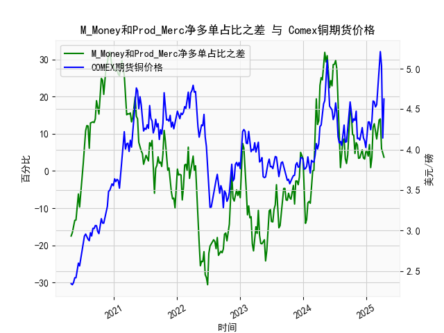

|            |   M_Money净多单占比 |   Prod_Merc净多单占比 |   Comex铜期货价格 |   M_Money和Prod_Merc净多单占比之差 |
|:-----------|--------------------:|----------------------:|------------------:|-----------------------------------:|
| 2024-12-03 |                35.6 |                  40.6 |            4.202  |                                5   |
| 2024-12-10 |                34.9 |                  40.6 |            4.272  |                                5.7 |
| 2024-12-17 |                35.8 |                  39.3 |            4.1465 |                                3.5 |
| 2024-12-24 |                35.7 |                  38.9 |            4.11   |                                3.2 |
| 2024-12-31 |                35   |                  40.2 |            4.0265 |                                5.2 |
| 2025-01-07 |                35.8 |                  41   |            4.1955 |                                5.2 |
| 2025-01-14 |                36.6 |                  40.6 |            4.3425 |                                4   |
| 2025-01-21 |                33.8 |                  40.9 |            4.341  |                                7.1 |
| 2025-01-28 |                36.1 |                  37   |            4.2465 |                                0.9 |
| 2025-02-04 |                35.5 |                  39.1 |            4.3535 |                                3.6 |
| 2025-02-11 |                30.8 |                  42.6 |            4.601  |                               11.8 |
| 2025-02-18 |                29.9 |                  42.6 |            4.591  |                               12.7 |
| 2025-02-25 |                30.7 |                  41.3 |            4.5275 |                               10.6 |
| 2025-03-04 |                32.1 |                  40.7 |            4.5565 |                                8.6 |
| 2025-03-11 |                30.3 |                  41.8 |            4.766  |                               11.5 |
| 2025-03-18 |                28.8 |                  42.5 |            5.0165 |                               13.7 |
| 2025-03-25 |                28.1 |                  42.1 |            5.2105 |                               14   |
| 2025-04-01 |                32.4 |                  38.4 |            5.035  |                                6   |
| 2025-04-08 |                32.2 |                  36.8 |            4.144  |                                4.6 |
| 2025-04-15 |                33.5 |                  37.2 |            4.626  |                                3.7 |

### 1. M_Money与Prod_Merc净多单占比差与铜价的相关性及逻辑

#### 相关性分析
从数据来看，**非商业多头持仓占比（M_Money）与商业多头持仓占比（Prod_Merc）之差**与**COMEX铜价**呈现显著的正相关性：
- **差值扩大时，铜价通常上涨**：例如，在差值从负值逐步转为正值（如从-25.5回升至30+）的阶段，铜价从3.2美元/磅涨至5.2美元/磅；当差值处于高位（如30以上）时，铜价也同步创下新高。
- **差值缩小时，铜价承压**：当差值从高位回落（如从31.3跌至负值），铜价往往回调（如从4.7美元/磅跌至3.2美元/磅）。

#### 影响逻辑
1. **投机资金驱动短期波动**：
   - 非商业持仓（M_Money）代表投机者（如对冲基金）的押注，其净多单占比上升表明市场看涨情绪增强，推动铜价短期上涨。
   - 当差值大幅走阔时，通常伴随铜价快速上涨（如2021年差值突破30，铜价突破4.5美元/磅）。

2. **商业套保反映基本面预期**：
   - 商业持仓（Prod_Merc）以生产商和贸易商为主，其净多单占比下降可能反映实体企业对高价的套保需求（锁定利润），或对远期供需失衡的担忧。
   - 当差值为负时（商业净多占比高于投机者），往往对应铜价低位（如2020年差值-25.5，铜价跌至2.3美元/磅），暗示基本面疲软。

3. **分歧预示拐点**：
   - 当差值达到极端水平（如历史高位或低位），可能预示价格反转。例如，2022年差值从30+快速回落至负值，铜价随后从5.2美元/磅暴跌至3.4美元/磅。

---

### 2. 近期投资或套利机会与策略

#### 当前市场信号
- **差值近期波动**：从数据末尾看，差值从-14.1逐步回升至正值（如8.2、19.4），铜价从3.6美元/磅反弹至4.6美元/磅，表明投机资金重新入场。
- **铜价趋势**：铜价近期从4.0美元/磅反弹至4.6美元/磅，但尚未突破2022年高点（5.2美元/磅）。

#### 潜在机会
1. **趋势跟随策略**：
   - **做多机会**：若差值维持正值且持续扩大（如突破20），铜价可能突破5.0美元/磅，可逢低布局多单。
   - **止损条件**：若差值回落至负值且铜价跌破4.2美元/磅（近期支撑位），需警惕回调风险。

2. **均值回归套利**：
   - **反向操作信号**：若差值再次接近历史高位（如30+），而铜价未能突破前高，可逐步做空，押注投机情绪过热后的修正。

3. **跨期套利**：
   - 当前铜价期限结构若呈“现货升水”（近月合约价格高于远月），可做多远月合约、做空近月合约，赚取价差收敛收益（需结合具体合约数据验证）。

#### 风险提示
- **宏观扰动**：美联储政策、全球经济复苏力度可能影响投机情绪。
- **供需变化**：中国地产/新能源需求、南美铜矿供应扰动需持续跟踪。