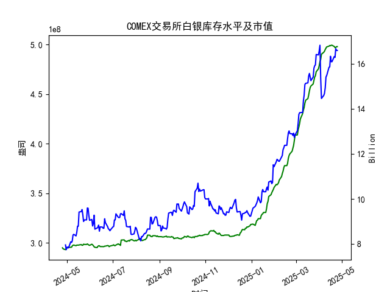

|            |   comex白银库存量 |   comex白银库存市值(billion) |   伦敦银现货价 |   上海金交所白银现货价 |   美元兑人民币汇率 |
|:-----------|------------------:|-----------------------------:|---------------:|-----------------------:|-------------------:|
| 2025-03-31 |       4.75358e+08 |                       34.48  |         34.055 |                   8485 |             7.1782 |
| 2025-04-01 |       4.78458e+08 |                       34.625 |         33.97  |                   8414 |             7.1775 |
| 2025-04-02 |       4.8257e+08  |                       34.855 |         33.87  |                   8386 |             7.1793 |
| 2025-04-03 |       4.84931e+08 |                       31.625 |         32.475 |                   8263 |             7.1889 |
| 2025-04-04 |       4.90077e+08 |                       29.515 |         31.34  |                   8263 |             7.1889 |
| 2025-04-07 |       4.92042e+08 |                       29.65  |         30.325 |                   7606 |             7.198  |
| 2025-04-08 |       4.92994e+08 |                       29.775 |         30.315 |                   7689 |             7.2038 |
| 2025-04-09 |       4.94816e+08 |                       30.17  |         30.18  |                   7746 |             7.2066 |
| 2025-04-10 |       4.96236e+08 |                       31.05  |         30.925 |                   7939 |             7.2092 |
| 2025-04-11 |       4.97475e+08 |                       31.115 |         31.27  |                   7984 |             7.2087 |
| 2025-04-14 |       4.98195e+08 |                       31.8   |         32.275 |                   8107 |             7.211  |
| 2025-04-15 |       4.98847e+08 |                       31.8   |         32.31  |                   8139 |             7.2096 |
| 2025-04-16 |       4.98569e+08 |                       32.755 |         32.955 |                   8230 |             7.2133 |
| 2025-04-17 |       4.99104e+08 |                       32.23  |         32.31  |                   8143 |             7.2085 |
| 2025-04-18 |       4.99104e+08 |                       32.23  |         32.31  |                   8142 |             7.2069 |
| 2025-04-21 |       4.97895e+08 |                       32.785 |         32.31  |                   8227 |             7.2055 |
| 2025-04-22 |       4.96698e+08 |                       32.785 |         32.61  |                   8154 |             7.2074 |
| 2025-04-23 |       4.96891e+08 |                       33.55  |         32.96  |                   8191 |             7.2116 |
| 2025-04-24 |       4.97741e+08 |                       33.325 |         33.395 |                   8295 |             7.2098 |
| 2025-04-25 |       4.97741e+08 |                       33.325 |         33.395 |                   8295 |             7.2066 |

### 近期白银市场套利机会分析与建议

#### 1. **跨市场套利（伦敦 vs. 上海）**
- **价差分析**：  
  根据最近一个月数据（2025年4月21日-25日），伦敦白银现货价格约为**33.395美元/盎司**，上海白银现货价格为**8295元/千克**。通过汇率（7.2066）和单位换算（1盎司≈0.0311千克），伦敦价格换算为人民币约为**7737元/千克**，与上海市场的价差高达**558元/千克**（上海溢价）。  
  **机会判断**：  
  价差显著高于历史均值，扣除税费、运输及交易成本（假设约300元/千克）后，仍存在约**250元/千克**的潜在利润空间，适合进行**买入伦敦白银、卖空上海白银**的跨市场套利。

- **风险与操作**：  
  - 需考虑中国进口白银的增值税（13%）及关税（公开数据需确认），可能压缩利润。  
  - 汇率波动风险较低（近期美元兑人民币汇率稳定在7.20附近），但仍需对冲。  
  - 建议高频监控价差，优先通过期货或ETF等工具实现无实物交割的套利。

#### 2. **库存与价格背离机会（COMEX）**
- **库存动态**：  
  COMEX库存量在最近一个月内先降后升（4.97亿→4.96亿→4.97亿），整体维持高位，但同期伦敦和上海白银价格持续上涨（伦敦从32.31→33.40美元/盎司，上海从8227→8295元/千克）。  
  **机会判断**：  
  库存高位与价格上涨的背离可能反映**投机性需求主导市场**，若库存进一步增加或需求降温，价格存在回调风险。可考虑**逢高做空期货合约**，或通过**库存增减与价格波动的统计套利模型**捕捉短期机会。

- **风险与操作**：  
  - 需结合宏观经济数据（如美联储政策、工业需求预期）验证库存变化逻辑。  
  - 若库存回升伴随价格滞涨，可逐步建立空头头寸。

#### 3. **期现套利（需期货数据辅助）**
- **隐含机会**：  
  若COMEX白银期货呈现**Contango结构**（远月价格高于近月），且价差覆盖仓储和资金成本，可执行**买入现货、卖出期货**的期现套利。  
  **操作前提**：  
  需获取期货合约价格数据以验证基差水平，当前库存高企可能压制近月合约价格，形成Contango。

#### 4. **策略建议**
- **优先策略**：  
  集中资源评估**跨市场套利可行性**（伦敦-上海），因其价差空间明确且汇率风险可控。  
- **辅助策略**：  
  - 监控COMEX库存与价格背离的持续性，结合技术指标（如RSI、持仓量）捕捉回调信号。  
  - 若期货市场提供Contango机会，可配置低风险期现套利组合。  
- **风险提示**：  
  - 地缘政治事件可能冲击白银供需（如工业需求骤增）。  
  - 套利需快速执行，建议自动化交易系统实时跟踪价差。

**结论**：当前市场最显著的套利机会为**伦敦-上海跨市场价差交易**，次要机会来自库存与价格背离的统计套利。建议优先执行跨市场策略，并严格设置止损以应对突发风险。