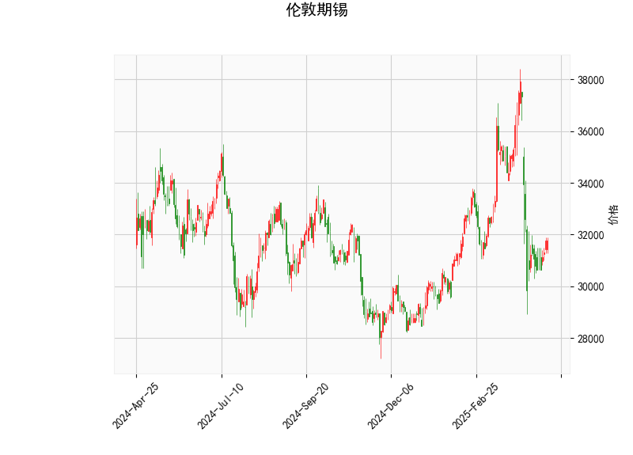

### 伦敦期锡技术分析解读

#### 1. 技术指标分析
- **当前价与布林轨道**：
  - 当前价（31,763）低于布林带中轨（33,026.55），但高于下轨（29,011.76），表明价格处于中性偏弱区间。若未来价格反弹至中轨附近（33,000-33,500区域），可能面临阻力；若跌破下轨，则可能加速下行。
  - 布林带开口略宽（上轨37,041，下轨29,011），显示波动率较高，但当前价未触及极端值，暂无明显超买/超卖信号。

- **RSI（45.24）**：
  - RSI接近中性（50），但略低于中轴，反映市场短期动能偏弱，但未进入超卖区域（通常RSI<30为超卖）。需结合其他指标判断趋势延续或反转可能。

- **MACD（-724.99）与信号线（-673.33）**：
  - MACD柱状图（-51.66）为负值且MACD线位于信号线下方，表明短期下行趋势仍占主导，但两者差值较小（-51.66），空头动能未显著增强。若未来MACD线向上突破信号线，可能形成“金叉”反弹信号。

- **K线形态**：
  - **CDLGAPSIDESIDEWHITE**：通常为反转信号，暗示多空力量接近平衡，需警惕价格在当前位置出现方向性突破。
  - **CDLSHORTLINE**：短实体K线（如十字星或纺锤线），反映市场犹豫，可能为趋势中继或反转前兆，需结合后续K线确认。

---

#### 2. 潜在机会与策略建议

##### **短期交易机会**：
- **看空策略**（谨慎）：
  - **入场条件**：若价格反弹至布林中轨（33,000附近）受阻，且MACD柱状图未转正，可轻仓试空，目标下看布林下轨（29,000）。
  - **止损**：中轨上方（如33,500）。
  - **风险**：当前RSI未超卖，且K线形态隐含反转可能，需严格止损。

- **看多策略**（等待确认）：
  - **入场条件**：若价格站稳中轨（33,000）且MACD形成金叉，可尝试多单，目标上看布林上轨（37,000）。
  - **止损**：中轨下方（如32,500）。
  - **风险**：MACD仍处负值区，需警惕趋势延续性不足。

##### **套利与中线布局**：
- **区间波段交易**：
  - 利用布林带上下轨作为区间边界，在价格接近下轨（29,000）且RSI<30时分批建仓多单，目标中轨；接近上轨（37,000）且RSI>70时反向操作。
  - **优势**：当前波动率较高，适合高抛低吸。
  - **风险**：需防范趋势性突破导致区间失效。

- **事件驱动策略**：
  - 关注宏观经济数据（如全球锡矿供应、新能源需求）对价格的催化作用。若基本面改善（如库存下降），可结合技术信号布局多单。

##### **风险提示**：
- 当前MACD与价格走势未出现明显背离，趋势反转信号较弱，建议以短线交易为主。
- K线形态的潜在反转需配合成交量验证，若缺乏量能支撑，可能仅为短期修正。
- 布林带中轨为关键分水岭，突破后需及时调整方向。