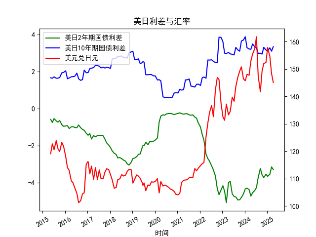

|            |   美元兑日元 |   美国10年期国债收益率 |   日本10年期国债收益率 |   美国2年期国债收益率 |   日本2年期国债收益率 |   每日美日2年期国债利差 |   每日美日10年期国债利差 |
|:-----------|-------------:|-----------------------:|-----------------------:|----------------------:|----------------------:|------------------------:|-------------------------:|
| 2023-09-12 |       147.12 |                  3.875 |                  0.716 |                 0.033 |                  4.98 |                   3.159 |                   -4.947 |
| 2023-10-11 |       149.17 |                  3.875 |                  0.776 |                 0.058 |                  4.99 |                   3.099 |                   -4.932 |
| 2023-11-08 |       150.77 |                  4.5   |                  0.852 |                 0.117 |                  4.93 |                   3.648 |                   -4.813 |
| 2023-12-11 |       146.41 |                  4.5   |                  0.798 |                 0.088 |                  4.71 |                   3.702 |                   -4.622 |
| 2024-01-10 |       145.68 |                  4.5   |                  0.621 |                 0.025 |                  4.37 |                   3.879 |                   -4.345 |
| 2024-02-07 |       148.04 |                  4     |                  0.714 |                 0.101 |                  4.41 |                   3.286 |                   -4.309 |
| 2024-03-12 |       147.69 |                  4     |                  0.783 |                 0.197 |                  4.58 |                   3.217 |                   -4.383 |
| 2024-04-10 |       152.9  |                  4     |                  0.801 |                 0.233 |                  4.97 |                   3.199 |                   -4.737 |
| 2024-05-08 |       155.42 |                  4.375 |                  0.887 |                 0.288 |                  4.84 |                   3.488 |                   -4.552 |
| 2024-06-11 |       157.32 |                  4.375 |                  1.035 |                 0.372 |                  4.81 |                   3.34  |                   -4.438 |
| 2024-07-10 |       161.73 |                  4.375 |                  1.093 |                 0.343 |                  4.62 |                   3.282 |                   -4.277 |
| 2024-08-07 |       147.42 |                  3.875 |                  0.899 |                 0.27  |                  4    |                   2.976 |                   -3.73  |
| 2024-09-11 |       141.72 |                  3.875 |                  0.886 |                 0.38  |                  3.62 |                   2.989 |                   -3.24  |
| 2024-10-09 |       149.2  |                  3.875 |                  0.936 |                 0.402 |                  3.99 |                   2.939 |                   -3.588 |
| 2024-11-05 |       151.96 |                  4.25  |                  0.944 |                 0.455 |                  4.19 |                   3.306 |                   -3.735 |
| 2024-12-11 |       152.34 |                  4.25  |                  1.083 |                 0.591 |                  4.15 |                   3.167 |                   -3.559 |
| 2025-01-07 |       157.82 |                  4.25  |                  1.148 |                 0.632 |                  4.3  |                   3.102 |                   -3.668 |
| 2025-02-12 |       154.62 |                  4.625 |                  1.346 |                 0.799 |                  4.36 |                   3.279 |                   -3.561 |
| 2025-03-12 |       148.32 |                  4.625 |                  1.527 |                 0.85  |                  4.01 |                   3.098 |                   -3.16  |
| 2025-04-09 |       145.09 |                  4.625 |                  1.284 |                 0.611 |                  3.91 |                   3.341 |                   -3.299 |

# 分析与策略建议

---

## **1. 日元汇率与利差背离对日本股市影响的判断**

### **数据观察与逻辑验证**
- **利差与汇率关系**：  
  从近1年数据看，美日利差（2年期和10年期）显著走阔（美国利率相对日本持续升高），而美元兑日元汇率也同步大幅升值（日元贬值）。这表明两者在长期趋势上呈现**正相关性**（利差扩大推动日元贬值）。但存在**短期阶段性背离**（例如2023年部分月份利差收窄但日元仍贬值），主要由以下因素驱动：
  1. **避险情绪**：全球风险事件（如地缘冲突）触发日元避险属性，短暂抵消利差影响。
  2. **日本央行政策干预**：日本央行维持宽松货币政策（如YCC政策）压制日元利率，导致利差被动扩大。

- **日元贬值对日本股市的影响机制**：  
  日本上市公司约70%的利润来自海外（如汽车、电子行业），**日元贬值直接提升其海外收入折算为日元的盈利水平**，推动股价上涨。例如：
  - 2022-2023年日元贬值周期中，日经225指数涨幅超过20%，与日元贬值幅度高度同步。
  - 近期日元汇率跌破160时，出口企业财报普遍超预期，支撑股市表现。

### **结论**  
文章观点**总体准确**，但需补充两点：  
1. **背离的短期性**：利差与汇率背离主要由外部冲击或政策干预导致，长期仍回归正相关性。  
2. **结构性依赖**：日本股市对日元贬值的敏感性高于其他国家，因其经济高度依赖出口导向型跨国企业。

---

## **2. 近期投资或套利机会分析**

### **机会方向**
#### **(1) 利差交易（Carry Trade）**
- **策略逻辑**：借入低息日元（日本短期利率接近0%），投资高息美元资产（美国短期国债收益率>5%），赚取利差收益。  
- **风险提示**：需对冲汇率波动风险（如远期外汇合约），避免日元反弹侵蚀利差收益。

#### **(2) 日股多头 + 日元空头组合**
- **策略逻辑**：做多日经225指数（受益于日元贬值），同时做空日元（USD/JPY多头），形成“企业盈利增长+汇率套利”双重收益。  
- **关键时点**：关注日本央行政策转向信号（如放弃YCC）可能引发日元反弹，需动态调整对冲比例。

#### **(3) 波动率套利**
- **策略逻辑**：利用美日利差与汇率波动率的非线性关系，在利差收窄预期下（如美联储降息），买入USD/JPY看跌期权，捕捉日元反弹机会。

### **风险因素**
1. **政策风险**：日本央行干预汇市或美联储政策转向超预期。  
2. **地缘风险**：中东冲突升级可能推升避险情绪，利多日元。  
3. **流动性风险**：全球金融市场流动性收缩可能放大汇率波动。

---

## **策略执行建议**
1. **短期（1-3个月）**：  
   - **做多USD/JPY**：利差维持高位且日本央行暂无紧缩信号，技术面支撑位145，目标位155-160。  
   - **加仓日股ETF**：重点配置出口企业（如丰田、索尼）及金融股（受益于利率上行）。  
2. **中期（3-6个月）**：  
   - **逐步平仓日元空头**：美联储降息预期升温后，利差收窄将压制USD/JPY。  
   - **切换至防御板块**：日元反弹预期下，增持内需型消费股（如零售、医药）。  

---

**注**：以上分析需结合实时数据更新动态调整，建议使用衍生品工具对冲尾部风险。