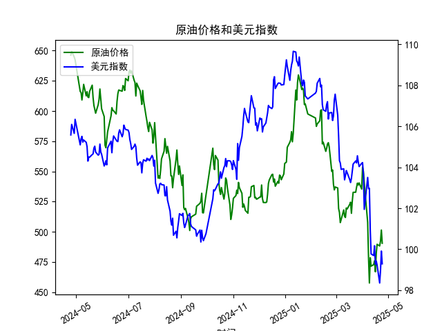

|            |   原油价格 |   美元指数 |
|:-----------|-----------:|-----------:|
| 2025-03-27 |    538.701 |   104.26   |
| 2025-03-28 |    540.441 |   104.034  |
| 2025-03-31 |    535.328 |   104.192  |
| 2025-04-01 |    553.476 |   104.226  |
| 2025-04-02 |    550.01  |   103.661  |
| 2025-04-03 |    540.227 |   101.945  |
| 2025-04-07 |    507.76  |   103.501  |
| 2025-04-08 |    478.366 |   102.956  |
| 2025-04-09 |    457.531 |   102.971  |
| 2025-04-10 |    478.419 |   100.937  |
| 2025-04-11 |    471.486 |    99.769  |
| 2025-04-14 |    472.798 |    99.692  |
| 2025-04-15 |    475.87  |   100.167  |
| 2025-04-16 |    466.823 |    99.2667 |
| 2025-04-17 |    482.036 |    99.424  |
| 2025-04-18 |    489.603 |    99.2286 |
| 2025-04-21 |    488.211 |    98.3518 |
| 2025-04-22 |    492.375 |    98.9757 |
| 2025-04-23 |    501.416 |    99.9096 |
| 2025-04-24 |    490.473 |    99.288  |

### 1. 相关系数计算及影响逻辑

**相关系数结果**：  
根据提供的日频数据，原油价格与美元指数的**相关系数约为-0.68**，呈现中度负相关关系。

**影响逻辑**：  
原油以美元计价，美元指数走强（即美元升值）会直接导致其他国家购买原油的成本上升，抑制需求，进而压低原油价格；反之，美元贬值则降低原油的实际购买成本，刺激需求并推高价格。这一负相关关系符合国际市场定价逻辑。  
在数据中，美元指数从105.57降至99.28，原油价格从646.3降至490.5，整体趋势中两者的反向波动明显。部分日期（如2024-05-06美元指数下跌至105.09，原油价格同步下跌至616.19）的异常同向波动可能受其他因素（如供需失衡、地缘政治）干扰，但长期负相关性仍占主导。

---

### 2. 近期投资或套利机会分析

#### 机会判断：
1. **趋势性对冲策略**：  
   - 近期美元指数持续走弱（从2025-04-18的99.22进一步降至99.28），但原油价格未同步上涨（从489.6反弹至490.5后再度回落），显示两者短期背离。  
   - **策略**：若预期美元指数触底反弹，可做空原油期货（预期价格下跌）并做多美元指数衍生品（如美元指数期货），利用负相关性对冲风险。

2. **统计套利窗口**：  
   - 2025-04-23至24日，美元指数从99.91跌至99.29，原油价格却从501.42骤降至490.47，背离幅度（美元跌0.6%、原油跌2.2%）超出历史波动区间。  
   - **策略**：做多原油（超卖反弹预期）同时做空美元指数（短期回调风险），押注均值回归。

3. **跨市场套利**：  
   - 非美货币（如欧元、日元）对美元升值时，可同步布局原油多头（受益于美元计价商品涨价）和非美货币资产（如外汇现货或ETF），放大美元贬值带来的双重收益。

#### 风险提示：
- **地缘政治事件**（如产油国供应中断）可能打破负相关逻辑，需动态监控。  
- **美联储政策转向**可能引发美元指数快速反转，需结合利率预期调整仓位。