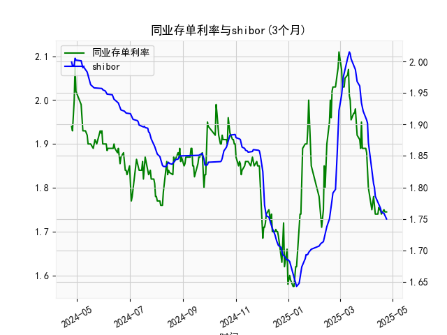

|            |   同业存单利率(3个月) |   shibor(3个月) |
|:-----------|----------------------:|----------------:|
| 2025-03-27 |                 1.89  |           1.924 |
| 2025-03-28 |                 1.89  |           1.921 |
| 2025-03-31 |                 1.89  |           1.912 |
| 2025-04-01 |                 1.88  |           1.907 |
| 2025-04-02 |                 1.85  |           1.902 |
| 2025-04-03 |                 1.8   |           1.871 |
| 2025-04-07 |                 1.75  |           1.824 |
| 2025-04-08 |                 1.77  |           1.81  |
| 2025-04-09 |                 1.78  |           1.806 |
| 2025-04-10 |                 1.76  |           1.8   |
| 2025-04-11 |                 1.74  |           1.786 |
| 2025-04-14 |                 1.74  |           1.777 |
| 2025-04-15 |                 1.755 |           1.775 |
| 2025-04-16 |                 1.75  |           1.772 |
| 2025-04-17 |                 1.75  |           1.767 |
| 2025-04-18 |                 1.74  |           1.761 |
| 2025-04-21 |                 1.75  |           1.759 |
| 2025-04-22 |                 1.745 |           1.755 |
| 2025-04-23 |                 1.745 |           1.753 |
| 2025-04-24 |                 1.745 |           1.75  |

# 同业存单利率与SHIBOR的相关性及影响逻辑分析

## 1. 同业存单利率与SHIBOR的相关性及影响逻辑

### （1）基础相关性
同业存单利率（NCD）与SHIBOR均反映银行间市场资金价格，二者具有**强正相关性**：
- **短期资金供需**：当银行间市场流动性紧张时，SHIBOR（报价利率）和同业存单（市场化发行利率）均会上行，反之则同步下行。
- **信用风险溢价差异**：同业存单（AAA级）隐含发行主体的信用风险，而SHIBOR为报价利率（无实际交易信用风险），因此NCD利率通常略高于SHIBOR，利差反映信用溢价。
- **期限结构联动**：3个月SHIBOR与同期限NCD利率的走势常受央行货币政策（如MLF利率调整）和市场对中期流动性预期的影响。

### （2）影响逻辑
- **货币政策传导**：央行通过OMO、MLF等工具调节流动性时，SHIBOR作为基准利率率先反应，进而影响同业存单发行定价。
- **银行负债端竞争**：当银行通过发行NCD主动负债的需求增加（如季末考核、信贷扩张），可能推高NCD利率并带动SHIBOR上行。
- **市场情绪分化**：若NCD-SHIBOR利差异常扩大（如NCD利率显著高于SHIBOR），可能反映中小银行融资压力或市场对特定机构信用风险的担忧。

---

## 2. 近期投资/套利机会与策略建议

### （1）利差套利机会
从数据末端可见，**3个月NCD利率（约1.75%）当前低于SHIBOR（约1.75%）**，与长期均值（NCD通常高于SHIBOR）出现倒挂。可能的策略：
- **反向套利**：若利差倒挂因短期流动性过剩导致，可做多NCD（锁定较低融资成本）同时做空SHIBOR相关衍生品（如利率互换），待利差回归后平仓。
- **跨市场套利**：通过回购市场融入低成本资金（如隔夜利率），投资于高评级同业存单，赚取期限利差。

### （2）趋势性机会
- **利率下行预期博弈**：若宏观经济数据疲软（如PMI、CPI低于预期），央行可能加大宽松力度，NCD与SHIBOR或同步下行。可配置长久期利率债或参与IRS（利率互换）接收固定利率。
- **信用分层机会**：AAA级NCD与低评级存单利差若走阔，可择优配置高评级存单以规避信用风险，同时利用利差收窄预期进行波段交易。

### （3）风险提示
- **流动性风险**：季末、节前等时点可能引发资金面波动，导致套利策略成本上升。
- **政策干预**：央行逆周期调节（如意外降准）可能快速收窄利差，需密切关注公开市场操作信号。
- **信用事件冲击**：若个别银行信用风险暴露，可能导致NCD利率结构性分化，需动态跟踪发行人资质。

---

**结论**：当前NCD-SHIBOR利差倒挂或为短期现象，建议结合资金面预判灵活开展利差回归交易，同时关注高评级存单的配置价值。策略实施需强化日内流动性监测并设置止损机制。