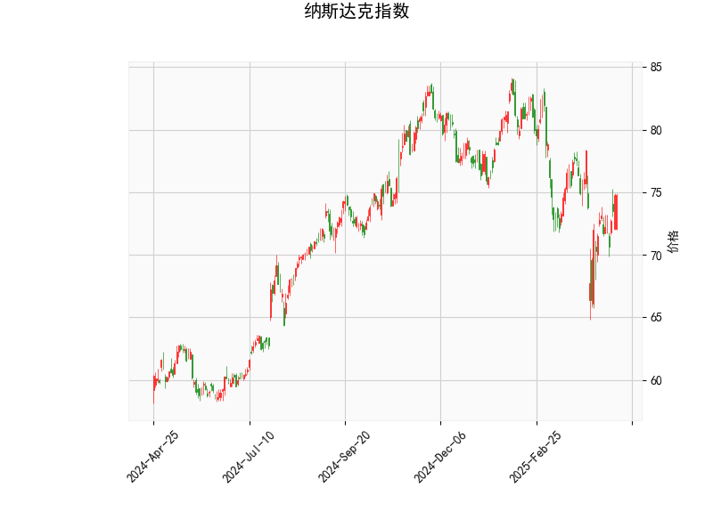

### 纳斯达克指数技术分析结果解读

#### 1. 技术指标分析
- **当前价（74.74）**：价格位于布林通道下轨（68.14）和中轨（76.28）之间，接近下轨区域，短期可能处于弱势区间，但未触及超跌区域。
- **RSI（52.89）**：处于中性区间（50附近），未显示超买或超卖信号，但略微偏向多头，可能暗示短期方向选择前的平衡状态。
- **MACD指标**：
  - MACD线（-0.57）上穿信号线（-1.08），柱状图（0.51）由负转正，显示短期下跌动能减弱，可能形成“金叉”信号。
  - 但MACD和信号线仍为负值，表明中期趋势尚未完全转向多头。
- **布林通道**：
  - 当前价低于中轨（76.28），但高于下轨（68.14），价格可能在中轨和下轨之间震荡。
  - 通道宽度（上轨84.42-下轨68.14=16.28）较大，显示波动率较高。
- **K线形态**：
  - **CDLBELTHOLD**：暗示趋势反转可能。
  - **CDLCLOSINGMARUBOZU**：光头阳线，显示短期多头力量增强。
  - **CDLLONGLINE**：长影线，反映多空博弈激烈。
  - **CDLMARUBOZU**：实体大阳线，强化短期看涨信号。
  
#### 2. 投资机会与策略
**短期机会**：
- **反弹交易**：
  - 入场点：若价格站稳布林下轨（68.14）后反弹，可尝试轻仓做多。
  - 目标位：中轨（76.28）附近，若突破则关注上轨（84.42）。
  - 止损位：跌破下轨（68.14）或前低。
- **套利机会**：
  - 波动率套利：布林通道宽度较大，可结合期权策略（如跨式组合）押注波动率收敛。
  - 多空对冲：若MACD金叉确认，可做多纳斯达克指数同时做空相关性较低的其他指数（如道琼斯）。

**中期风险提示**：
- MACD仍处于负值区域，需警惕反弹后二次探底风险。
- RSI未给出明确方向信号，建议结合成交量验证趋势强度。
- K线形态矛盾（长影线与看涨形态并存），需等待价格确认信号。

**策略总结**：
短期以震荡思路为主，重点关注价格对布林中轨的突破情况。若MACD持续上行且价格站稳中轨，可视为趋势反转信号；若反弹无力跌破下轨，则需防范进一步下跌风险。建议配合基本面（如美联储政策、科技股财报）进行多维度验证。