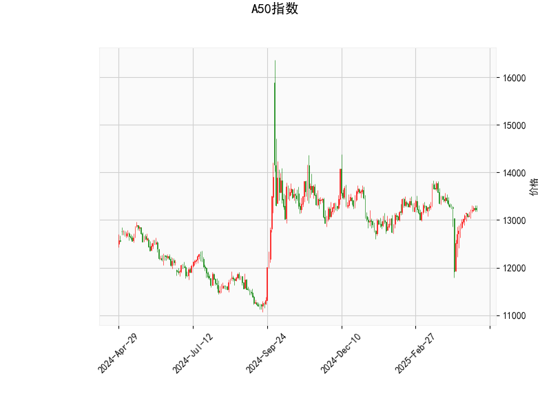

### A50指数技术分析结果解读

#### 1. 技术指标分析
- **当前价（13218.0）**：  
  价格位于布林通道中轨（13223.2）附近，显示短期市场处于**中性平衡状态**。需关注价格是否突破中轨以确定趋势方向。

- **RSI（52.91）**：  
  处于50附近的**中性区域**，表明市场未出现明显超买或超卖。若后续RSI突破60或跌破40，可能触发趋势性信号。

- **MACD指标**：  
  - MACD线（-0.33）与信号线（-43.38）均位于零轴下方，但**MACD柱（43.04）为正值**，显示短期下跌动能减弱，可能形成**底背离**或**潜在金叉**（需进一步确认信号线拐头向上）。

- **布林通道**：  
  - 上轨（13805.2）与下轨（12641.2）间距较大，当前价靠近中轨，表明市场处于**震荡区间**。若价格突破中轨并站稳，可能向上测试上轨；若跌破中轨，可能向下轨回落。

- **K线形态**：  
  - **CDLMATCHINGLOW**：出现在下跌趋势中的潜在反转信号，需结合成交量确认。  
  - **CDLSPINNINGTOP**：显示多空博弈激烈，短期方向不明朗，可能延续震荡。

---

#### 2. 投资机会与策略

##### **短期交易机会**：
1. **区间交易策略**：  
   - **做多条件**：若价格站稳中轨（13223.2）且MACD柱持续扩大，可看向上轨（13805.2），止损设于中轨下方。  
   - **做空条件**：若价格跌破中轨且RSI下破50，可看向下轨（12641.2），止损设于中轨上方。

2. **反转信号博弈**：  
   - **CDLMATCHINGLOW**若伴随放量反弹，可尝试轻仓做多，目标中轨上方，止损于形态低点下方。

##### **套利机会**：
- **波动率套利**：布林通道收窄后可能伴随波动率放大，若价格突破中轨后加速，可布局突破性策略（如买入看涨/看跌期权）。

##### **风险提示**：
- **MACD与价格背离**：MACD柱虽为正值，但MACD线与信号线仍处于低位，需警惕假反弹。  
- **K线形态不确定性**：SPINNINGTOP需结合次日K线确认方向，避免单凭形态入场。

---

##### **总结**：
当前A50指数处于**震荡修复阶段**，建议以**区间操作**为主，突破中轨后顺势交易。若MACD形成金叉且价格站稳中轨，可关注反弹机会；若跌破中轨，则需防范加速下跌风险。套利策略需结合波动率变化动态调整仓位。