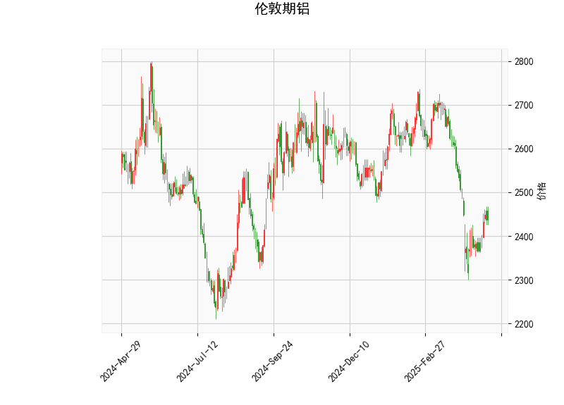

# 伦敦期铝技术分析与投资策略

## 一、技术分析解读

### 1. 价格与布林轨道
- **当前价2437.5**位于布林下轨（2310.18）与中轨（2561.58）之间，距离下轨仅5.5%空间，但较中轨低4.8%，显示短期处于弱势区间。
- **缩口型布林轨道**（上下轨间距502点）暗示波动率收敛，近期可能出现方向性突破。若价格站稳中轨2561则转强，跌破下轨2310则打开下跌空间。

### 2. 动量指标
- **RSI 46.05**处于中性区间，无超买超卖信号，但需注意其正从40以下回升，显示下跌动能减弱。
- **MACD指标**呈现典型底背离特征：MACD线（-37.63）上穿信号线（-53.62），柱状图（15.98）持续放大，形成水下金叉，属于看涨信号。

### 3. K线形态
- **CDLMATCHINGLOW形态**出现，该形态在连续下跌后具有看涨反转意义，要求第二日开盘价与收盘价均与前一日相近，暗示空头力量衰竭。

---

## 二、投资机会与策略

### （一）趋势跟踪策略
1. **突破交易机会**
   - **多头策略**：若价格放量突破中轨2561且MACD持续上行，可建立多头头寸，目标位看至布林上轨2813（潜在空间15%）。
   - **空头策略**：若价格跌破下轨2310且MACD转弱，可顺势做空，目标位看至前低2200区域。

2. **均值回归策略**
   - 当前价格处于布林带下半区，MACD金叉与看涨K线形成共振时，可尝试在2380-2350区间轻仓做多，止损设于2300下方，目标中轨2561。

### （二）套利机会
1. **跨期套利**
   - 观察近月合约贴水结构（当前价低于中轨），若库存数据出现下降，可做多近月/做空远月，捕捉价差回归机会。

2. **跨品种对冲**
   - 关注铝/铜比价关系（当前处于历史低位），若制造业PMI回升，可做多铝/做空铜进行对冲套利。

---

## 三、风险提示
1. **宏观面扰动**：需重点关注中国房地产政策、新能源车产销数据对铝需求的实质影响。
2. **库存变化**：LME库存若持续累积将压制反弹空间，建议配合每周库存数据操作。
3. **美元波动**：美联储政策转向时点可能引发美元指数剧烈波动，铝价与美元呈显著负相关。

*（注：以上策略需配合严格止损，建议仓位不超过本金的5%，突破交易需验证成交量配合）*