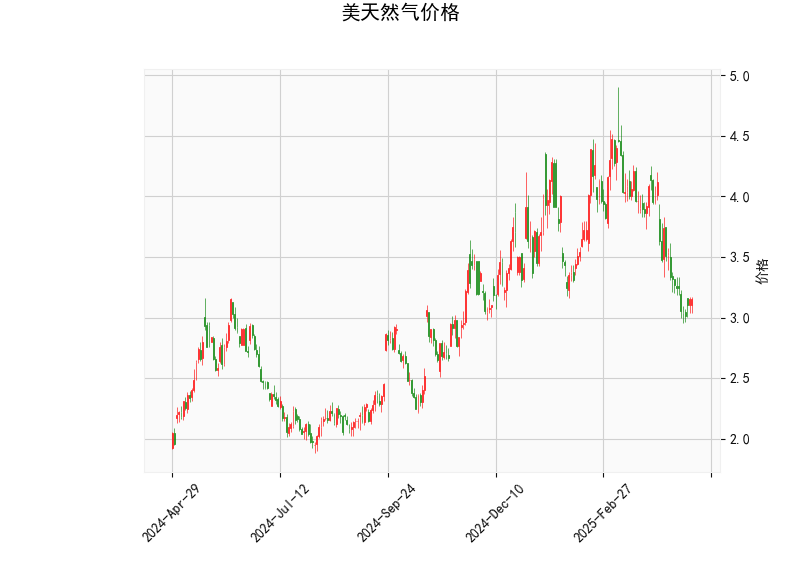

### 一、技术指标分析

#### 1. **当前价与布林轨道**
- **当前价**（3.158）显著低于**布林中轨**（3.814），且接近**布林下轨**（3.004），表明价格处于短期超卖区间，可能进入技术性反弹区域。
- **布林带宽度收窄**（上轨4.623 vs 下轨3.004），显示市场波动率下降，短期可能面临方向选择。

#### 2. **RSI（相对强弱指数）**
- **RSI为36.98**，接近超卖阈值（30），但尚未完全进入超卖区域。需注意两点：
  - **潜在反弹信号**：若RSI回升至40以上，可能确认短期底部。
  - **下行风险**：若价格继续下跌且RSI未创新低，可能形成底背离，但当前未出现此信号。

#### 3. **MACD指标**
- **MACD线（-0.224）低于信号线（-0.206）**，柱状图（MACD Histogram）为负值（-0.0175），表明当前处于**空头主导趋势**。
- **MACD与信号线接近黏合**，若MACD向上突破信号线，可能触发短期看涨金叉。

#### 4. **K线形态**
- 无明确K线反转形态（如锤头线、吞没形态等），显示市场缺乏短期方向指引。

---

### 二、投资机会与策略建议

#### 1. **短期反弹机会（轻仓博弈）**
- **逻辑**：价格贴近布林下轨，RSI接近超卖，存在技术性修复需求。
- **策略**：
  - **入场条件**：价格站稳布林下轨（3.004）且RSI回升至40以上。
  - **目标**：布林中轨（3.814），潜在涨幅约21%。
  - **止损**：跌破布林下轨（如2.95以下）。

#### 2. **趋势跟随策略（空头延续）**
- **逻辑**：MACD仍处于空头区域，布林带中轨压制明显。
- **策略**：
  - **入场条件**：价格反弹至中轨（3.814）附近后回落，或MACD柱状图扩大负值。
  - **目标**：前低或布林下轨（3.004）。
  - **止损**：突破中轨且站稳（如3.85以上）。

#### 3. **波动率突破策略**
- **逻辑**：布林带收窄后，波动率可能放大，需关注方向选择。
- **策略**：
  - **向上突破**：若放量突破中轨（3.814），可跟进多单，目标上轨（4.623）。
  - **向下突破**：若跌破下轨（3.004），可能加速下跌，可轻仓追空。

#### 4. **套利机会（跨期价差）**
- **逻辑**：天然气库存及季节性需求波动可能影响远期合约价差。
- **建议**：
  - 关注近月合约（超卖反弹）与远月合约（冬季需求预期）的价差变化。
  - 若近月合约反弹力度强于远月，可做多近月/做空远月组合。

---

### 三、风险提示
1. **基本面扰动**：天气变化、库存数据（EIA报告）可能引发价格剧烈波动。
2. **技术面失效**：若价格持续贴布林下轨运行，需警惕极端行情（如流动性踩踏）。
3. **仓位管理**：建议单笔交易风险不超过总资金的2%，避免过度杠杆。