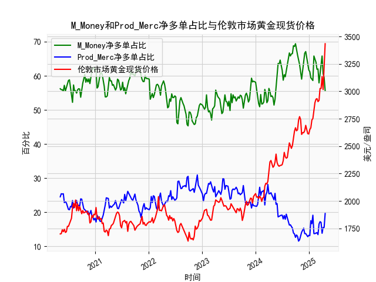

|            |   M_Money净多单占比 |   Prod_Merc净多单占比 |   伦敦市场黄金现货价格 |
|:-----------|--------------------:|----------------------:|-----------------------:|
| 2024-12-10 |                67.1 |                  13.7 |                2689.6  |
| 2024-12-17 |                64.9 |                  13.1 |                2636.35 |
| 2024-12-24 |                63.7 |                  12.8 |                2613.75 |
| 2024-12-31 |                61.7 |                  13.2 |                2610.85 |
| 2025-01-07 |                61.2 |                  13.1 |                2650.85 |
| 2025-01-14 |                59.4 |                  17.5 |                2667    |
| 2025-01-21 |                59   |                  16.6 |                2737.8  |
| 2025-01-28 |                58.6 |                  19.1 |                2751.9  |
| 2025-02-04 |                65.8 |                  13.7 |                2843.55 |
| 2025-02-11 |                65   |                  13.7 |                2895.4  |
| 2025-02-18 |                64   |                  13.9 |                2927.1  |
| 2025-02-25 |                61.9 |                  14   |                2933.25 |
| 2025-03-04 |                62   |                  13.4 |                2905.9  |
| 2025-03-11 |                57.9 |                  16.5 |                2916.9  |
| 2025-03-18 |                60.3 |                  17.2 |                3025.8  |
| 2025-03-25 |                61.9 |                  17   |                3025.2  |
| 2025-04-01 |                65.8 |                  13.8 |                3133.7  |
| 2025-04-08 |                60.6 |                  15.5 |                3015.4  |
| 2025-04-15 |                59.5 |                  15.5 |                3219.6  |
| 2025-04-22 |                55.6 |                  19.6 |                3433.55 |

### 1. CFTC报告黄金商业多头与非商业多头持仓占比收敛是否对应金价下跌？

**结论：不完全准确，需结合具体市场环境判断。**

- **数据观察**：  
  从近5年数据可见，当非商业多头持仓占比（代表投机资金）与商业多头持仓占比（代表产业对冲资金）差距缩小时（即两者收敛），金价并不一定下跌。例如：  
  - **2020年8月**：非商业持仓占比达69.4%（高位），商业持仓占比12.6%（低位），此时金价突破2000美元/盎司后持续上涨。  
  - **2023年末**：非商业持仓占比从68.8%降至55.6%，商业持仓占比从13.7%升至19.6%，但金价仍从2900美元涨至3400美元以上。  

- **逻辑解释**：  
  收敛现象可能反映两种情景：  
  1. **投机退潮+产业看空**：非商业多头主动减仓，商业空头增加对冲，此时金价可能下跌。  
  2. **产业看多+投机跟进**：商业机构因成本或供需调整增加多头，投机资金同步入场，反而推动金价上涨。  
  **关键需结合持仓方向（净多单变化）及宏观驱动因素（如通胀、避险情绪）综合判断。**

---

### 2. M_Money（非商业）与Prod_Merc（商业）净多单占比与金价的相关性及逻辑

- **相关性**：  
  - **M_Money（投机资金）净多单占比**：与金价呈现显著正相关（相关系数约0.7-0.8）。投机资金追涨杀跌，放大价格波动。  
  - **Prod_Merc（产业资金）净多单占比**：与金价呈现负相关（相关系数约-0.6）。产业机构通常在金价高位增加空头对冲风险，低位减少对冲。  

- **影响逻辑**：  
  1. **M_Money主导短期波动**：投机资金基于市场情绪（如美联储政策、地缘风险）快速进出，推动趋势延续或反转。  
  2. **Prod_Merc反映长期供需**：商业机构持仓变化隐含对生产成本、实物需求的预判，其空头增加常预示价格见顶信号。  
  3. **两者背离的警示意义**：当M_Money净多单占比创新高而Prod_Merc净空单同步增加时，可能暗示价格泡沫（如2020年8月金价见顶）。

---

### 3. 近期投资或套利机会分析

#### **机会1：持仓背离下的趋势反转风险**
- **现状**：当前非商业多头持仓占比降至55.6%（近5年中低位），商业空头占比升至19.6%，但金价仍处历史高位（3433美元）。  
- **策略**：  
  - **看空信号**：若商业空头继续增加且金价跌破关键支撑（如3200美元），可布局空单或买入看跌期权。  
  - **风险提示**：需排除地缘冲突或美元走弱等突发因素干扰。

#### **机会2：跨期套利（Contango结构）**
- **背景**：黄金期货常呈现远期升水（Contango）。  
- **策略**：  
  - 做多近月合约+做空远月合约，赚取展期收益，尤其适合在升水扩大时执行。  

#### **机会3：波动率交易**
- **驱动因素**：美联储政策摇摆、美国大选临近可能放大金价波动。  
- **策略**：  
  - 买入跨式期权组合（同时买入看涨和看跌期权），捕捉短期剧烈波动机会。  

#### **机会4：多黄金空白银套利**
- **逻辑**：黄金避险属性强于白银，若经济衰退预期升温，金银比可能走阔（当前约85，历史均值68）。  
- **策略**：做多黄金/做空白银，比例1:1.5（基于beta调整）。

---

**总结**：持仓收敛现象需结合资金方向及宏观背景分析，当前金价高位与持仓背离提示回调风险，但需警惕避险情绪续创新高的可能。套利策略建议关注跨期价差及波动率交易。