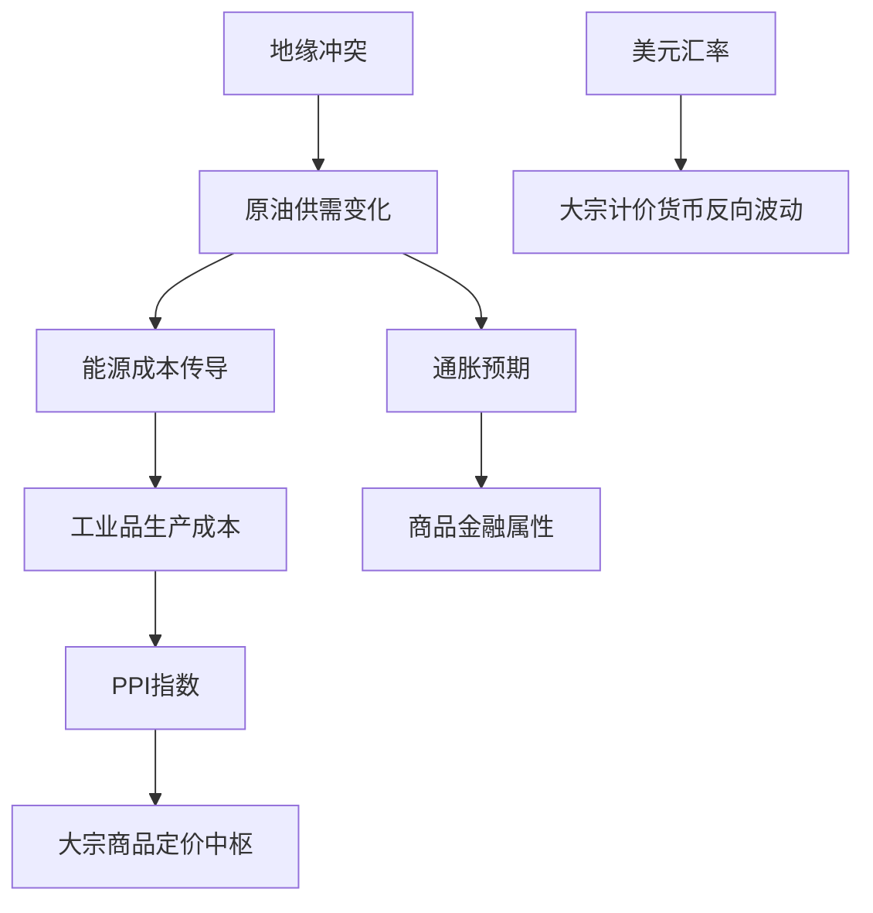

|            |   原油价格 |   大宗商品价格指数BPI |
|:-----------|-----------:|----------------------:|
| 2025-03-28 |    540.441 |                   900 |
| 2025-03-31 |    535.328 |                   899 |
| 2025-04-01 |    553.476 |                   899 |
| 2025-04-02 |    550.01  |                   901 |
| 2025-04-03 |    540.227 |                   901 |
| 2025-04-07 |    507.76  |                   895 |
| 2025-04-08 |    478.366 |                   890 |
| 2025-04-09 |    457.531 |                   882 |
| 2025-04-10 |    478.419 |                   884 |
| 2025-04-11 |    471.486 |                   884 |
| 2025-04-14 |    472.798 |                   885 |
| 2025-04-15 |    475.87  |                   883 |
| 2025-04-16 |    466.823 |                   880 |
| 2025-04-17 |    482.036 |                   878 |
| 2025-04-18 |    489.603 |                   877 |
| 2025-04-21 |    488.211 |                   875 |
| 2025-04-22 |    492.375 |                   874 |
| 2025-04-23 |    501.416 |                   874 |
| 2025-04-24 |    490.473 |                   871 |
| 2025-04-25 |    492.962 |                   870 |

# 原油价格与大宗商品价格指数的相关性及影响逻辑分析

## 一、原油价格与大宗商品价格指数的相关性
### 1. 统计相关性特征
从数据走势看，原油价格（波动范围457-633）与大宗商品指数（870-958）整体呈现**中等正相关性**，但存在阶段性背离：
- **长期趋势联动**：在原油价格上行周期（如末段581→617→629）时，大宗商品指数同步从885回升至905附近
- **短期分化**：部分时段原油急跌（如633→536）时大宗指数保持横盘，显示**原油波动率显著高于整体大宗商品**

### 2. 影响逻辑链条

核心传导路径：
- **成本驱动**：原油作为"工业血液"直接影响运输/制造/化工全产业链成本
- **通胀锚定**：油价波动改变市场对通胀的预期，引发商品持仓调整
- **流动性联动**：美联储政策通过美元汇率同时作用于原油（美元计价）和商品指数

## 二、近期投资机会与策略建议

### 1. 跨品种套利机会
**原油-商品指数价差修复策略**：
- 当前原油价格（末值492）相对于商品指数（871）处于1年低位区间，历史价差比处于15%分位
- 做多原油期货+做空商品指数ETF，捕捉均值回归机会
- 需监测OPEC减产执行度及中国工业品库存数据

### 2. 波动率交易机会
**原油期权跨式组合**：
- 近期原油隐含波动率降至18%低位，但地缘风险（中东局势）和库存变化（EIA数据）可能引发价格突破
- 买入行权价500/480的跨式期权组合，持有周期2-4周

### 3. 期限结构套利
**布油期货Contango结构利用**：
- 观察近月合约贴水结构（6月vs9月价差2.5美元）
- 采用"买近抛远"的滚动套利，配合库存数据逆向操作

### 风险提示
- 美国战略石油储备释放可能压制油价反弹
- 中国房地产政策对黑色系商品的独立影响
- 伊核协议进展带来突发性供给冲击