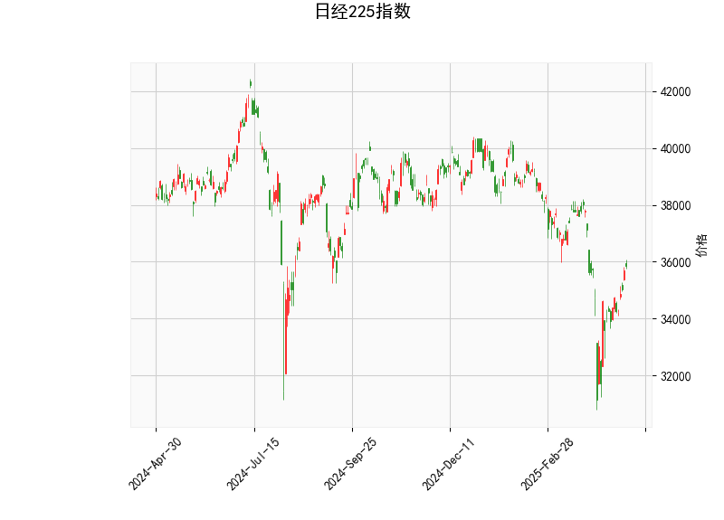

### 日经225指数技术分析结果解读

#### 1. 指标分析
- **RSI（相对强弱指数）**：当前值为**53.76**，处于中性区间（50附近），表明市场多空力量相对均衡，短期内无明显超买或超卖信号。
- **MACD指标**：
  - MACD线（-333.72）与信号线（-671.81）均为负值，反映长期趋势仍偏弱。
  - **MACD柱状图（338.08）**：正值且绝对值较大，显示短期动能向上，MACD线已上穿信号线形成“金叉”，可能预示短期反弹机会。
- **布林轨道**：
  - 当前价格（35,839.99）位于**下轨（32,656.18）和中轨（36,657.70）之间**，低于中轨表明短期趋势偏弱。
  - 布林带开口较宽（上轨40,659.23，下轨32,656.18），显示市场波动率较高，但价格未突破上下轨，暂未出现极端超买/超卖信号。
- **K线形态**：无明确形态，市场处于整理阶段。

#### 2. 投资机会与策略建议

##### **短期机会**：
- **反弹交易**：
  - **逻辑**：MACD金叉、价格接近布林带下轨，短期存在技术性反弹可能。
  - **策略**：
    - 若价格站稳中轨（36,657.70），可轻仓做多，目标看向上轨（40,659.23），止损设于中轨下方。
    - 若反弹至中轨附近遇阻回落，可反向做空，止损设于中轨上方。
- **波动率策略**：
  - **逻辑**：布林带开口较宽，若价格突破中轨或下轨，可能触发趋势行情。
  - **策略**：突破中轨后顺势追多，跌破下轨则追空，结合止损保护。

##### **中长期机会**：
- **趋势反转确认**：
  - **逻辑**：MACD需持续向上修复至零轴上方，且价格站稳中轨，才可能确认趋势反转。
  - **策略**：若MACD持续走强且RSI突破60，可逐步建立多头仓位，长期目标看向上轨。

##### **风险提示**：
- **止损必要性**：当前市场仍处于宽幅震荡，需严格设置止损（例如布林带下轨下方或中轨附近）。
- **事件驱动风险**：日本央行政策、日元汇率波动及全球经济数据可能影响指数走势，需关注基本面变化。

#### 3. 总结
短期关注**35,800-36,600区间**的突破方向，MACD金叉和布林带下轨支撑为多头提供短期交易窗口，但中长期趋势反转需更多技术信号支持。建议结合日内分时图及成交量验证信号有效性。