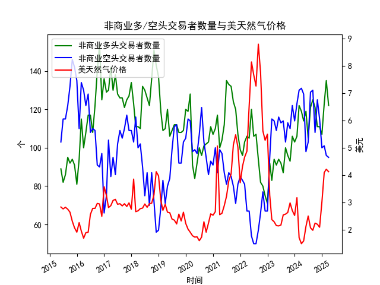

|            |   非商业多头交易者数量 |   非商业空头交易者数量 |   美天然气价格 |
|:-----------|-----------------------:|-----------------------:|---------------:|
| 2023-08-31 |                    100 |                    103 |           2.58 |
| 2023-09-30 |                     96 |                    113 |           2.64 |
| 2023-10-31 |                     93 |                    110 |           2.99 |
| 2023-11-30 |                    106 |                    122 |           2.71 |
| 2023-12-31 |                    103 |                    114 |           2.53 |
| 2024-01-31 |                    106 |                    123 |           3.18 |
| 2024-02-29 |                    122 |                    130 |           1.72 |
| 2024-03-31 |                    119 |                    131 |           1.5  |
| 2024-04-30 |                    114 |                    128 |           1.6  |
| 2024-05-31 |                    119 |                     98 |           2.13 |
| 2024-06-30 |                    105 |                    103 |           2.51 |
| 2024-07-31 |                    121 |                    129 |           2.08 |
| 2024-08-31 |                    125 |                    130 |           1.99 |
| 2024-09-30 |                    121 |                    108 |           2.25 |
| 2024-10-31 |                    111 |                    125 |           2.21 |
| 2024-11-30 |                    111 |                    115 |           2.1  |
| 2024-12-31 |                    107 |                    100 |           3.02 |
| 2025-01-31 |                    123 |                    101 |           4.1  |
| 2025-02-28 |                    135 |                     96 |           4.22 |
| 2025-03-31 |                    122 |                     95 |           4.13 |

### 近期套利机会与策略分析

#### 1. **多空持仓与价格趋势的背离**
- **数据观察**：
  - **多头持仓**：2025年1月至3月期间，多头持仓从123增至135后回落至122，显示短期投机情绪冲高后部分撤离。
  - **价格走势**：同期天然气价格从4.10美元/百万英热单位升至4.22后回落至4.13，呈现高位震荡。
- **潜在机会**：
  - **多空反转信号**：若空头持仓在价格高位时同步增加（需补充空头数据验证），可能形成“多头平仓+空头入场”的共振下跌机会，可关注短期做空。
  - **持仓与价格背离**：若价格持续上涨但多头持仓下降，警惕趋势反转，可结合技术面信号布局空单。

#### 2. **季节性波动与跨期套利**
- **季节性特征**：
  - 冬季（1-2月）需求旺季推动价格上涨，春季（3月）需求回落导致价格回调。2025年1-2月价格从4.10升至4.22，3月回落至4.13，符合季节性规律。
- **跨期策略**：
  - **买入冬季合约+卖出春季合约**：利用1-2月与3月合约价差（如1月4.10 vs. 3月4.13），若预期价差收窄，可做空价差（卖近月、买远月）。
  - **价差回归**：若历史价差显示3月价格通常低于2月，可关注2月至3月价差从+0.12到-0.09的异常波动，择机反向操作。

#### 3. **持仓集中度与市场情绪**
- **多头持仓峰值风险**：
  - 2025年2月多头持仓达135（近10年高位），需警惕“拥挤交易”风险。若价格未能突破前高，可能触发多头踩踏式平仓。
- **策略建议**：
  - **波动率策略**：在持仓集中度高的时段（如2月），买入看跌期权或宽跨式组合，押注价格大幅波动。

#### 4. **中长期趋势与基本面背离**
- **价格与持仓分化**：
  - 2024年11月至2025年3月，价格从2.10飙升至4.13，但同期多头持仓仅从111增至122，显示价格上涨更多由空头回补或供需驱动，而非投机多头推动。
- **策略建议**：
  - **基本面验证**：若库存数据、天气预测等显示供应过剩或需求不及预期，可做空远月合约，押注价格回归。

---

### 风险提示
1. **数据局限性**：空头持仓数据缺失，需结合完整的多空比分析市场情绪。
2. **流动性风险**：远月合约（如2025年3月）流动性可能较低，跨期套利需谨慎。
3. **政策与地缘风险**：美国天然气出口政策、极端天气等事件可能打破季节性规律。

**结论**：短期内关注2月多头持仓峰值后的回调风险（结合空头数据验证），跨期套利可尝试1-3月价差回归策略；中长期需跟踪库存及天气对基本面的影响。