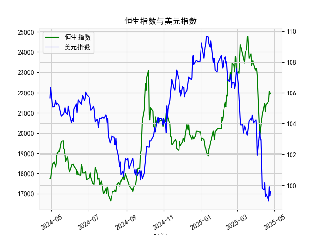

|            |   恒生指数 |   美元指数 |
|:-----------|-----------:|-----------:|
| 2025-03-26 |    23483.3 |   104.559  |
| 2025-03-27 |    23578.8 |   104.26   |
| 2025-03-28 |    23426.6 |   104.034  |
| 2025-03-31 |    23119.6 |   104.192  |
| 2025-04-01 |    23206.8 |   104.226  |
| 2025-04-02 |    23202.5 |   103.661  |
| 2025-04-03 |    22849.8 |   101.945  |
| 2025-04-07 |    19828.3 |   103.501  |
| 2025-04-08 |    20127.7 |   102.956  |
| 2025-04-09 |    20264.5 |   102.971  |
| 2025-04-10 |    20681.8 |   100.937  |
| 2025-04-11 |    20914.7 |    99.769  |
| 2025-04-14 |    21417.4 |    99.692  |
| 2025-04-15 |    21466.3 |   100.167  |
| 2025-04-16 |    21057   |    99.2667 |
| 2025-04-17 |    21395.1 |    99.424  |
| 2025-04-22 |    21562.3 |    98.9757 |
| 2025-04-23 |    22072.6 |    99.9096 |
| 2025-04-24 |    21909.8 |    99.288  |
| 2025-04-25 |    21980.7 |    99.5836 |

# 恒生指数与美元指数的相关性及影响逻辑分析

## 一、恒生指数与美元指数的相关性及影响逻辑

### 1. **负相关性特征**
恒生指数与美元指数长期呈现**负相关性**，逻辑链条如下：
- **汇率挂钩机制**：港元与美元实行联系汇率制，美元走强会直接导致**港元计价资产变贵**，削弱港股对外资的吸引力。
- **跨境资本流动**：美元指数上涨通常反映全球避险情绪升温，资金倾向于回流美元资产（如美债），导致**外资从港股撤离**，流动性收缩压制恒指。
- **企业盈利传导**：
  - **出口企业**：美元升值可能抑制以美元结算的出口企业收入（如科技、航运股）。
  - **内地业务敞口**：港股中资股收入以人民币为主，美元走强会通过**人民币被动贬值**影响财务报表汇兑损益。
- **利率联动效应**：美元走强常伴随美联储加息，港元利率被动抬升，企业融资成本上升，压制估值。

### 2. **短期背离与干扰因素**
- **中国政策刺激**：若国内释放强烈经济刺激信号（如近期房地产放松、财政扩张），可能推动恒指独立走强，弱化美元指数影响。
- **地缘政治事件**：中美关系、香港本地政策变化可能打破两者常规联动。
- **市场情绪极端化**：恐慌性抛售或狂热追涨阶段，相关性可能暂时失效。

---

## 二、近期投资机会与策略建议

### 1. **当前市场信号**
- **美元指数走势**：从提供的数据看，美元指数近期从109高位回落至103附近，显示美联储加息周期接近尾声的预期升温。
- **恒生指数表现**：若恒指伴随美元走弱出现反弹（假设数据中最后一段回升对应恒指反弹），可能形成技术面右侧机会。
- **人民币存贷差扩大**：贷款增速持续高于存款，反映**信贷扩张**和实体经济需求回暖，对港股（尤其是金融、周期股）形成基本面支撑。

### 2. **策略建议**
#### **多头策略**
- **方向性做多恒指**：
  - **触发条件**：美元指数跌破102且恒指突破22,000点阻力位。
  - **工具选择**：恒指期货、港股通ETF（如盈富基金）或高贝塔权重股（腾讯、友邦保险）。
  - **风控**：设置止损于21,500点，对应美元指数反弹至105上方。

#### **套利策略**
- **跨市场对冲套利**：
  - **做多恒指期货 + 做空美元指数期货**：捕捉两者负相关性回归的收益。
  - **期权组合**：买入恒指看涨期权（行权价22,500）的同时卖出美元看涨期权（行权价104），通过波动率差异获利。

#### **行业轮动**
- **金融与地产板块**：受益于信贷扩张和政策放松，关注汇丰控股、中银香港及龙头内房股。
- **科技股修复**：若美元进一步走弱，外资回流可能优先配置超跌科技股（如美团、快手）。

### 3. **风险提示**
- **美联储政策反复**：若美国通胀反弹导致加息预期升温，美元可能再度走强。
- **中国经济数据疲软**：信贷扩张若未能转化为实体经济复苏，可能引发盈利预期下修。
- **地缘冲突升级**：台海、中美关系紧张可能引发外资避险性抛售。

---

**结论**：当前美元指数回调与国内政策宽松形成共振，恒指存在阶段性反弹机会，建议通过多头+套利组合参与，但需密切关注美联储政策转向信号及中国经济复苏强度。