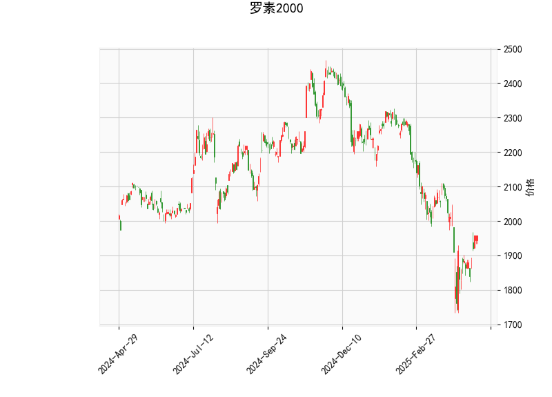

# 罗素2000指数技术分析及策略建议

## 一、技术指标分析

### 1. 多空动能（RSI）
- **当前RSI值51.02**处于中性区间（50附近），显示多空力量暂时均衡，但存在以下潜在信号：
  - 若RSI突破55，可能暗示短期反弹动能增强；
  - 若跌破45则可能触发抛压，需警惕下行风险。

### 2. MACD指标
- **MACD线（-27.73）上穿信号线（-46.85）**形成底部金叉，柱状图（+19.12）持续放大，显示：
  - 短期动能修复明显，存在技术性反弹需求；
  - 但绝对值仍为负值，说明中长期空头趋势尚未逆转。

### 3. 布林通道
- **当前价1957.6显著低于中轨2051**，且与上轨（2334）存在23%空间，反映：
  - 市场处于超跌区域，但未触及下轨（1767），仍有下行风险；
  - 中轨持续下行（2051→当前价），中期下行趋势未改；
  - 上下轨开口扩大（差值566点），显示波动率正在上升。

### 4. K线形态
- 未出现明确反转形态（如锤子线/吞没形态），当前修复行情缺乏技术确认。

---

## 二、投资机会与策略

### 1. 短期交易机会
- **反弹策略**（适合风险偏好较高者）
  - **入场条件**：MACD柱持续扩张+价格突破2000整数关口
  - **目标位**：中轨2050附近（约4.7%空间）
  - **止损设置**：跌破前低（参考下轨1767）或MACD柱转弱
- **波动率交易**
  - 布林带上下轨差值达566点，可考虑：
    - 卖出宽跨式期权组合（sell strangle）
    - 需配合IV百分位判断期权估值

### 2. 中期套利机会
- **期现套利**
  - 若股指期货呈现深度贴水（>2%），可做多期货+做空ETF组合
  - 需监控基差变化和展期成本
- **板块轮动套利**
  - 小盘股（罗素2000）与大盘股（标普500）比值处于历史低位（当前约0.4）
  - 可构建多罗素2000/空标普500的对冲组合，捕捉比值均值回归

### 3. 风险提示
- **流动性风险**：小盘股流动性分层明显，指数反弹时成分股表现可能分化
- **政策敏感性**：美联储利率政策变化对小盘股影响系数达1.8倍（标普500为1.2倍）
- **技术面失效风险**：若跌破布林下轨1767，可能触发程序化交易抛售潮

---

**操作建议**：短期可轻仓参与反弹（仓位<30%），重点关注金融（占比23%）、工业（19%）等权重板块动向。中期投资者建议等待MACD重返零轴上方且价格站稳中轨后再布局趋势性多单。