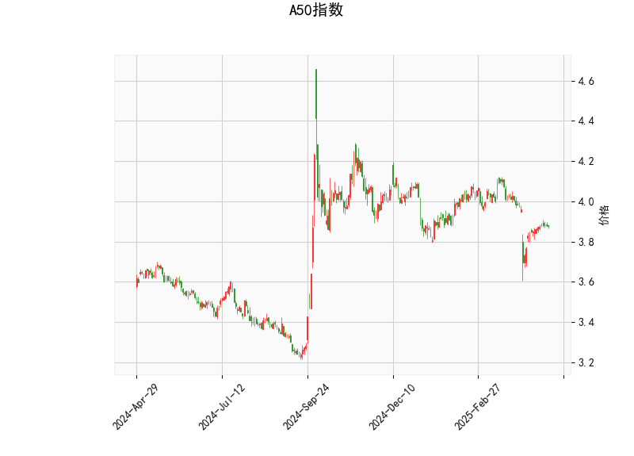

### 技术分析结果解读

#### 1. **关键指标分析**
- **当前价（3.876）与布林轨道**：
  - 当前价低于布林中轨（3.972），但接近布林下轨（3.780），表明价格处于短期下行趋势中，但可能接近支撑位。若价格企稳于下轨附近，存在反弹可能。
  - 布林带开口向下，中轨和下轨均呈下行趋势，反映短期空头占优，但下轨支撑的可靠性需结合其他指标验证。

- **RSI（44.49）**：
  - RSI处于中性偏弱区间（接近40），尚未进入超卖区域（30以下），表明市场情绪偏谨慎，但未出现极端抛压。若RSI进一步下行至30附近，可能触发超卖反弹。

- **MACD指标**：
  - MACD线（-0.0255）高于信号线（-0.0345），柱状图（0.00899）由负转正，形成短期“金叉”，暗示空头动能减弱，存在技术性反弹可能。但MACD整体仍位于零轴下方，表明中长期趋势尚未转多。

- **K线形态**：
  - **CDLHAMMER（锤头线）**：出现在下跌趋势中，通常预示底部反转信号，需结合成交量放大确认。
  - **CDLHIKKAKE（陷阱形态）**：表明市场可能通过假突破诱多/诱空后反转，需警惕短期波动风险。

---

### 投资机会与策略建议

#### 1. **短期反弹机会（多头策略）**
- **入场条件**：
  - 价格站稳布林下轨（3.780）且RSI反弹至50以上，或MACD柱状图持续扩大。
  - 若K线形态确认反转（如放量突破前一日高点），可视为短期做多信号。
- **目标与止损**：
  - **目标1**：布林中轨（3.972），突破后可看至布林上轨（4.163）。
  - **止损**：跌破布林下轨（3.780）或前低，止损幅度约2-3%。

#### 2. **趋势延续机会（空头策略）**
- **入场条件**：
  - 若价格跌破布林下轨且MACD柱状图重新转负，或RSI跌破40后加速下行，可考虑顺势做空。
- **目标与止损**：
  - **目标**：前低或下一技术支撑位（如3.700整数关口）。
  - **止损**：价格重回布林下轨上方，止损幅度约1.5-2%。

#### 3. **套利与风控建议**
- **区间波段策略**：
  - 在布林下轨（3.780）与中轨（3.972）之间高抛低吸，结合MACD金叉/死叉信号操作。
- **事件驱动对冲**：
  - 若宏观数据（如中国PMI、美联储政策）公布前市场波动率上升，可买入跨式期权组合（Long Straddle）捕捉波动。
- **风险提示**：
  - 当前K线形态（CDLHIKKAKE）暗示短期陷阱风险，需避免追涨杀跌。
  - 若价格长期徘徊于中轨下方，可能进一步打开下行空间，需动态调整仓位。

---

### 总结
A50指数短期存在技术性反弹需求，但中长期趋势仍偏空。建议以区间波段操作为主，重点关注布林带支撑/压力位及MACD动能变化，严格止损控制风险。若市场情绪改善（如政策利好或资金流入），可转为趋势跟随策略。