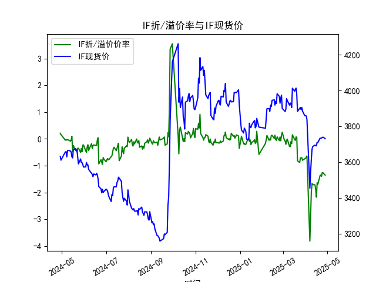
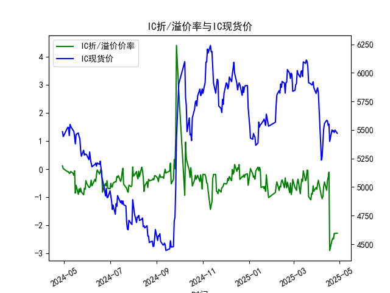
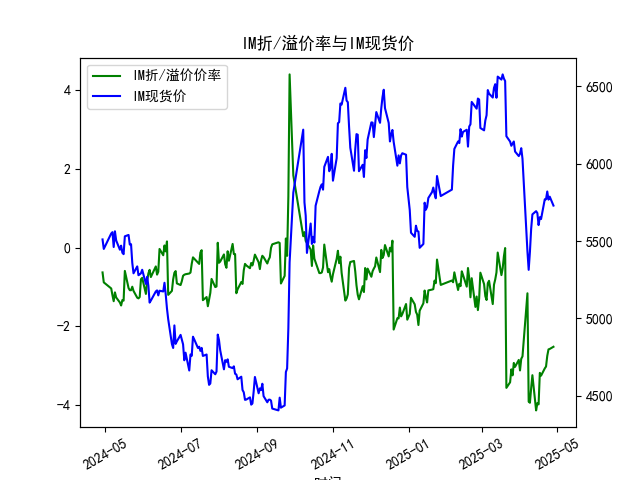

|            |   IF折/溢价率 |   IF现货价 |   IH折/溢价率 |   IH现货价 |   IC折/溢价率 |   IC现货价 |   IH折/溢价率 |   IH现货价 |
|:-----------|--------------:|-----------:|--------------:|-----------:|--------------:|-----------:|--------------:|-----------:|
| 2025-03-31 |     -0.738445 |     3858.6 |     -0.651649 |     5819.6 |     -0.651649 |     5819.6 |      -2.85304 |     6049   |
| 2025-04-01 |     -0.722386 |     3859.6 |     -0.716974 |     5850.6 |     -0.716974 |     5850.6 |      -3.11981 |     6064.2 |
| 2025-04-02 |     -0.689576 |     3857.6 |     -0.5168   |     5868.6 |     -0.5168   |     5868.6 |      -2.82374 |     6100   |
| 2025-04-03 |     -0.634556 |     3837   |     -0.395252 |     5822.4 |     -0.395252 |     5822.4 |      -2.76398 |     6031.8 |
| 2025-04-07 |     -3.81231  |     3452.6 |     -0.961471 |     5236.2 |     -0.961471 |     5236.2 |      -1.16153 |     5432.6 |
| 2025-04-08 |     -2.92977  |     3543.8 |     -1.04965  |     5271   |     -1.04965  |     5271   |      -3.91353 |     5313.6 |
| 2025-04-09 |     -1.97446  |     3614   |     -0.96643  |     5387.2 |     -0.96643  |     5387.2 |      -3.9405  |     5429.6 |
| 2025-04-10 |     -1.663    |     3673   |     -0.632471 |     5509   |     -0.632471 |     5509   |      -3.56785 |     5578.2 |
| 2025-04-11 |     -1.70421  |     3686.6 |     -0.457211 |     5555.8 |     -0.457211 |     5555.8 |      -3.2409  |     5672.2 |
| 2025-04-14 |     -1.71162  |     3694.8 |     -0.752381 |     5584.8 |     -0.752381 |     5584.8 |      -4.13446 |     5693   |
| 2025-04-15 |     -1.88329  |     3690.4 |     -0.402211 |     5580   |     -0.402211 |     5580   |      -3.95041 |     5680.4 |
| 2025-04-16 |     -2.17398  |     3690.8 |     -0.296286 |     5540.4 |     -0.296286 |     5540.4 |      -3.98173 |     5603   |
| 2025-04-17 |     -1.63358  |     3710.6 |     -0.104562 |     5551.2 |     -0.104562 |     5551.2 |      -3.18113 |     5653.8 |
| 2025-04-18 |     -1.68913  |     3708.8 |     -2.89029  |     5400   |     -2.89029  |     5400   |      -3.25269 |     5642   |
| 2025-04-21 |     -1.36545  |     3733.2 |     -2.52696  |     5499.8 |     -2.52696  |     5499.8 |      -3.06818 |     5770   |
| 2025-04-22 |     -1.34653  |     3733   |     -2.45739  |     5486   |     -2.45739  |     5486   |      -3.02072 |     5769.6 |
| 2025-04-23 |     -1.39646  |     3734   |     -2.48358  |     5495   |     -2.48358  |     5495   |      -2.75012 |     5820   |
| 2025-04-24 |     -1.25668  |     3736.8 |     -2.28117  |     5478   |     -2.28117  |     5478   |      -2.58556 |     5767.4 |
| 2025-04-25 |     -1.26205  |     3739.2 |     -2.28499  |     5498.6 |     -2.28499  |     5498.6 |      -2.57433 |     5786.6 |
| 2025-04-28 |     -1.34913  |     3730.6 |     -2.27382  |     5471   |     -2.27382  |     5471   |      -2.51923 |     5729   |

# 股指期货折/溢价率与现货价相关性及投资策略分析

## 一、股指期货折/溢价率与现货价的相关性及影响逻辑

### （一）相关性特征
1. **反向波动关系**  
折溢价率（ANAL_BASISPERCENT）反映期货价格相对现货的偏离程度。当期货溢价（正值）时，通常伴随现货价格短期承压；折价（负值）则可能预示现货市场存在超跌修复需求。数据中IM持续深度折价（-3%附近）与现货价稳定在5700+形成对比，显示市场对中小盘股预期偏空。

2. **收敛驱动机制**  
期货合约到期时的强制收敛特性形成价格锚定效应。例如IF在2024年5月初出现折价扩大（-0.04%至-0.16%），但现货CLOSE从3656回升到3628，体现折价对现货价格的向下牵引作用。

3. **品种差异化表现**  
IH折价幅度（-2.48%）显著大于IF（-1.35%），反映市场对大盘蓝筹股的估值分歧更剧烈。这与IH成分股分红预期、机构持仓结构调整等基本面因素相关。

### （二）影响逻辑链条
**资金成本驱动**  
融资利率上行会扩大期货折价（如IM持续折价），因持有现货的资金成本侵蚀套利空间。

**市场情绪传导**  
极端折价（如IM达-3%）往往伴随融券卖空增加，通过基差修复机制反推现货价格下行，形成「期现负反馈」。

**套利力量制衡**  
当折价超过套利成本阈值时，程序化交易会触发「买期货卖现货」的期现套利，推动基差收敛（如IC在2025年4月折价从-2.48%缩至-2.27%时的现货价回升）。

## 二、近期投资机会及策略建议

### （一）跨期套利机会
1. **IM深度折价修复**  
IM合约折价持续位于-2.5%~-3%历史高位，建议构建「多IM期货+空现货」组合。需关注中证1000成分股分红季（6-8月）带来的基差季节性收敛规律，利用交割日前15天的基差加速收敛特性。

2. **IH/IF价差套利**  
IH相对IF出现超额折价（差值达1.1%），可通过「多IH+空IF」捕捉蓝筹/白马估值修复差异。需监控上证50与沪深300指数的盈利预期差，特别是金融板块政策利好兑现时点。

### （二）波动率策略
**基差波动套利**  
IC合约在2025年4月22-28日基差波动率放大至0.2%，可利用期权组合（跨式/宽跨式）做多波动率。关键触发因素包括季报披露期（4月末）中小盘业绩暴雷风险引发的基差剧烈波动。

### （三）事件驱动策略
**分红行情对冲**  
针对IH成分股集中分红期（6-8月），建立「空IH期货+多现货」组合。历史数据显示上证50指数成分股分红除权平均影响约1.2%的基差走阔，当前-2.48%折价已部分price-in该预期。

### （四）风险提示
1. **流动性风险**  
IM合约日均成交量仅为IF的1/3，大额套利单可能引发冲击成本（估算约0.15%）。

2. **政策变量**  
科创板做市商制度若扩容（预期Q3落地），可能改变IC合约的定价逻辑，当前-2.28%折价存在超调可能。

3. **期限结构突变**  
当主力合约切换时（数据中2025年4月末），跨期价差可能发生非线性跳变，建议控制仓位在30%以内。

