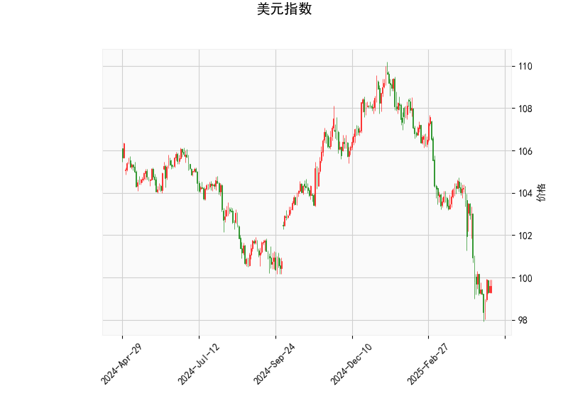

# 美元指数技术分析解读

### 1. 美元指数技术分析结果解析

#### （1）价格与布林带
- **当前价（99.58）**：位于布林带下轨（98.19）附近，且显著低于中轨（103.75），表明美元指数短期处于**超卖区域**，存在技术性反弹可能，但中期趋势仍偏空。
- **布林带形态**：上轨（109.32）与中轨（103.75）持续下行，下轨（98.19）走平，反映市场处于**空头主导**阶段，需关注价格能否站稳下轨并向上突破中轨以确认趋势反转。

#### （2）RSI与MACD
- **RSI（37.65）**：接近超卖阈值（30），但尚未触及，显示空头动能有所释放，但未形成明确反转信号。
- **MACD（-1.29）与信号线（-1.34）**：MACD柱状图（0.049）小幅转正，表明下跌动能边际减弱，但MACD仍位于零轴下方，**短期反弹需进一步验证**。

#### （3）综合判断
美元指数短期可能面临技术性反弹（因接近布林带下轨且RSI偏低），但中期下行压力未解除。若价格反弹未能突破中轨（103.75），则空头趋势仍将延续。

---

# 近期A股/港股投资机会与策略

### 1. **美元走弱背景下的市场联动**
- **港股弹性更高**：若美元指数延续弱势，港股（联系汇率制）受外资流动性驱动更敏感，可关注**恒生科技、消费龙头**等外资偏好板块。
- **A股外资流入预期**：人民币汇率若随美元走弱升值，北向资金可能回流，利好**消费（白酒/家电）、新能源**等外资重仓行业。

### 2. **跨市场套利机会**
- **A/H溢价收敛**：当前A/H股溢价指数仍处高位（约140%），可关注**券商、银行等低溢价H股**（如中信证券H、招商银行H），通过**做多H股+做空A股**对冲套利。
- **汇率对冲策略**：若预期人民币升值，可布局港股ETF（如恒生科技指数ETF）并搭配外汇远期合约锁定汇率风险。

### 3. **行业与主题策略**
- **高股息防御板块**：若市场波动加剧，**能源（中海油）、电信（中国移动H）**等高股息标的具备避险价值。
- **政策驱动机会**：
  - **A股**：关注“设备更新/消费品以旧换新”政策受益的**机械、汽车、家电**板块。
  - **港股**：互联网监管边际放松下，**平台经济龙头（腾讯、美团）**估值修复空间。

### 4. **风险提示**
- **美元反弹风险**：美国通胀数据超预期或地缘冲突升级可能推动美元反弹，需动态调整仓位。
- **国内经济数据**：4-5月宏观数据（PMI、社融）若不及预期，可能压制市场情绪，建议保留部分现金仓位。