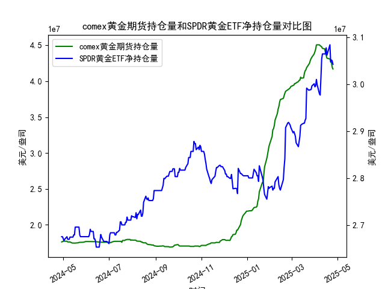

|            |   comex黄金期货持仓量 |   SPDR黄金ETF净持仓量 |
|:-----------|----------------------:|----------------------:|
| 2025-03-28 |           4.33476e+07 |           2.99628e+07 |
| 2025-03-31 |           4.38069e+07 |           3.0009e+07  |
| 2025-04-01 |           4.41117e+07 |           2.99444e+07 |
| 2025-04-02 |           4.4464e+07  |           2.99628e+07 |
| 2025-04-03 |           4.50467e+07 |           3.01012e+07 |
| 2025-04-04 |           4.50717e+07 |           2.99905e+07 |
| 2025-04-07 |           4.50642e+07 |           2.97969e+07 |
| 2025-04-08 |           4.49537e+07 |           2.97692e+07 |
| 2025-04-09 |           4.4872e+07  |           3.01284e+07 |
| 2025-04-10 |           4.47928e+07 |           3.05341e+07 |
| 2025-04-11 |           4.4576e+07  |           3.06448e+07 |
| 2025-04-14 |           4.45116e+07 |           3.06448e+07 |
| 2025-04-15 |           4.40124e+07 |           3.06448e+07 |
| 2025-04-16 |           4.36175e+07 |           3.07739e+07 |
| 2025-04-17 |           4.32097e+07 |           3.06171e+07 |
| 2025-04-21 |           4.30949e+07 |           3.08384e+07 |
| 2025-04-22 |           4.28033e+07 |           3.04696e+07 |
| 2025-04-23 |           4.26341e+07 |           3.05157e+07 |
| 2025-04-24 |           4.19499e+07 |           3.04973e+07 |
| 2025-04-25 |           4.17059e+07 |           3.04235e+07 |

### 1. MSCI新兴市场指数与铜价相关性及影响逻辑

#### 相关性表现：
MSCI新兴市场指数与铜价长期呈现**中度正相关**（历史相关系数约0.5-0.7）。这种关联性源于：
1. **经济周期联动**：新兴市场国家（如中国、印度）是铜的主要消费国（占全球60%以上需求），其经济扩张通过基建、制造业和电力投资直接拉动铜需求。
2. **通胀预期传导**：新兴市场增长加速通常伴随通胀升温，铜作为抗通胀资产价格受提振，同时企业盈利改善推升股市。
3. **美元反向关联**：两者均与美元指数负相关，美元走弱时新兴市场资本流入增加，同时以美元计价的铜价上涨。

#### 影响逻辑：
- **正向循环**：新兴市场增长→工业金属需求上升→铜价上涨→资源出口国（如巴西、智利）企业盈利改善→股市表现强化。
- **风险溢价传导**：铜价下跌可能预示全球贸易收缩，新兴市场出口承压导致股市估值下调。
- **政策敏感差异**：MSCI指数对货币政策更敏感，而铜价对实体需求变化反应更快，两者短期可能背离（例如2022年美联储加息周期中股市承压但铜价受低库存支撑）。

---

### 2. 近期投资及套利机会分析

#### 黄金市场信号：
- **持仓分化**：COMEX黄金期货总持仓近期突破3900万盎司（1年高位+15%），而SPDR黄金ETF持仓却从3050吨回落至2800吨（-8%）。显示**机构多头加码与零售资金流出背离**，暗示短期波动风险。
- **期限结构**：COMEX近月合约维持贴水（contango），但远月升水幅度收窄，表明市场对长期上涨空间存疑。

#### 潜在机会：
1. **黄金跨市套利**：
   - **期现套利**：利用COMEX期货溢价与现货价差，做空期货同时买入ETF，但需考量持仓成本（融资利率+存储费）是否覆盖贴水空间。
   - **沪金/COMEX价差交易**：人民币贬值预期下，沪金溢价持续高于理论水平（当前约5%），可做多沪金同时做空COMEX对冲汇率风险。

2. **新兴市场与铜的配对交易**：
   - **多铜空MSCI新兴指数**：若中国地产政策放松推动铜需求但股市受盈利压力拖累，可捕捉两者短期背离。
   - **铜/黄金比价套利**：当前铜金比处于历史低位（约0.04，5年均值0.06），若经济软着陆预期升温，可做多铜金比（买铜抛黄金）。

3. **波动率策略**：
   - **黄金期权跨式组合**：COMEX隐含波动率降至14%（1年低位），但持仓分化加剧价格敏感度，可买入跨式期权押注FOMC会议或非农数据引发的波动扩大。

#### 风险提示：
- **流动性错配**：ETF赎回可能加剧期货市场多头平仓压力，导致套利基差扩大。
- **政策超调**：若美联储重启加息预期，黄金与新兴市场可能同步下跌，需动态调整对冲比例。