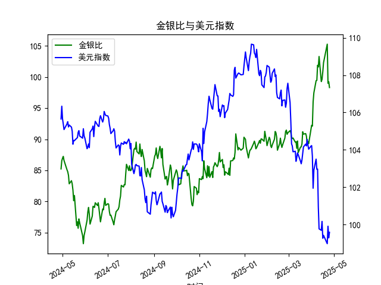

|            |    金价 |   银价 |   美元指数 |   金银比 |
|:-----------|--------:|-------:|-----------:|---------:|
| 2025-03-27 | 3056.55 | 34.11  |   104.26   |  89.6086 |
| 2025-03-28 | 3071.6  | 34.395 |   104.034  |  89.3037 |
| 2025-03-31 | 3115.1  | 34.055 |   104.192  |  91.4726 |
| 2025-04-01 | 3133.7  | 33.97  |   104.226  |  92.249  |
| 2025-04-02 | 3119.75 | 33.87  |   103.661  |  92.1095 |
| 2025-04-03 | 3118.1  | 32.475 |   101.945  |  96.0154 |
| 2025-04-04 | 3054.5  | 31.34  |   102.919  |  97.4633 |
| 2025-04-07 | 3014.75 | 30.325 |   103.501  |  99.4147 |
| 2025-04-08 | 3015.4  | 30.315 |   102.956  |  99.4689 |
| 2025-04-09 | 3075.5  | 30.18  |   102.971  | 101.905  |
| 2025-04-10 | 3143.15 | 30.925 |   100.937  | 101.638  |
| 2025-04-11 | 3230.5  | 31.27  |    99.769  | 103.31   |
| 2025-04-14 | 3204.2  | 32.275 |    99.692  |  99.2781 |
| 2025-04-15 | 3219.6  | 32.31  |   100.167  |  99.6472 |
| 2025-04-16 | 3322.9  | 32.955 |    99.2667 | 100.831  |
| 2025-04-17 | 3305.65 | 32.31  |    99.424  | 102.31   |
| 2025-04-22 | 3433.55 | 32.61  |    98.9757 | 105.291  |
| 2025-04-23 | 3262.95 | 32.96  |    99.9096 |  98.9973 |
| 2025-04-24 | 3314.75 | 33.395 |    99.288  |  99.2589 |
| 2025-04-25 | 3277.3  | 33.335 |    99.5836 |  98.3141 |

### 1. 金银比与美元指数的相关性及影响逻辑

#### 相关性分析
金银比（黄金价格/白银价格）与美元指数在多数情况下呈现**负相关性**，但具体关系需结合市场背景：
- **美元走强**：通常压制以美元计价的黄金和白银价格，但由于黄金的避险属性更强，其跌幅可能小于白银（尤其在风险偏好上升时），导致金银比**被动上升**。
- **美元走弱**：贵金属价格普遍上涨，但黄金因流动性更高、避险属性更突出，涨幅可能超过白银（尤其在市场避险情绪主导时），导致金银比**主动扩大**。

#### 影响逻辑
1. **美元指数作为计价货币**：美元强弱直接影响黄金和白银的美元标价。美元走强使两者承压，但白银因工业属性（与经济周期相关）更敏感，跌幅可能更大。
2. **避险需求分化**：黄金的避险属性强于白银。当市场恐慌时，黄金需求激增而白银受工业需求拖累，金银比上升；反之，经济复苏时白银表现可能优于黄金。
3. **货币政策预期**：美联储加息预期推升美元，同时抑制通胀预期，可能压制白银（工业金属属性）更甚，间接推高金银比。

---

### 2. 近期投资或套利机会与策略

#### 当前数据特征
- **金银比趋势**：从85升至103附近（历史高位），近期略有回落但仍处高位。
- **美元指数走势**：从105震荡下行至99附近，近期企稳反弹。

#### 机会与策略
1. **金银比均值回归套利**：
   - **逻辑**：金银比已突破100，远高于历史均值（约60-80），存在高估风险。若经济复苏预期增强或通胀回升，白银工业需求可能改善，驱动比值回落。
   - **操作**：做空白银比（即做多白银+做空黄金），需结合止损（如金银比突破105则平仓）。
   - **风险**：地缘冲突或通缩预期可能延续黄金强势，需关注宏观经济数据。

2. **美元反弹与黄金对冲**：
   - **逻辑**：美元指数近期从低点反弹，若美联储加息预期重燃，可能压制贵金属价格。但黄金抗跌性更强，可做多美元同时做多黄金对冲。
   - **操作**：做多美元指数期货+轻仓做多黄金，利用金银比波动性收窄获利。

3. **事件驱动策略**：
   - **场景1**：若美国经济数据（如非农、CPI）弱于预期，美元走弱+通胀预期回升，可做多白银（受益于工业需求+贵金属属性）。
   - **场景2**：若地缘风险升温，优先做多黄金并观望白银，因避险需求可能进一步推高金银比。

#### 关键风险提示
- **流动性冲击**：贵金属市场流动性差异可能导致套利价差短期扩大。
- **政策转向**：美联储货币政策超预期变化可能同时冲击美元和贵金属定价逻辑。
- **工业需求波动**：新能源（如光伏）对白银需求的变化可能打破传统金银比规律。