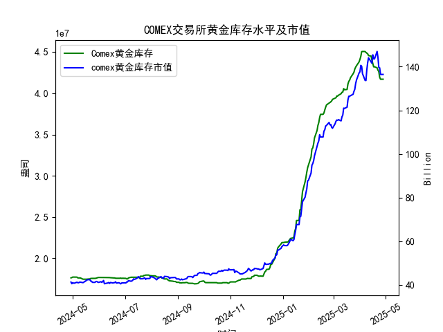

|            |   comex黄金库存量 |   comex黄金库存市值(billion) |   伦敦金现货价 |   上海金交所黄金现货价 |   美元兑人民币汇率 |
|:-----------|------------------:|-----------------------------:|---------------:|-----------------------:|-------------------:|
| 2025-04-01 |       4.41117e+07 |                       3120.6 |        3133.7  |                 735.84 |             7.1775 |
| 2025-04-02 |       4.4464e+07  |                       3162.3 |        3119.75 |                 732.5  |             7.1793 |
| 2025-04-03 |       4.50467e+07 |                       3112.6 |        3118.1  |                 738.94 |             7.1889 |
| 2025-04-04 |       4.50717e+07 |                       3035.6 |        3054.5  |                 738.94 |             7.1889 |
| 2025-04-07 |       4.50642e+07 |                       2968   |        3014.75 |                 713.98 |             7.198  |
| 2025-04-08 |       4.49537e+07 |                       2973.3 |        3015.4  |                 717.5  |             7.2038 |
| 2025-04-09 |       4.4872e+07  |                       3087.2 |        3075.5  |                 728.88 |             7.2066 |
| 2025-04-10 |       4.47928e+07 |                       3166   |        3143.15 |                 741.26 |             7.2092 |
| 2025-04-11 |       4.4576e+07  |                       3233   |        3230.5  |                 757.1  |             7.2087 |
| 2025-04-14 |       4.45116e+07 |                       3195   |        3204.2  |                 762.47 |             7.211  |
| 2025-04-15 |       4.40124e+07 |                       3216.5 |        3219.6  |                 762.9  |             7.2096 |
| 2025-04-16 |       4.36175e+07 |                       3334.3 |        3322.9  |                 781.62 |             7.2133 |
| 2025-04-17 |       4.32097e+07 |                       3323.1 |        3305.65 |                 786    |             7.2085 |
| 2025-04-18 |       4.32097e+07 |                       3323.1 |        3305.65 |                 788.62 |             7.2069 |
| 2025-04-21 |       4.30949e+07 |                       3411.1 |        3305.65 |                 804.11 |             7.2055 |
| 2025-04-22 |       4.28033e+07 |                       3371.6 |        3433.55 |                 825.8  |             7.2074 |
| 2025-04-23 |       4.26341e+07 |                       3276.9 |        3262.95 |                 786.99 |             7.2116 |
| 2025-04-24 |       4.19499e+07 |                       3325.5 |        3314.75 |                 792.47 |             7.2098 |
| 2025-04-25 |       4.17059e+07 |                       3272.2 |        3277.3  |                 785.6  |             7.2066 |
| 2025-04-28 |       4.17059e+07 |                       3272.2 |        3277.3  |                 785.6  |             7.2043 |

### 近期COMEX黄金库存及市场套利机会分析

#### 1. **COMEX库存变化与市场信号**
- **库存趋势**：近一个月（2025年3月底至4月底）COMEX黄金库存从4280万盎司降至4170万盎司，降幅约2.6%，显示市场交割需求增强或供应收紧。库存减少通常与价格上涨预期相关，但需结合价格走势判断。
- **库存与价格背离**：尽管库存下降，同期伦敦和上海金价均出现回调（伦敦从3433→3277美元/盎司，上海从825→785元/克），可能与美元走强或避险情绪降温有关。**库存下降但价格下跌的背离**可能隐含短期超卖风险，需警惕价格修复机会。

#### 2. **跨市场套利机会（伦敦 vs 上海）**
- **价差测算**：以4月28日数据为例，伦敦金价3277.3美元/盎司，汇率7.2043，换算为人民币后：  
  **3277.3 × 7.2043 / 31.1035 ≈ 759元/克**，上海金价785.6元/克，**价差26.6元/克**。扣除运输、保险等成本（假设约15-20元/克），仍存在约6-11元/克利润空间。
- **趋势验证**：近一个月价差持续扩大（如4月22日伦敦→上海价差29.8元/克），显示**买入伦敦黄金、卖出上海黄金的跨市场套利窗口**打开。需关注人民币汇率波动对利润的影响。

#### 3. **期现套利策略（需期货数据补充）**
- **假设场景**：若COMEX期货价格显著高于现货，可通过**买入现货、卖空期货**锁定价差；反之则反向操作。当前库存下降可能支撑近月合约价格，若远月贴水扩大，可捕捉跨期套利机会。

#### 4. **风险与建议**
- **政策风险**：中国黄金进口管制可能增加跨市场套利难度，需提前确认交割合规性。
- **流动性风险**：价差收窄时需快速平仓，避免因市场反转导致亏损。
- **操作建议**：  
  - **优先跨市场套利**：利用伦敦-上海价差，在人民币汇率稳定窗口期执行。  
  - **监控库存与价格联动**：若COMEX库存继续下降且金价企稳，可布局多单对冲空头风险。  
  - **结合宏观事件**：美联储政策、地缘冲突等可能扰动金价，需动态调整策略。

### 结论
近期COMEX库存下降与中欧美价差扩大提供了明确的套利信号，**跨市场操作（伦敦-上海）为最优策略**，需快速执行并严格风控。若库存加速下降且金价反弹，可进一步关注期现套利机会。