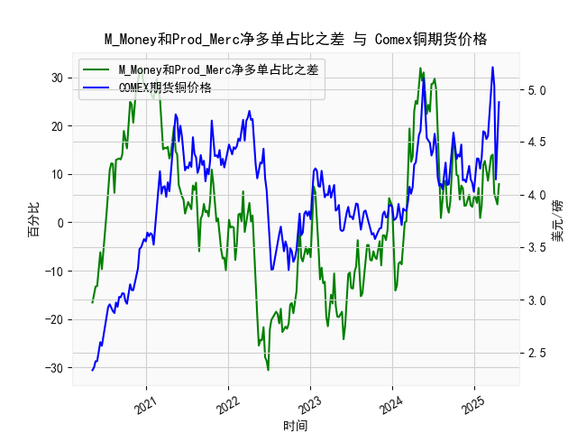

|            |   M_Money净多单占比 |   Prod_Merc净多单占比 |   Comex铜期货价格 |   M_Money和Prod_Merc净多单占比之差 |
|:-----------|--------------------:|----------------------:|------------------:|-----------------------------------:|
| 2024-12-10 |                34.9 |                  40.6 |            4.272  |                                5.7 |
| 2024-12-17 |                35.8 |                  39.3 |            4.1465 |                                3.5 |
| 2024-12-24 |                35.7 |                  38.9 |            4.11   |                                3.2 |
| 2024-12-31 |                35   |                  40.2 |            4.0265 |                                5.2 |
| 2025-01-07 |                35.8 |                  41   |            4.1955 |                                5.2 |
| 2025-01-14 |                36.6 |                  40.6 |            4.3425 |                                4   |
| 2025-01-21 |                33.8 |                  40.9 |            4.341  |                                7.1 |
| 2025-01-28 |                36.1 |                  37   |            4.2465 |                                0.9 |
| 2025-02-04 |                35.5 |                  39.1 |            4.3535 |                                3.6 |
| 2025-02-11 |                30.8 |                  42.6 |            4.601  |                               11.8 |
| 2025-02-18 |                29.9 |                  42.6 |            4.591  |                               12.7 |
| 2025-02-25 |                30.7 |                  41.3 |            4.5275 |                               10.6 |
| 2025-03-04 |                32.1 |                  40.7 |            4.5565 |                                8.6 |
| 2025-03-11 |                30.3 |                  41.8 |            4.766  |                               11.5 |
| 2025-03-18 |                28.8 |                  42.5 |            5.0165 |                               13.7 |
| 2025-03-25 |                28.1 |                  42.1 |            5.2105 |                               14   |
| 2025-04-01 |                32.4 |                  38.4 |            5.035  |                                6   |
| 2025-04-08 |                32.2 |                  36.8 |            4.144  |                                4.6 |
| 2025-04-15 |                33.5 |                  37.2 |            4.626  |                                3.7 |
| 2025-04-22 |                32.1 |                  40   |            4.878  |                                7.9 |

### 1. M_Money与Prod_Merc净多单占比之差与Comex铜价的相关性及影响逻辑

#### 相关性分析
- **指标定义**：
  - **M_Money（非商业多头持仓占比）**：代表投机资金（如对冲基金、资管机构）对铜价的看涨押注，通常与市场情绪和短期价格波动强相关。
  - **Prod_Merc（商业多头持仓占比）**：代表实体企业（如矿商、贸易商）的套保需求，通常反映长期供需预期。
  - **两者之差（M_Money - Prod_Merc）**：体现投机资金与实体企业对铜价预期的分歧。差值为正时，投机资金看涨情绪强于套保需求；为负时则相反。

- **历史数据表现**：
  - **正向差值扩张阶段**（如差值从-16.6逐步升至32.1）：伴随铜价从2.33美元/磅涨至4.89美元/磅。投机资金主导市场，推动价格趋势性上涨。
  - **差值高位震荡阶段**（如差值在20-32区间波动）：铜价维持高位但波动加剧，反映投机情绪过热后供需基本面逐渐修正。
  - **差值快速转负阶段**（如差值从15.3降至-30.6）：铜价从4.7美元/磅跌至3.28美元/磅，实体企业套保压力增加，投机资金撤离引发价格回调。

#### 影响逻辑
1. **投机资金驱动短期价格**：  
   M_Money占比上升时，投机资金通过杠杆放大价格波动，尤其在铜价突破关键阻力位或市场流动性宽松时（如2021年差值达32.1，铜价突破4.8美元/磅）。

2. **实体企业套保抑制价格泡沫**：  
   Prod_Merc占比上升常伴随铜价高位回落。例如，2022年差值从27.9降至-30.6，实体企业在高铜价下加大套保卖盘，最终铜价从5.21美元/磅暴跌至3.28美元/磅。

3. **分歧差值作为领先指标**：  
   - **差值拐点领先价格拐点**：例如2023年差值从-19.6反弹至19.4，铜价随后从3.76美元/磅回升至4.87美元/磅，反映投机资金提前布局复苏预期。
   - **极端差值预示反转风险**：2021年差值达32.1（历史高位），铜价随后见顶回落，显示市场情绪过度乐观后的修正需求。

---

### 2. 近期投资或套利机会与策略

#### 当前数据特征（截至最新数据点）
- **差值变化**：从-14.1逐步反弹至8.2，最新值为7.9，显示投机资金看涨情绪回暖。
- **铜价走势**：从4.87美元/磅回落至4.62美元/磅后企稳，近期波动区间为4.1-4.8美元/磅。

#### 机会与策略
1. **趋势性做多机会**：
   - **逻辑**：差值从底部回升且铜价未创新低，暗示投机资金重新入场。若差值持续扩大（如突破10），可能推动铜价上探4.8-5.0美元/磅区间。
   - **策略**：  
     - **入场信号**：差值连续两周站稳10以上，且铜价突破4.8美元/磅。  
     - **目标**：前高5.21美元/磅；止损位：4.5美元/磅（对应差值跌破0）。

2. **套利策略（跨期套利）**：
   - **逻辑**：当前近月合约价格（4.62美元/磅）与远月价差收窄，若差值回升伴随库存低位，可能引发近月合约补涨。
   - **策略**：  
     - **多近月（如COMEX 3月合约）空远月（如12月合约）**，价差目标扩大至0.3美元/磅以上。

3. **均值回归策略**：
   - **逻辑**：当前差值7.9仍低于5年均值（约15），若实体企业套保未显著增加（差值维持正值），可博弈差值向均值回归。
   - **策略**：  
     - **分批建仓多单**，每差值增加2加仓一次，目标铜价4.8美元/磅。

#### 风险提示
- **宏观风险**：美联储货币政策转向或全球经济衰退预期可能压制铜价。
- **持仓数据滞后性**：CFTC数据反映前一周仓位，需结合实时基本面（如LME库存、中国需求数据）验证趋势。