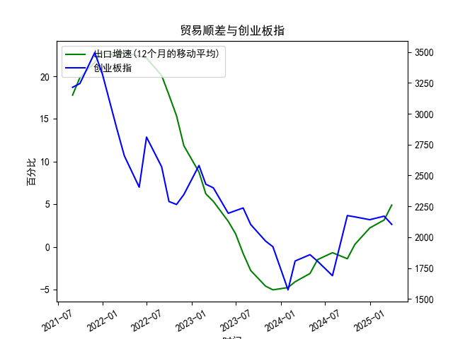

|            |   出口增速 |   创业板指 |   出口增速(12个月的移动平均) |
|:-----------|-----------:|-----------:|-----------------------------:|
| 2022-11-30 | -10.38     |    2345.31 |                    11.86     |
| 2023-01-31 | -12.0231   |    2580.84 |                     8.76724  |
| 2023-02-28 |  -2.86551  |    2429.03 |                     6.22011  |
| 2023-03-31 |  10.84     |    2399.5  |                     5.33261  |
| 2023-05-31 |  -7.56172  |    2193.41 |                     2.98747  |
| 2023-06-30 | -12.3776   |    2215    |                     1.53184  |
| 2023-07-31 | -14.2563   |    2236.67 |                    -0.776185 |
| 2023-08-31 |  -8.5529   |    2102.58 |                    -2.77643  |
| 2023-10-31 |  -6.61276  |    1968.23 |                    -4.60916  |
| 2023-11-30 |   0.693013 |    1922.59 |                    -5.04057  |
| 2024-01-31 |   7.69     |    1573.37 |                    -4.77057  |
| 2024-02-29 |   6.25     |    1807.03 |                    -4.09641  |
| 2024-04-30 |   1.33     |    1858.39 |                    -3.12057  |
| 2024-05-31 |   7.42     |    1805.11 |                    -1.50031  |
| 2024-07-31 |   6.93     |    1688.14 |                    -0.684019 |
| 2024-09-30 |   2.35     |    2175.09 |                    -1.39152  |
| 2024-10-31 |  12.65     |    2164.46 |                     0.292791 |
| 2024-12-31 |  10.69     |    2141.6  |                     2.21509  |
| 2025-02-28 |  -3        |    2170.39 |                     3.15311  |
| 2025-03-31 |  12.4      |    2103.7  |                     4.89919  |

### 中国出口增速与创业板指的相关性及影响逻辑

#### 1. **相关性分析**
从数据趋势来看，中国出口增速与创业板指在近5年中呈现阶段性正相关性，但整体关联度受多重因素影响：
- **经济周期同步性**：出口增速回升往往伴随全球经济回暖或国内供应链修复，市场对成长型企业的盈利预期改善（如科技、新能源等高弹性板块），推动创业板指上涨。例如，出口增速从2022年低谷（-5.04%）回升至2023年的4.89%时，创业板指同期从1573点反弹至2100点以上。
- **市场情绪传导**：出口数据作为宏观经济先行指标，其改善可能增强投资者风险偏好，吸引资金流入高波动的成长股；反之，出口疲软可能引发避险情绪，压制创业板估值。
- **结构性差异**：创业板企业以内需驱动为主，与出口的直接关联较弱，但出口复苏可能通过“产业链传导”（如电子、机械设备等出口相关行业）间接带动创业板成分股业绩。

#### 2. **影响逻辑**
- **正向传导路径**：  
  出口增长 → 制造业景气度提升 → 科技/高端制造产业链需求增加 → 创业板企业盈利预期改善 → 创业板指上涨。  
- **反向制约因素**：  
  出口下滑 → 经济下行压力加大 → 政策宽松预期升温 → 流动性宽松利好成长股估值 → 创业板指阶段性抗跌（但长期依赖盈利兑现）。  
- **外部干扰项**：汇率波动（如人民币贬值利好出口但压制外资流入）、海外科技周期（如全球半导体需求影响创业板电子板块）可能打破两者短期相关性。

---

### 近期投资或套利机会与策略

#### 1. **趋势性机会**
- **出口链成长股补涨**：若出口增速持续回升（如近期4.89%的增速），可关注创业板中与出口间接相关的细分龙头（如新能源车零部件、光伏设备、消费电子），这些板块可能滞后于传统出口行业启动。
- **创业板指左侧布局**：当前创业板指处于近5年低位（2100点附近），若出口数据进一步验证经济复苏，可逢低配置创业板ETF或指数增强基金，博弈估值修复。

#### 2. **套利策略**
- **跨市场配对交易**：若观察到出口增速与创业板指短期背离（例如出口改善但创业板滞涨），可做多创业板指期货/ETF，同时做空与出口强相关的沪深300周期板块，对冲系统性风险。
- **行业轮动套利**：出口增速触底反弹初期，优先增配创业板中出口敏感度较高的行业（如电子、医疗器械），减持内需主导板块（如软件服务）。

#### 3. **风险提示**
- **数据滞后风险**：出口增速为12个月移动平均，对实时景气度反映较慢，需结合高频数据（如PMI新出口订单）验证。
- **政策扰动**：若稳增长政策加码（如大规模基建投资），可能分流创业板资金至传统板块，削弱出口增速与创业板的关联性。
- **海外流动性**：美联储加息周期尾声可能缓解创业板成长股估值压力，但需警惕美债收益率反弹导致的全球成长股共振下跌。

---

### 总结
**核心逻辑**：出口增速与创业板指在中短期内存在“经济复苏预期驱动”的正向联动，但需警惕结构性分化和外部冲击。  
**策略建议**：短期关注出口链成长股超跌反弹，中期布局创业板指估值修复，同时通过跨市场对冲规避系统性风险。