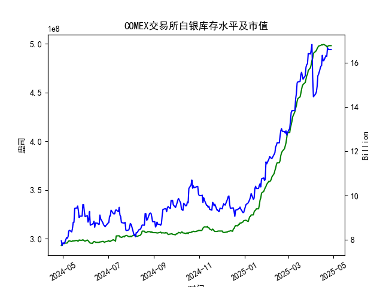

|            |   comex白银库存量 |   comex白银库存市值(billion) |   伦敦银现货价 |   上海金交所白银现货价 |   美元兑人民币汇率 |
|:-----------|------------------:|-----------------------------:|---------------:|-----------------------:|-------------------:|
| 2025-04-01 |       4.78458e+08 |                       34.625 |         33.97  |                   8414 |             7.1775 |
| 2025-04-02 |       4.8257e+08  |                       34.855 |         33.87  |                   8386 |             7.1793 |
| 2025-04-03 |       4.84931e+08 |                       31.625 |         32.475 |                   8263 |             7.1889 |
| 2025-04-04 |       4.90077e+08 |                       29.515 |         31.34  |                   8263 |             7.1889 |
| 2025-04-07 |       4.92042e+08 |                       29.65  |         30.325 |                   7606 |             7.198  |
| 2025-04-08 |       4.92994e+08 |                       29.775 |         30.315 |                   7689 |             7.2038 |
| 2025-04-09 |       4.94816e+08 |                       30.17  |         30.18  |                   7746 |             7.2066 |
| 2025-04-10 |       4.96236e+08 |                       31.05  |         30.925 |                   7939 |             7.2092 |
| 2025-04-11 |       4.97475e+08 |                       31.115 |         31.27  |                   7984 |             7.2087 |
| 2025-04-14 |       4.98195e+08 |                       31.8   |         32.275 |                   8107 |             7.211  |
| 2025-04-15 |       4.98847e+08 |                       31.8   |         32.31  |                   8139 |             7.2096 |
| 2025-04-16 |       4.98569e+08 |                       32.755 |         32.955 |                   8230 |             7.2133 |
| 2025-04-17 |       4.99104e+08 |                       32.23  |         32.31  |                   8143 |             7.2085 |
| 2025-04-18 |       4.99104e+08 |                       32.23  |         32.31  |                   8142 |             7.2069 |
| 2025-04-21 |       4.97895e+08 |                       32.785 |         32.31  |                   8227 |             7.2055 |
| 2025-04-22 |       4.96698e+08 |                       32.785 |         32.61  |                   8154 |             7.2074 |
| 2025-04-23 |       4.96891e+08 |                       33.55  |         32.96  |                   8191 |             7.2116 |
| 2025-04-24 |       4.97741e+08 |                       33.325 |         33.395 |                   8295 |             7.2098 |
| 2025-04-25 |       4.97908e+08 |                       33.325 |         33.335 |                   8270 |             7.2066 |
| 2025-04-28 |       4.97908e+08 |                       33.325 |         33.335 |                   8270 |             7.2043 |

### 近期COMEX白银库存及市场套利机会分析

#### 1. **库存与市值变化**
- **库存趋势**：近一个月（2025-04-22至2025-04-28）COMEX白银库存稳定在约**4.979亿盎司**，但库存市值从**15.08亿**美元升至**16.59亿**美元，增幅近10%。这表明白银现货价格在此期间显著上涨，推动库存价值攀升。
- **隐含信号**：库存总量持平而市值上升，可能反映市场对白银的囤积需求或对未来供应紧张的预期。

#### 2. **跨市场价差套利（伦敦 vs 上海）**
- **价格对比**：
  - **伦敦现货**：近一个月价格稳定在**32.61-33.395美元/盎司**。
  - **上海现货**：同期价格从**8154元/千克**涨至**8270元/千克**（人民币计价）。
- **汇率换算**：美元兑人民币汇率从**7.2074**升至**7.2043**（人民币小幅升值）。
  - **伦敦价换算为人民币**：32.61美元/盎司 × 7.2043 ≈ **235元/盎司** → 折合**7554元/千克**（1盎司=31.1035克）。
  - **上海价差**：上海现货价格（8270元/千克）高于伦敦换算价（7554元/千克），理论价差达**716元/千克**，扣除物流和关税成本（约400-500元/千克），仍存在**200-300元/千克**的潜在套利空间。

**策略建议**：通过进口伦敦白银并在上海市场抛售，锁定价差利润。需关注中国进口政策（如配额限制）及运输时效风险。

#### 3. **期现套利（COMEX期货 vs 现货）**
- **库存与价格关系**：COMEX库存持平时现货价格走强，可能表明期货市场存在溢价（Contango）或现货需求旺盛。
- **操作逻辑**：若期货价格显著高于现货价格+持仓成本（仓储、资金利息），可做空期货、买入现货交割套利。需监控近期合约升贴水结构。

#### 4. **跨期套利（期限结构变化）**
- **期限结构观察**：近一个月库存总量未明显增加，但市值上升可能反映市场预期未来价格继续走强，导致远月合约溢价扩大。
- **策略建议**：若远月合约升水幅度超过持仓成本，可考虑“买近抛远”的跨期套利，赚取价差收敛收益。

#### 5. **逼仓风险与库存博弈**
- **逼仓信号**：库存总量停滞而价格快速上涨，需警惕部分机构通过控制仓单推高近月合约价格。若近月合约持仓量集中且交割意愿低，可能引发短期价格异动。
- **应对策略**：避免单边裸空近月合约，可结合期权策略（如买入看跌期权）对冲风险。

---

### 综合建议
- **优先关注跨市场套利**：伦敦与上海价差空间显著，需快速执行并锁定汇率风险（如使用远期结汇）。
- **警惕政策风险**：中国对贵金属进口的管制可能影响套利通道的畅通性。
- **动态监控库存与持仓**：COMEX库存若突然放量增长，可能逆转当前价差逻辑，需设置止损机制。

**风险提示**：地缘政治、美联储政策及工业需求波动可能加剧白银价格短期波动，需结合宏观事件调整策略。