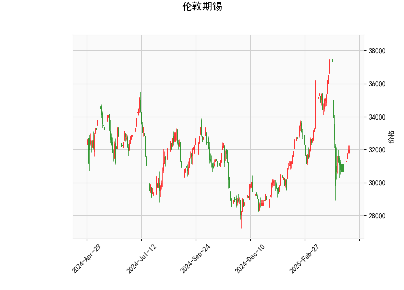

### 1. 技术分析结果解读

#### （1）价格与布林轨道
- **当前价**（31975.0）位于布林带**中轨（33047.58）和下轨（29063.67）之间**，表明价格处于短期弱势区域，但尚未触及下轨支撑。
- **布林带收窄**：上轨（37031.50）与下轨（29063.67）的间距较大，显示市场波动性较高，需警惕潜在突破风险。

#### （2）RSI指标
- **RSI为46.79**，接近中性区间（50附近），显示多空力量暂时平衡，但略微偏弱。需结合其他指标判断是否可能转向超卖（若RSI跌破30）或超买（突破70）。

#### （3）MACD指标
- **MACD线（-632.63）上穿信号线（-662.48）**，且**柱状图（29.85）转正**，形成短期“金叉”，暗示下跌动能减弱，可能迎来技术性反弹。
- **整体趋势仍偏空**：MACD和信号线均位于零轴下方，表明中长期空头趋势未改，反弹可能为短期修正。

#### （4）K线形态
- **CDLGAPSIDESIDEWHITE**（侧面间隙的白色蜡烛）：通常出现在趋势延续或盘整阶段，显示多空双方争夺激烈但未形成方向性突破，需结合后续K线确认。

---

### 2. 投资/套利机会与策略

#### （1）短期反弹机会
- **看多条件**：若价格站稳布林中轨（33047.58）且MACD柱状图持续扩大，可轻仓试多，目标价看向上轨（37031.50），止损设于当前价下方（如31500附近）。
- **风险提示**：MACD仍位于零轴下方，反弹可能受制于中轨压力，需警惕假突破。

#### （2）下轨支撑策略
- **超跌反弹**：若价格接近布林下轨（29063.67）且RSI跌破30（超卖），可分批布局多单，止损设于下轨下方2%~3%（如28000），目标中轨附近。
- **套利补充**：结合跨期价差（如近月合约超跌、远月合约贴水），可尝试正向套利（买近卖远）。

#### （3）趋势反转预警
- **空头策略**：若价格反弹至中轨（33047.58）后回落且MACD柱状图转负，可逢高做空，目标下轨，止损设于中轨上方。
- **关键信号**：需关注RSI是否同步拐头向下，以及K线是否出现看跌吞没、乌云盖顶等形态。

---

### 3. 综合建议
- **谨慎观望**：当前价格处于震荡区间，RSI中性，MACD金叉尚未确认趋势反转，建议等待更明确的突破信号。
- **动态跟踪**：若基本面（如库存、供需）出现利多消息，可能加速价格向上突破布林中轨；反之，经济衰退预期或库存增加可能压制反弹空间。