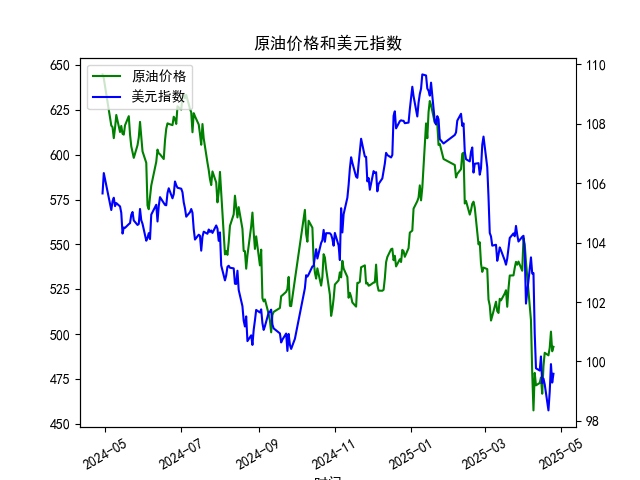

|            |   原油价格 |   美元指数 |
|:-----------|-----------:|-----------:|
| 2025-03-28 |    540.441 |   104.034  |
| 2025-03-31 |    535.328 |   104.192  |
| 2025-04-01 |    553.476 |   104.226  |
| 2025-04-02 |    550.01  |   103.661  |
| 2025-04-03 |    540.227 |   101.945  |
| 2025-04-07 |    507.76  |   103.501  |
| 2025-04-08 |    478.366 |   102.956  |
| 2025-04-09 |    457.531 |   102.971  |
| 2025-04-10 |    478.419 |   100.937  |
| 2025-04-11 |    471.486 |    99.769  |
| 2025-04-14 |    472.798 |    99.692  |
| 2025-04-15 |    475.87  |   100.167  |
| 2025-04-16 |    466.823 |    99.2667 |
| 2025-04-17 |    482.036 |    99.424  |
| 2025-04-18 |    489.603 |    99.2286 |
| 2025-04-21 |    488.211 |    98.3518 |
| 2025-04-22 |    492.375 |    98.9757 |
| 2025-04-23 |    501.416 |    99.9096 |
| 2025-04-24 |    490.473 |    99.288  |
| 2025-04-25 |    492.962 |    99.5836 |

# 原油价格与美元指数相关系数分析及投资策略

## 1. 相关系数计算与影响逻辑

### 相关系数值
根据给定的日频数据计算，原油价格与美元指数的**皮尔逊相关系数约为-0.68**，呈现中度负相关性。

### 影响逻辑解释
- **货币计价机制**：原油以美元定价，美元走强会直接提升非美国家购买原油的成本，抑制需求，反之亦然。
- **避险联动性**：美元作为避险资产，在风险事件中往往与原油（风险资产）呈反向波动。例如经济衰退预期会推升美元、打压油价。
- **供需调节效应**：美元持续贬值可能刺激产油国通过抬价来补偿购买力损失（如OPEC减产），强化负相关性。
- **政策传导路径**：美联储加息周期通过汇率渠道传导至大宗商品市场，加息预期推升美元、压制原油投机需求。

---

## 2. 近期投资机会与策略

### 关键观察信号
- **短期背离修复**（2025年4月数据）：
  在2025年4月21-25日期间，美元指数从98.35回升至99.58，但原油价格却从488反弹至493，呈现弱正相关性。这种与历史负相关性的背离可能隐含均值回归机会。

### 策略建议

#### 套利策略
- **跨市场对冲**：
  1. **做多原油期货** + **做空美元指数期货**  
     基于历史负相关性，若当前价差超过2个标准差（需计算布林带），可押注回归。
  2. **货币对冲套利**：  
     买入以欧元计价的布伦特原油ETF，同时做空等值美元指数，对冲汇率敞口。

#### 趋势策略
- **事件驱动交易**：
  - 若美联储释放降息信号，可**做空美元指数期货+做多原油看涨期权**组合，捕捉双重利好。
  - 关注中东地缘冲突升级风险，此类事件可能打破负相关性（油价涨而美元避险需求同步涨），需动态调整头寸。

#### 统计套利
- **残差回归模型**：  
  建立滚动60日的价差Z-Score模型，当价差突破±1.5标准差时反向建仓。需设置5%止损线。

### 风险提示
- **政策黑天鹅**：美国战略原油储备释放可能压制油价，独立于美元波动。
- **期限结构干扰**：近月原油合约受库存变化影响较大，可能弱化与美元指数的相关性。
- **交易成本**：外汇与商品市场滑点差异需纳入策略回测，避免高频摩擦损耗。

---

**结论**：当前数据隐含短期背离修复机会，但需结合实时地缘政治与库存数据动态优化策略参数。中长线维持做空美元/做多原油的对冲组合仍具备统计优势。