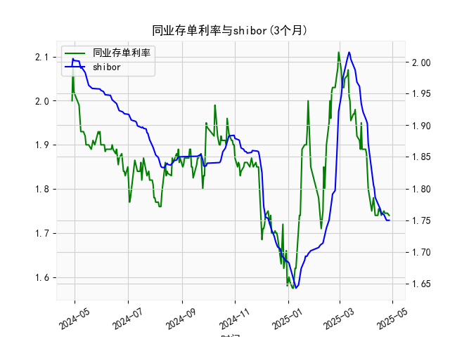

|            |   同业存单利率(3个月) |   shibor(3个月) |
|:-----------|----------------------:|----------------:|
| 2025-03-31 |                 1.89  |           1.912 |
| 2025-04-01 |                 1.88  |           1.907 |
| 2025-04-02 |                 1.85  |           1.902 |
| 2025-04-03 |                 1.8   |           1.871 |
| 2025-04-07 |                 1.75  |           1.824 |
| 2025-04-08 |                 1.77  |           1.81  |
| 2025-04-09 |                 1.78  |           1.806 |
| 2025-04-10 |                 1.76  |           1.8   |
| 2025-04-11 |                 1.74  |           1.786 |
| 2025-04-14 |                 1.74  |           1.777 |
| 2025-04-15 |                 1.755 |           1.775 |
| 2025-04-16 |                 1.75  |           1.772 |
| 2025-04-17 |                 1.75  |           1.767 |
| 2025-04-18 |                 1.74  |           1.761 |
| 2025-04-21 |                 1.75  |           1.759 |
| 2025-04-22 |                 1.745 |           1.755 |
| 2025-04-23 |                 1.745 |           1.753 |
| 2025-04-24 |                 1.745 |           1.75  |
| 2025-04-25 |                 1.745 |           1.75  |
| 2025-04-27 |                 1.74  |           1.75  |

# 同业存单利率与SHIBOR的相关性及投资策略分析

---

## 一、同业存单利率与SHIBOR的相关性及影响逻辑

### 1. **定义与定价基础**
- **同业存单利率**：反映银行间市场对AAA级金融机构3个月期同业存单的发行定价，由市场供需决定，受流动性、信用风险溢价和货币政策影响。
- **SHIBOR（上海银行间同业拆放利率）**：由18家报价行提供的无担保短期资金成本，代表银行间市场信用资质最优机构的融资成本。

### 2. **相关性分析**
- **方向同步性**：两者均反映银行间市场短期资金成本，在货币政策宽松或收紧时往往同向波动（例如央行降准后两者均下行）。
- **利差波动**：同业存单利率通常略高于SHIBOR（因存单流动性稍弱且含发行溢价），但利差可能因市场情绪分化（如流动性紧张时存单利率上行更快）。
- **传导机制**：
  - **政策传导**：央行通过MLF利率影响银行负债成本，间接引导SHIBOR和同业存单利率。
  - **市场套利**：当两者利差偏离历史均值时，机构通过发行存单或拆借资金进行套利，推动利差回归。

### 3. **影响逻辑差异**
- **SHIBOR**：更敏感于短期流动性事件（如季末资金面波动）和公开市场操作。
- **同业存单利率**：受供需关系（如银行负债管理需求）和信用分层（中小行存单溢价更高）影响更显著。

---

## 二、近期投资或套利机会与策略

### 1. **利差套利机会**
- **现象**：当前数据中，同业存单利率（如近期2.07%）与SHIBOR（1.75%）利差扩大至30bps以上，高于历史中枢（约15-20bps）。
- **策略**：
  - **正向套利**：借入SHIBOR定价资金（成本≈1.75%），购买同业存单（收益≈2.07%），锁定无风险利差。
  - **风险控制**：需关注流动性风险（存单持有期内无法卖出）和利率上行风险（若SHIBOR快速上升）。

### 2. **趋势性交易机会**
- **政策宽松预期**：若经济数据疲软，央行可能降息降准，同业存单利率或先于SHIBOR下行（因存单对政策更敏感）。
- **策略**：
  - **多头配置**：增持同业存单，博弈利率下行带来的资本利得。
  - **对冲工具**：搭配利率互换（IRS）或国债期货对冲利率风险。

### 3. **跨品种套利**
- **信用利差策略**：AAA级存单与利率债（如国债）利差处于高位时，可通过“做阔利差”交易（买入存单+做空国债）获利。
- **区域套利**：部分城商行存单溢价较高，但需谨慎评估信用风险。

---

## 三、风险提示
1. **流动性风险**：季末或政策收紧可能导致资金面骤变，利差短期扩大。
2. **信用风险**：需警惕中小银行存单的信用溢价波动（虽AAA级风险较低）。
3. **政策不确定性**：监管对同业负债的调控可能改变供需结构。

**结论**：当前利差环境适合短久期套利，中长期需关注货币政策转向信号，灵活调整持仓。