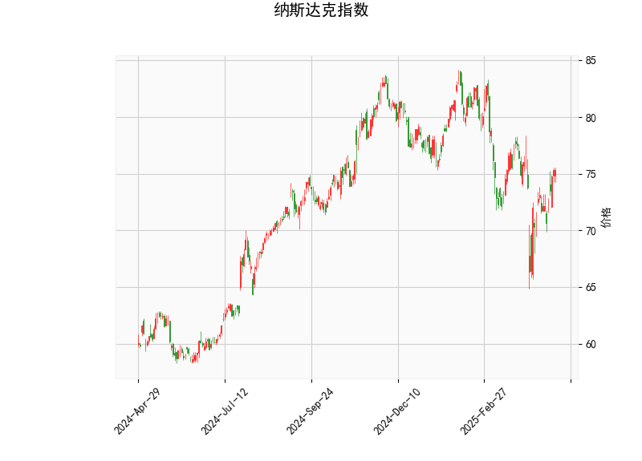

# 纳斯达克指数技术分析及策略建议

---

## 一、技术指标分析

### 1. **价格与布林轨道**
- **当前价**（75.36）位于**布林下轨（68.21）与中轨（76.15）之间**，接近中轨但未突破，短期可能面临中轨阻力。
- **布林带形态**：中轨向下倾斜，上下轨收窄，显示波动率下降，但尚未形成明确趋势信号。若后续价格站稳中轨，可能开启反弹；若跌破下轨，则可能加速下跌。

### 2. **RSI（相对强弱指数）**
- **RSI为54.38**，处于中性区间（50-70），无明显超买或超卖信号，反映市场短期处于多空平衡状态。

### 3. **MACD指标**
- **MACD线（-0.306）上穿信号线（-0.918）**，形成**金叉**，柱状图翻红（+0.61），显示短期空头动能减弱，存在反弹潜力。
- **信号线仍为负值**：中长期趋势尚未转向多头，需警惕反弹后再次回落。

### 4. **K线形态**
- **CDLGAPSIDESIDEWHITE**（向上缺口并列白三兵）：此形态通常表示**短期看涨信号**，但需结合成交量验证。若后续价格突破中轨且放量，则可能确认上涨趋势。

---

## 二、投资机会与策略建议

### 1. **短期波段策略**
- **多头机会**：
  - **入场条件**：价格突破中轨（76.15）且MACD柱状图持续扩大，可轻仓做多，目标看向上轨（84.09）。
  - **止损设置**：若价格跌破布林下轨（68.21）或MACD柱状图转绿，需止损离场。
- **空头机会**：
  - **入场条件**：价格受中轨压制回落，且RSI跌破50，可短空至下轨（68.21）。
  - **止损设置**：价格突破中轨或MACD柱状图加速翻红时止损。

### 2. **套利策略**
- **布林带均值回归**：若价格靠近下轨（68.21）且RSI低于40，可尝试低吸；若靠近上轨（84.09）且RSI高于70，可考虑高抛。
- **MACD背离交易**：若后续价格创新低但MACD未同步走弱，可能形成底背离，可布局中长线多单。

### 3. **风险提示**
- **市场情绪扰动**：若宏观数据（如美联储政策、通胀数据）超预期，可能打破技术形态。
- **量能配合不足**：若反弹未伴随成交量放大，需警惕假突破。

---

## 三、总结
当前纳斯达克指数处于**震荡整理阶段**，MACD金叉与K线形态显示短期反弹可能，但中长期趋势仍需观察价格对布林中轨的突破情况。建议以**轻仓波段交易**为主，严格设置止损，并关注量能变化与宏观事件驱动。