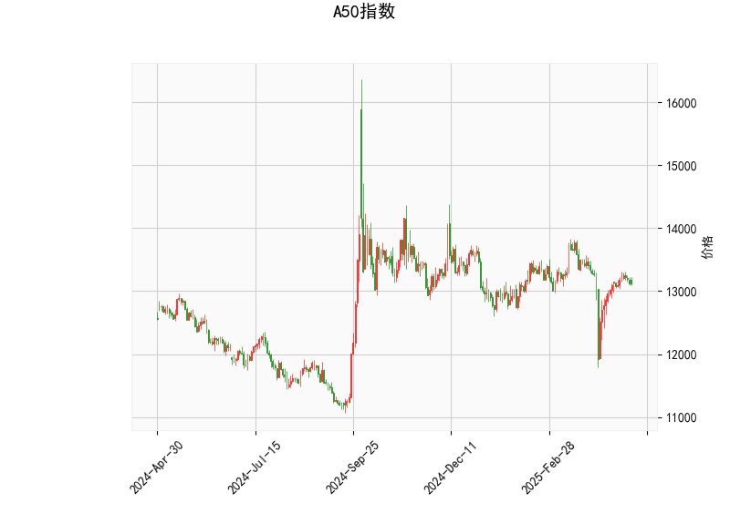

# A50指数技术分析及策略建议

## 一、技术指标解读
### 1. 多空平衡阶段（RSI 49.34）
当前RSI值处于49.34的中性区域，显示多空力量处于相对均衡状态，既未进入超买（>70）也未达到超卖（<30）区间，暗示市场短期可能维持震荡格局。

### 2. 潜在反弹信号（MACD指标）
- **MACD线**（-3.84）与**信号线**（-29.18）的负值差异显著，形成25.35的**正向柱状图**
- 指标呈现"水下金叉"特征，虽然整体仍位于零轴下方，但MACD柱持续放大可能预示下跌动能衰减，短期存在技术性反弹可能

### 3. 布林带通道分析
- 当前价（13,115）位于**中轨（13,225）与下轨（12,646）之间**
- 距离下轨（12,646）约3.6%空间，距中轨仅0.8%幅度
- 通道开口扩大（上轨13,804至下轨12,646），显示市场波动率正在上升

### 4. K线形态组合
- **CDLLONGLINE（长腿十字星）**：暗示多空博弈激烈，可能形成短期反转
- **CDLMATCHINGLOW（匹配低形态）**：连续两日低点相近，显示下跌动能衰减
- 双看涨形态叠加，强化短期筑底可能性

---

## 二、投资机会与策略建议

### 1. 趋势跟踪策略
**多头机会**：
- 入场条件：价格站上中轨13,225且MACD柱持续放大
- 目标空间：第一目标上轨13,804（潜在涨幅5.3%）
- 止损设置：下破前日低点（结合CDLMATCHINGLOW低点）

**空头机会**：
- 触发条件：价格跌破12,646下轨
- 目标空间：打开下行通道后测算延伸幅度
- 风险提示：需警惕K线组合的反转信号

### 2. 区间套利策略
**布林带回归交易**：
- 当前价格接近通道下沿，可轻仓布局均值回归
- 配置比例建议不超过总仓位的20%
- 配合RSI若下探40以下时逐步加仓

**波动率套利**：
- 利用期权市场构建跨式组合（Long Straddle）
- 关键时间窗口：重要经济数据公布前3个交易日
- 需监控IV（隐含波动率）水平，避免溢价过高

### 3. 风险对冲建议
- 若持有多头头寸，建议通过富时中国A50期货对冲
- 套保比例建议1:0.6（现货:期货）
- 关注离岸人民币汇率变动，防范汇率波动传导风险

---

## 三、关键风险提示
1. **MACD指标背离风险**：若价格反弹但MACD柱未能持续放大，需警惕假突破
2. **流动性风险**：关注新加坡交易所（SGX）的持仓量变化，单日缩量超15%需警惕
3. **事件驱动风险**：特别关注中国PMI数据、美联储议息会议等重大事件
4. **通道突破有效性**：需配合成交量验证，单日突破中轨需至少5%放量

> **操作建议**：当前宜采用"小仓位试单+突破加仓"的渐进策略，总仓位控制在50%以内，重点关注13,200-13,300区间的多空争夺。