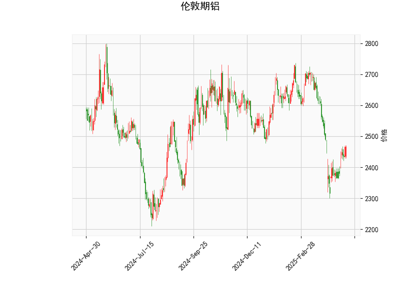

# 伦敦期铝技术分析及投资策略

## 一、技术指标分析

### 1. 价格与RSI
- **当前价**：2465.5，处于布林带中轨（2554.8）和下轨（2303.3）之间，接近下轨。
- **RSI（51.5）**：略高于50中性值，显示市场未明显超买或超卖，短期趋势中性。

### 2. MACD指标
- **MACD线（-25.52）**与**信号线（-44.45）**均为负值，但MACD柱状图（18.92）为正值，表明空头动能减弱，短期可能出现反弹信号（MACD金叉）。

### 3. 布林带
- **价格位置**：当前价低于中轨，接近下轨（2303.3），显示短期超卖可能。
- **布林带宽度**：上轨（2806.4）与下轨（2303.3）间距较大，市场波动性较高。

### 4. K线形态
- **CDLLONGLINE（长实体线）**：表明当前交易日多空力量对比显著，若为阳线则可能预示短期底部反弹，若为阴线则需警惕进一步下跌。

---

## 二、投资机会与策略

### 1. 短期反弹机会
- **逻辑**：
  - MACD柱状图转正，短期空头动能减弱。
  - 价格接近布林带下轨，存在技术性反弹需求。
- **策略**：
  - **做多**：若价格站稳下轨（2303）或突破中轨（2554），可轻仓入场，目标上看中轨（2554）或上轨（2806）。
  - **止损**：若跌破下轨（2303），需止损离场。

### 2. 趋势反转确认
- **逻辑**：
  - RSI中性，MACD潜在金叉可能推动趋势反转。
  - 若价格突破中轨（2554），可能确认短期多头趋势。
- **策略**：
  - **突破追多**：价格站稳中轨后加仓，目标上轨（2806）。
  - **止损**：跌破中轨时止损。

### 3. 套利机会（区间交易）
- **逻辑**：
  - 布林带上下轨间距较大，价格可能在中轨与下轨间震荡。
- **策略**：
  - **高抛低吸**：价格接近下轨（2303）时买入，接近中轨（2554）时卖出。
  - **止损**：跌破下轨或突破中轨时止损。

### 4. 风险提示
- **假信号风险**：MACD金叉可能失败，需结合价格突破中轨确认。
- **波动性风险**：布林带宽度较大，价格可能快速波动，需严格止损。

---

## 三、总结
- **短期**：关注价格在布林带下轨的支撑，MACD金叉可能带来反弹机会。
- **中期**：若价格突破中轨（2554），可看多至布林带上轨（2806）；若跌破下轨（2303），则可能进一步下行。
- **关键位置**：2303（下轨）、2554（中轨）、2806（上轨）。