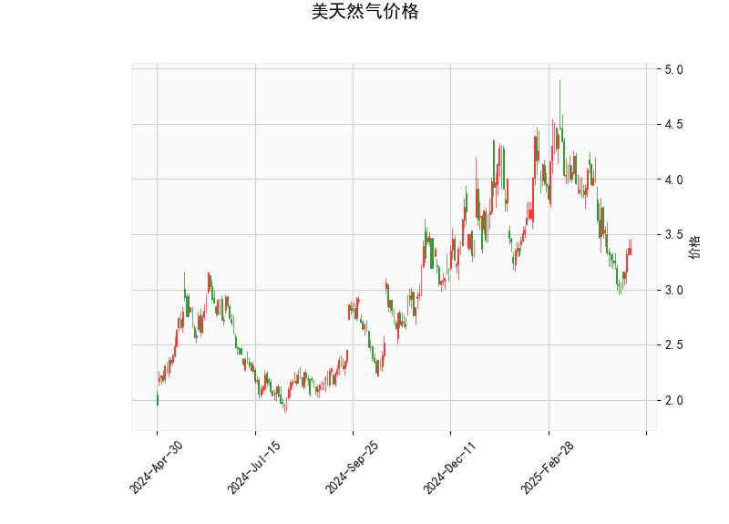

### 美国天然气价格技术分析结果解读

#### 1. 指标分析
- **当前价格（3.38）与布林轨道**  
  当前价格（3.38）位于布林下轨（3.01）和中轨（3.81）之间，靠近下轨。这表明市场处于**短期弱势状态**，可能接近超卖区域。若价格能站稳下轨上方，可能触发技术性反弹；若跌破下轨，则可能进一步下跌。

- **RSI（46.15）**  
  RSI值处于中性区间（40-60），既未超买也未超卖，暗示市场**缺乏明确方向性动能**。需结合其他指标判断趋势是否可能反转。

- **MACD指标**  
  - MACD线（-0.165）略高于信号线（-0.193），柱状图（0.028）为正值且微弱扩张，显示**短期下跌动能减弱**，但未形成明确金叉。
  - 整体MACD仍处于负值区域，表明**中长期趋势仍偏空**。

- **K线形态（CDLBELTHOLD）**  
  该形态属于看涨反转信号（类似“多头吞噬”或“锤子线”），通常出现在价格低位，暗示空方力量衰竭，可能迎来反弹。需结合成交量确认有效性。

---

#### 2. 近期投资/套利机会与策略

##### **潜在机会**
1. **短期反弹机会**  
   - **条件**：当前价接近布林下轨，K线形态释放看涨信号，MACD柱状图转正。若价格站稳3.0支撑位，可尝试短线做多。
   - **策略**：  
     - **入场**：价格回升至3.4-3.5区间且站稳中轨（3.81）时加仓。  
     - **目标**：第一目标中轨3.81，第二目标上轨4.62（需基本面或情绪催化）。  
     - **止损**：跌破布林下轨（3.0）或MACD柱状图转负时离场。

2. **趋势延续空头机会**  
   - **条件**：若价格持续承压中轨（3.81）且MACD未能形成金叉，可能延续下跌趋势。  
   - **策略**：  
     - **入场**：价格反弹至中轨附近（3.8）受阻时轻仓试空。  
     - **目标**：下轨3.0，破位可看至前低（需关注库存、天气等基本面）。  
     - **止损**：突破中轨3.81后回补空单。

3. **波动率套利（布林带策略）**  
   - **逻辑**：布林带上下轨间距较大（4.62-3.01），隐含波动率较高，适合区间交易。  
   - **策略**：  
     - **卖出宽跨式期权**：同时卖出执行价接近上轨的看涨期权和下轨的看跌期权，赚取时间价值衰减收益。  
     - **风险**：需警惕突发消息（如极端天气、地缘冲突）导致价格突破区间。

---

##### **风险提示**
- **基本面变量**：天然气价格受天气（冬季供暖需求）、库存数据、地缘政治（俄乌冲突、LNG出口）影响显著，需同步关注相关事件。
- **技术面局限性**：当前RSI和MACD未给出强信号，需等待更明确的趋势确认。
- **仓位管理**：建议轻仓试单，反弹策略止损空间控制在5%以内，空头策略止损可放宽至中轨上方（3.85）。