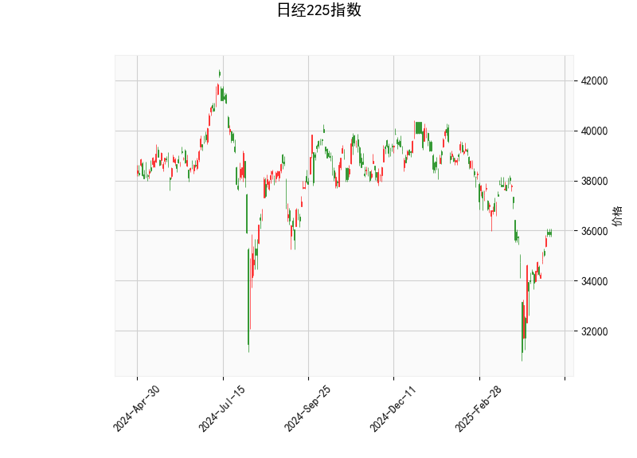

### 日经225指数技术分析结果解读

#### 1. 技术指标分析
- **当前价与布林轨道**：  
  当前价（35,839.99）位于布林带**中轨（36,550）下方**，且距离**下轨（32,626）**较远，但未触及下轨。这表明市场短期处于**中性偏弱**区间，未出现极端超卖，但存在向中轨修复的可能。布林带收窄（上轨40,473与下轨32,626间距较大）暗示波动率较高，需警惕价格突破中轨后的方向选择。

- **RSI（53.76）**：  
  处于**中性区域（50附近）**，无明确超买或超卖信号，显示多空力量暂时均衡。若RSI后续突破60或跌破40，可能触发趋势性行情。

- **MACD指标**：  
  - MACD线（-151.28）上穿信号线（-497.48），柱状图（346.20）显著放大，形成**底背离金叉**，暗示短期**反弹动能增强**。但MACD和信号线均位于负值区，表明中长期趋势仍偏空，需警惕反弹后二次探底风险。

- **K线形态（CDLMATCHINGLOW）**：  
  出现“匹配低”形态（连续两根阴线收盘价相近），通常被视为**短期止跌信号**，但需结合成交量确认有效性。若后续出现阳线突破前高，可进一步强化看涨预期。

---

#### 2. 投资机会与策略建议

##### **短期机会（1-2周）**：
- **多头策略**：  
  - **入场条件**：若价格突破布林中轨（36,550）且MACD柱状图持续放大，可轻仓做多，目标看向上轨（40,473），止损设于当前价下方1-2%（约35,200）。  
  - **辅助信号**：关注RSI能否站稳55以上，或K线出现“晨星”等反转形态。

- **套利机会**：  
  - **跨期套利**：若近月期货贴水扩大（反映市场情绪悲观），可做多近月合约、做空远月合约，博弈贴水修复。  
  - **波动率策略**：布林带宽度较大，可卖出宽跨式期权组合（Sell Strangle），赚取时间价值衰减收益。

##### **中长期风险提示**：
- **下行风险**：MACD位于负值区的金叉可能仅为技术性反弹，若价格无法站稳中轨，可能再次下探32,600支撑位。  
- **外部因素**：美联储政策、日元汇率波动及日本央行干预可能加剧指数波动，需密切关注宏观事件。

---

**结论**：当前技术面呈现**短期反弹迹象**，但中长期趋势尚未反转。建议以轻仓参与反弹为主，严格设置止损，并等待RSI与布林带方向共振的确定性信号。