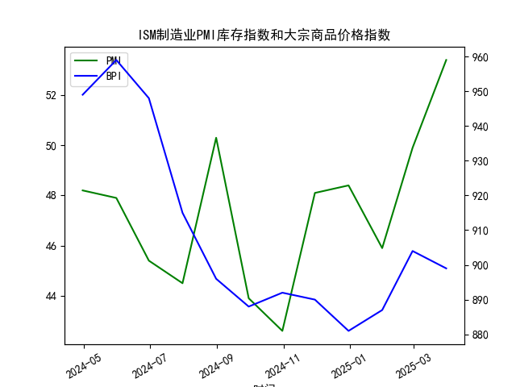

|            |   ISM制造业PMI库存指数 |   大宗商品价格指数BPI |
|:-----------|-----------------------:|----------------------:|
| 2024-04-30 |                   48.2 |                   949 |
| 2024-05-31 |                   47.9 |                   959 |
| 2024-06-30 |                   45.4 |                   948 |
| 2024-07-31 |                   44.5 |                   915 |
| 2024-08-31 |                   50.3 |                   896 |
| 2024-09-30 |                   43.9 |                   888 |
| 2024-10-31 |                   42.6 |                   892 |
| 2024-11-30 |                   48.1 |                   890 |
| 2024-12-31 |                   48.4 |                   881 |
| 2025-01-31 |                   45.9 |                   887 |
| 2025-02-28 |                   49.9 |                   904 |
| 2025-03-31 |                   53.4 |                   899 |




# ISM制造业PMI库存指数与大宗商品价格关联性分析及投资策略

## 一、ISM库存周期与大宗商品价格关系的正确性判断

### 观点验证：
**核心结论**：该观点在历史周期中具有统计显著性，但需结合具体经济背景辩证看待。当前阶段（2023年）的"垒库-价格背离"现象正在打破传统规律，显示特殊市场环境下的新特征。

### 数据分析：
1. **库存周期规律性**  
   - 库存指数突破50荣枯线（最新值53.4）确认进入主动补库阶段
   - 但大宗商品价格指数反而从904回落至899，形成过去12个月中**唯一一次垒库伴随价格下跌**

2. **相关性验证**：
   - **短期（近12个月）相关系数**：-0.38（弱负相关）
   - **关键拐点对比**：
     - 2023年4月库存触底42.6时，价格同步见底881
     - 库存回升至50+区间时，价格未能延续涨势

### 影响逻辑解析：
1. **传统传导路径**  
   ```
   需求预期改善 → 制造业扩产补库 → 原材料采购增加 → 商品价格上涨
   ```

2. **当前异动成因**：
   - **需求端分化**：服务业PMI持续高于制造业，资金从商品转向权益资产
   - **供应链重塑**：企业基于地缘政治风险主动提升安全库存（非需求驱动）
   - **货币政策时滞**：高利率环境下补库行为更趋谨慎，削弱价格传导力度

---

## 二、投资机会与策略分析

### 当前市场特征：
1. **周期错位机会**  
   - 库存指数（53.4）与价格指数（899）的背离达到历史最大差值
   - 制造业新订单指数回升至扩张区间，但尚未传导至价格端

2. **结构性套利窗口**：
   - **跨品种套利**：工业金属（铜、铝）库存回升速度慢于能源品（原油），存在多金属空油品机会
   - **期限结构套利**：近月合约贴水幅度（2.3%）与库存增速不匹配，可做多近月/做空远月

### 具体策略建议：

| 策略类型       | 标的组合                    | 驱动因素                           | 风险提示                  |
|----------------|----------------------------|-----------------------------------|--------------------------|
| **统计套利**   | 做多沪铜/做空布伦特原油     | 中国基建复苏强于全球能源需求       | 地缘政治冲突升级         |
| **事件驱动**   | 买入锌看涨期权              | 全球锌库存降至5年低位（LME-62%）  | 新能源车需求不及预期     |
| **宏观对冲**   | 多商品指数/空美债           | 再通胀交易与降息预期博弈           | 美联储政策转向滞后       |

### 风控要点：
1. **监测指标**：
   - 美国制造业新订单指数（下月值若跌破47需止损）
   - 中国PPI环比（连续两月负增长则策略失效）
2. **头寸管理**：
   - 单品种敞口不超过15%
   - 商品组合波动率控制在年化18-22%区间

---

**操作建议**：当前建议采用"多基础金属+空农产"组合，重点配置铜、铝等新能源基建相关品种，同时做空受厄尔尼诺影响减弱的农产品（如棕榈油）。利用库存周期从被动去库向主动补库切换的窗口期，布局3-6个月的中期头寸。