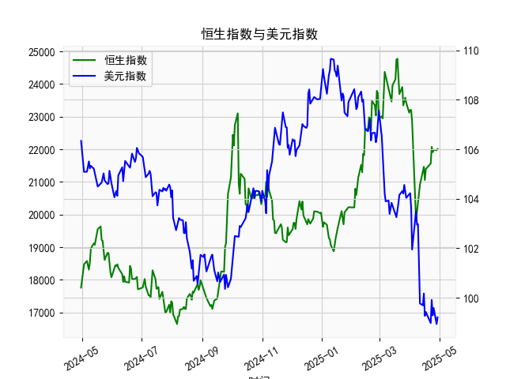

|            |   社会融资规模存量:人民币贷款:同比 |   金融机构各项存款余额:人民币:同比 |   上证综合指数 |   人民币贷款增速与存款增速之差 |
|:-----------|-----------------------------------:|-----------------------------------:|---------------:|-------------------------------:|
| 2022-11-30 |                               10.8 |                               11.6 |        3151.34 |                           -0.8 |
| 2023-01-31 |                               11.1 |                               12.4 |        3255.67 |                           -1.3 |
| 2023-02-28 |                               11.5 |                               12.4 |        3279.61 |                           -0.9 |
| 2023-03-31 |                               11.7 |                               12.7 |        3272.86 |                           -1   |
| 2023-05-31 |                               11.3 |                               11.6 |        3204.56 |                           -0.3 |
| 2023-06-30 |                               11.2 |                               11   |        3202.06 |                            0.2 |
| 2023-07-31 |                               11   |                               10.5 |        3291.04 |                            0.5 |
| 2023-08-31 |                               10.9 |                               10.5 |        3119.88 |                            0.4 |
| 2023-10-31 |                               10.7 |                               10.5 |        3018.77 |                            0.2 |
| 2023-11-30 |                               10.7 |                               10.2 |        3029.67 |                            0.5 |
| 2024-01-31 |                               10.1 |                                9.2 |        2788.55 |                            0.9 |
| 2024-02-29 |                                9.7 |                                8.4 |        3015.17 |                            1.3 |
| 2024-04-30 |                                9.1 |                                6.6 |        3104.82 |                            2.5 |
| 2024-05-31 |                                8.9 |                                6.7 |        3086.81 |                            2.2 |
| 2024-07-31 |                                8.3 |                                6.3 |        2938.75 |                            2   |
| 2024-09-30 |                                7.8 |                                7.1 |        3336.5  |                            0.7 |
| 2024-10-31 |                                7.7 |                                7   |        3279.82 |                            0.7 |
| 2024-12-31 |                                7.2 |                                6.3 |        3351.76 |                            0.9 |
| 2025-02-28 |                                7.1 |                                7   |        3320.9  |                            0.1 |
| 2025-03-31 |                                7.2 |                                6.7 |        3335.75 |                            0.5 |

### 1. 人民币贷款增速与存款增速之差与上证综合指数的相关性及影响逻辑

#### （1）相关性分析  
人民币贷款增速与存款增速之差（以下简称**“存贷差”**）反映了银行体系内资金的供需状况：  
- **存贷差扩大**（贷款增速>存款增速）：表明银行信贷扩张意愿强，市场流动性充裕，企业融资成本可能下降，资金更易流入股市，通常利好股市。  
- **存贷差收窄或转负**（贷款增速≤存款增速）：反映银行吸储压力上升或信贷需求疲软，流动性趋紧，可能抑制股市资金流入。

从数据看，存贷差与上证指数呈现**阶段性正相关**：  
- **前中期（存贷差较高时）**：存贷差在3%以上时（如第1-12个月），上证指数从约3000点攀升至3600点以上，反映流动性宽松推动股市上行。  
- **后期（存贷差回落甚至转负）**：存贷差降至0%以下（如第17-24个月），上证指数从3400点跌至2788点，显示流动性收缩对股市的压制。  
- **近期（存贷差小幅回升）**：存贷差回升至0.5%左右（最后几个月），上证指数反弹至3300点附近，表明边际流动性改善支撑市场。

#### （2）影响逻辑  
- **流动性传导**：存贷差扩大→银行体系可贷资金增加→企业融资活跃→盈利预期改善→股市估值提升。  
- **风险偏好联动**：宽松流动性环境下，投资者风险偏好上升，资金从存款转向股票等风险资产。  
- **政策预期反馈**：存贷差收窄可能引发市场对降准/降息的预期（如近期存贷差低位回升），政策宽松预期间接提振股市。

---

### 2. 投资或套利机会与策略分析  

#### （1）潜在机会  
- **流动性边际改善机会**：近期存贷差已从低位（-1.3%）回升至0.5%，若后续存贷差持续扩大（如政策推动信贷扩张），可布局**金融股（银行、券商）**及**高贝塔板块（科技、消费）**。  
- **政策套利窗口**：存贷差低位时（如-0.5%至0%区间），市场可能隐含政策宽松预期，可逢低配置**指数ETF**或**利率敏感型行业**（房地产、基建）。  

#### （2）策略建议  
- **趋势跟踪策略**：  
  - 当存贷差连续3个月回升且上证指数站上关键均线（如60日均线）时，加仓权益资产。  
  - 若存贷差再度转负且指数跌破支撑位（如3000点），减仓避险。  
- **板块轮动策略**：  
  - **存贷差上行期**：优先配置**券商、科技成长股**（流动性敏感）。  
  - **存贷差下行期**：转向防御性板块（**公用事业、必需消费**）。  
- **事件驱动套利**：  
  - 关注央行货币政策会议前后存贷差变化，若释放宽松信号，可短期做多股指期货。  

#### （3）风险提示  
- **滞后效应**：存贷差对股市的影响可能存在1-2个月滞后，需结合其他指标（如M2、社融）验证。  
- **外部冲击**：美联储政策、地缘冲突等可能削弱存贷差与A股的关联性。  
- **政策调控风险**：若存贷差快速扩大引发监管干预（如窗口指导控信贷），需及时止盈。  

---

### 结论  
存贷差与上证指数的相关性在流动性驱动市场中较为显著，近期存贷差的温和回升可能为市场提供支撑，但需警惕外部风险和政策不确定性。投资者可结合趋势信号与板块轮动逻辑，把握结构性机会，同时控制仓位以应对波动。