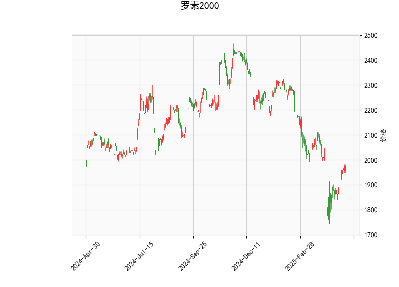

# 罗素2000指数技术分析与策略建议

## 一、技术指标分析

### 1. **价格与布林带**  
- **当前价（1976.52）**位于布林带中轨（2040.11）下方，且接近下轨（1770.51），表明短期趋势偏弱，市场处于下行压力中。  
- **布林带宽度**（中轨与上下轨距离）显示波动率较高，但当前价偏离中轨幅度较大，存在向中轨回归的可能性。

### 2. **RSI（相对强弱指数）**  
- **53.13**处于中性区间（50附近），未出现超买（>70）或超卖（<30）信号，表明市场多空力量暂时均衡，缺乏明确方向性。

### 3. **MACD指标**  
- **MACD线（-15.22）**与**信号线（-36.24）**均为负值，但**柱状图（21.01）**大幅回升，显示MACD线正加速向上靠近信号线，短期可能形成“金叉”，暗示潜在反弹动能。

### 4. **K线形态**  
- **空列表**表明当前无显著反转或持续形态（如头肩顶、吞没形态等），需结合其他指标判断趋势。

---

## 二、投资机会与策略建议

### 1. **短期反弹机会**  
- **触发条件**：MACD金叉确认（MACD线上穿信号线）且价格突破布林带中轨（2040）。  
- **策略**：轻仓试多，目标价看向上轨（2309），止损位设于当前低点或布林带下轨（1770）。  
- **风险**：若RSI无法站稳50以上或价格未能站稳中轨，可能延续震荡。

### 2. **区间套利策略**  
- **逻辑**：当前价接近布林带下轨，若市场维持宽幅震荡，可尝试在下轨附近（1770-1900）分批买入，中轨附近（2040）止盈，跌破下轨则止损。  
- **优势**：利用布林带的均值回归特性，降低单边趋势风险。

### 3. **趋势突破策略**  
- **向上突破**：若价格放量突破中轨并站稳，可能开启中期上行趋势，可顺势加仓。  
- **向下破位**：若跌破下轨（1770），可能加速下跌，需警惕小盘股流动性风险，可考虑对冲或减仓。

---

## 三、风险提示  
1. **小盘股波动性**：罗素2000成分股以小盘股为主，流动性较低，需警惕突发波动。  
2. **宏观环境影响**：美联储政策、经济数据等可能打破技术面信号，需结合基本面动态调整策略。  
3. **K线形态缺失**：缺乏明确形态支持，需依赖指标共振（如MACD与RSI同步转强）增强信号可信度。