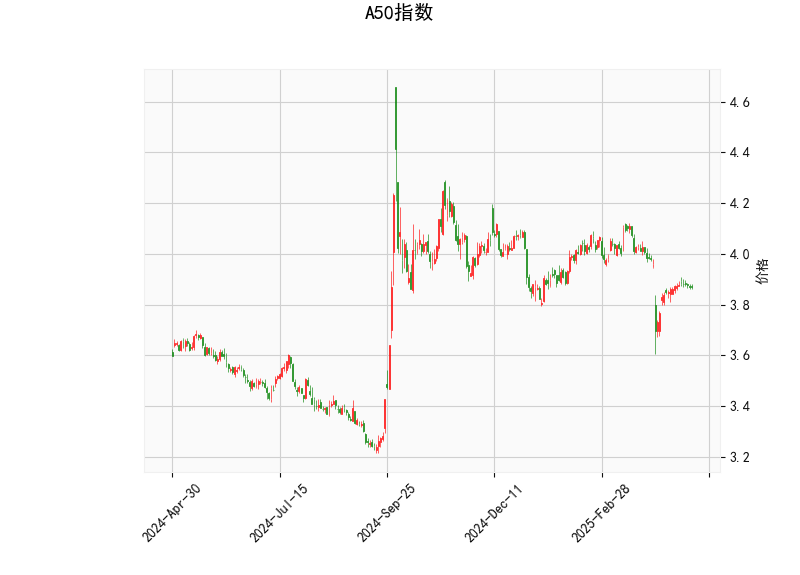

# A50指数技术分析及投资策略

## 一、技术指标解析

### 1. RSI指标（相对强弱指数）
- **当前值43.26**：处于中性区间（30-70），但略低于50分水岭，显示短期市场情绪偏弱但未进入超卖区域。
- **潜在信号**：若RSI跌破40可能加速下行，若回升突破50则可能转向多头。

### 2. MACD指标
- **负值金叉形态**：MACD线（-0.0228）上穿信号线（-0.0305），柱状图翻红（+0.00769），属于低位弱反弹信号。
- **动能判断**：绝对值接近零轴，反映市场缺乏方向性动能，需警惕“假金叉”风险。

### 3. 布林轨道
- **价格位置**：当前价3.869位于**中轨（3.968）与下轨（3.773）之间**，接近下轨支撑。
- **波动率暗示**：中轨向下倾斜，布林带呈收敛状态，预示市场处于震荡下行或蓄势阶段。

### 4. K线形态组合
- **CDLMATCHINGLOW（匹配底）**：下跌趋势中连续两根相近低位的阴线，暗示空头动能衰竭。
- **CDLSHORTLINE（短实体）**+**CDLSPINNINGTOP（纺锤线）**：多空力量平衡，短期可能转向震荡或反转。

---

## 二、投资机会与策略

### ▶ 短期交易机会
1. **超跌反弹策略**  
   - **触发条件**：价格触及布林下轨（3.773）且MACD柱状图持续扩大  
   - **操作**：轻仓试多，目标中轨3.968，止损设于3.75下方  
   - **验证信号**：需配合成交量放大和RSI回升至50上方

2. **突破追单策略**  
   - **向上突破**：若价格站稳中轨3.968，可追加多单，目标上轨4.163  
   - **向下破位**：若跌破下轨3.773，可能开启加速下跌，可顺势做空

### ▶ 套利机会
1. **波动率套利**  
   - **逻辑**：布林带持续收窄（当前带宽4.163-3.773≈0.39）接近历史波动率低位  
   - **操作**：买入跨式期权组合，押注波动率扩张

2. **期现价差回归**  
   - **观察点**：若期货较现货贴水扩大至1%以上，可布局正向期现套利

---

## 三、风险提示
1. **假突破风险**：MACD接近零轴时易出现反复，建议突破后等待1-2根K线确认  
2. **事件驱动风险**：关注中国宏观经济数据（PMI、CPI）及美联储政策对A50的冲击  
3. **仓位管理**：建议单笔交易仓位不超过5%，总风险敞口控制在20%以内  

> **关键观察窗口**：未来3个交易日若未出现实体阳线站稳3.90关口，则需警惕延续阴跌趋势。