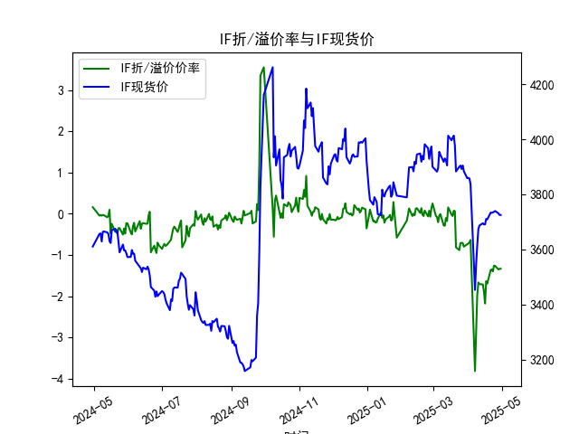
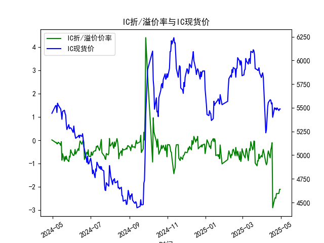
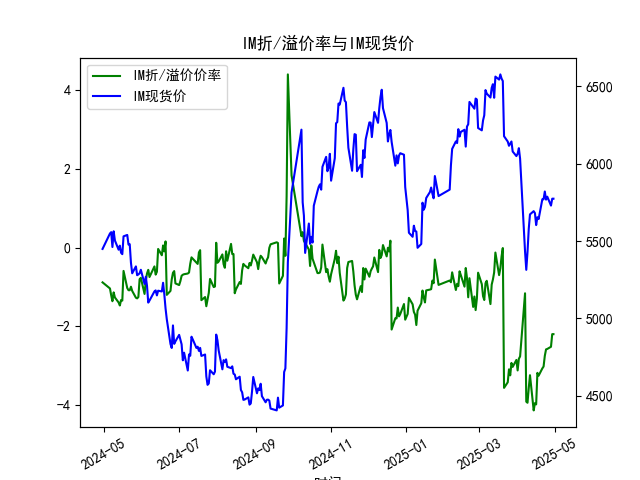

|            |   IF折/溢价率 |   IF现货价 |   IH折/溢价率 |   IH现货价 |   IC折/溢价率 |   IC现货价 |   IH折/溢价率 |   IH现货价 |
|:-----------|--------------:|-----------:|--------------:|-----------:|--------------:|-----------:|--------------:|-----------:|
| 2025-04-02 |     -0.689576 |     3857.6 |     -0.5168   |     5868.6 |     -0.5168   |     5868.6 |      -2.82374 |     6100   |
| 2025-04-03 |     -0.634556 |     3837   |     -0.395252 |     5822.4 |     -0.395252 |     5822.4 |      -2.76398 |     6031.8 |
| 2025-04-07 |     -3.81231  |     3452.6 |     -0.961471 |     5236.2 |     -0.961471 |     5236.2 |      -1.16153 |     5432.6 |
| 2025-04-08 |     -2.92977  |     3543.8 |     -1.04965  |     5271   |     -1.04965  |     5271   |      -3.91353 |     5313.6 |
| 2025-04-09 |     -1.97446  |     3614   |     -0.96643  |     5387.2 |     -0.96643  |     5387.2 |      -3.9405  |     5429.6 |
| 2025-04-10 |     -1.663    |     3673   |     -0.632471 |     5509   |     -0.632471 |     5509   |      -3.56785 |     5578.2 |
| 2025-04-11 |     -1.70421  |     3686.6 |     -0.457211 |     5555.8 |     -0.457211 |     5555.8 |      -3.2409  |     5672.2 |
| 2025-04-14 |     -1.71162  |     3694.8 |     -0.752381 |     5584.8 |     -0.752381 |     5584.8 |      -4.13446 |     5693   |
| 2025-04-15 |     -1.88329  |     3690.4 |     -0.402211 |     5580   |     -0.402211 |     5580   |      -3.95041 |     5680.4 |
| 2025-04-16 |     -2.17398  |     3690.8 |     -0.296286 |     5540.4 |     -0.296286 |     5540.4 |      -3.98173 |     5603   |
| 2025-04-17 |     -1.63358  |     3710.6 |     -0.104562 |     5551.2 |     -0.104562 |     5551.2 |      -3.18113 |     5653.8 |
| 2025-04-18 |     -1.68913  |     3708.8 |     -2.89029  |     5400   |     -2.89029  |     5400   |      -3.25269 |     5642   |
| 2025-04-21 |     -1.36545  |     3733.2 |     -2.52696  |     5499.8 |     -2.52696  |     5499.8 |      -3.06818 |     5770   |
| 2025-04-22 |     -1.34653  |     3733   |     -2.45739  |     5486   |     -2.45739  |     5486   |      -3.02072 |     5769.6 |
| 2025-04-23 |     -1.39646  |     3734   |     -2.48358  |     5495   |     -2.48358  |     5495   |      -2.75012 |     5820   |
| 2025-04-24 |     -1.25668  |     3736.8 |     -2.28117  |     5478   |     -2.28117  |     5478   |      -2.58556 |     5767.4 |
| 2025-04-25 |     -1.26205  |     3739.2 |     -2.28499  |     5498.6 |     -2.28499  |     5498.6 |      -2.57433 |     5786.6 |
| 2025-04-28 |     -1.34913  |     3730.6 |     -2.27382  |     5471   |     -2.27382  |     5471   |      -2.51923 |     5729   |
| 2025-04-29 |     -1.33181  |     3724.8 |     -2.10005  |     5487.2 |     -2.10005  |     5487.2 |      -2.19842 |     5773.6 |
| 2025-04-30 |     -1.33181  |     3724.8 |     -2.10005  |     5487.2 |     -2.10005  |     5487.2 |      -2.19842 |     5773.6 |

### 1. 股指期货折/溢价率与现货价的相关性及影响逻辑

#### （1）相关性分析
股指期货的折/溢价率（基差率）与现货价格通常呈现**动态负相关关系**。当期货价格高于现货（溢价）时，基差率为正，可能反映市场对未来现货价格上涨的乐观预期；反之，当期货价格低于现货（折价）时，基差率为负，可能隐含对未来的悲观预期或套利行为的压制。

#### （2）影响逻辑
- **市场预期驱动**：  
  溢价常由多头情绪（如经济复苏预期、政策利好）推动，吸引资金流入期货市场；折价则可能源于避险情绪（如市场下跌预期）或套利卖压。
  
- **资金成本与股息率**：  
  期货定价理论（持有成本模型）中，期货价格 = 现货价格 × (1 + 融资成本 - 股息率)。若融资成本上升或股息率下降，期货易溢价；反之则折价。

- **套利机制**：  
  折/溢价率超出无套利区间时，会触发**期现套利**。例如：
  - **溢价过高**：套利者卖空期货、买入现货（正向套利），压低期货价格、推高现货价格，促使基差收敛。
  - **折价过深**：套利者买入期货、卖空现货（反向套利），支撑期货价格、压低现货价格，缩小折价。

- **交割日效应**：  
  临近交割时，期货价格趋于收敛于现货价格，基差率波动通常收窄。

---

### 2. 近期投资或套利机会与策略分析

#### （1）数据观察
- **IF/IH/IC/IM基差特征**：  
  - **IF（沪深300）**：基差率从2024年的微幅波动转为2025年4月持续深折价（-1.33%），现货价同步温和上涨（3610→3724）。  
  - **IH（上证50）**：基差率大幅走弱（-2.28%），现货价小幅上升（5442→5487），显示市场对大盘蓝筹股情绪谨慎。  
  - **IM（中证1000）**：基差率长期为负且加深（-2.20%），但现货价显著上涨（5448→5773），反映小盘股现货强势与期货情绪分化的矛盾。

#### （2）潜在机会与策略
1. **反向套利（买入期货+卖空现货）**：  
   - **适用品种**：IH、IM基差率深度折价（-2%以上），若融资成本低于折价率，可买入期货同时融券卖空现货组合，锁定基差收敛收益。  
   - **风险点**：融券成本、现货波动风险（需对冲Beta）。

2. **跨期套利**：  
   - **机会**：若远月合约折价率显著高于近月（如IM 2025年4月基差率-2.20%），可做多远月、做空近月，博弈基差结构修复。  
   - **需验证**：合约流动性及展期成本。

3. **多IM现货+空IH期货的跨品种策略**：  
   - **逻辑**：IM现货强势（+6%）与IH期货深折价的分化，可能反映风格切换（小盘股强于大盘股）。做多IM现货（或ETF）并做空IH期货，对冲系统性风险的同时捕捉风格收益。  

4. **基差率均值回归交易**：  
   - **适用场景**：IF基差率从-1.33%向长期均值（如0%）回归时，可做多期货+动态对冲现货。需结合波动率模型控制敞口。

#### （3）风险提示
- **政策干预**：若监管层出台限制卖空或鼓励做多政策（如平准基金入场），可能逆转基差走势。  
- **流动性风险**：IM等小盘品种现货卖空难度较高，可能影响套利执行。  
- **市场情绪突变**：若现货加速上涨引发期货空头平仓，基差可能快速收窄，需设置止损机制。

