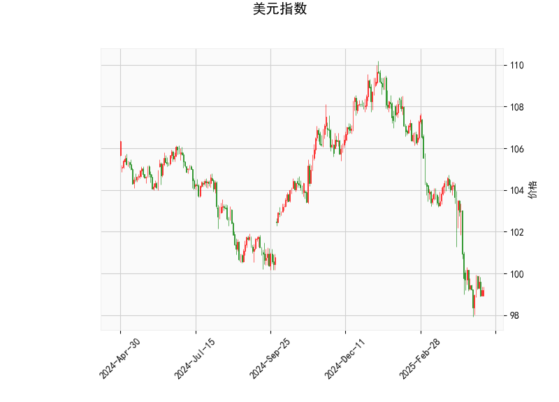

### 美元指数技术分析结果解读

#### 1. **当前价与布林轨道**
- **当前价（99.21）**：位于布林轨道下轨（97.84）附近，且明显低于中轨（103.42）和上轨（109.00），表明美元指数处于**弱势区间**，短期可能面临超卖反弹需求，但整体趋势偏空。
- **布林轨道形态**：价格贴近下轨运行，若未跌破下轨，可能触发技术性反弹；若持续承压，则可能进一步下行。

#### 2. **RSI（36.94）**
- RSI低于40但未进入超卖区（30以下），显示美元指数短期**卖压较重**，但未完全超卖，需警惕反弹风险。

#### 3. **MACD指标**
- **MACD线（-1.23）**与**信号线（-1.31）**：MACD线略高于信号线，柱状图（0.08）为正值，暗示**短期动能可能转向多头**，但整体仍处于零轴下方，表明趋势仍偏空，反弹可能为技术性修复。

#### 4. **K线形态**
- 当前无明确反转形态，需结合其他指标判断方向。

**结论**：美元指数短期可能技术性反弹，但中期趋势偏弱，需关注是否站稳中轨（103.42）以确认趋势反转。

---

### 近期A股/港股投资机会与策略

#### 1. **美元走弱对市场的影响**
- **人民币升值预期**：美元指数弱势可能推动人民币升值，利好外资流入A股/港股（尤其港股通标的）。
- **大宗商品价格支撑**：美元走弱通常利好大宗商品（如能源、金属），相关板块（能源、材料）可能受益。

#### 2. **A股机会**
- **出口型企业**：人民币升值可能压制出口竞争力，但进口成本下降的行业（如航空、造纸）可能受益。
- **科技与消费**：外资偏好高成长性板块（新能源、半导体、消费龙头），可关注北向资金动向。
- **政策驱动**：稳增长政策（基建、地产边际放松）相关板块可能阶段性表现。

#### 3. **港股机会**
- **科技股修复**：美元走弱缓解港股流动性压力，互联网龙头（腾讯、美团）估值修复空间较大。
- **高股息资产**：利率敏感型板块（公用事业、REITs）在美元走弱时更具吸引力。
- **AH溢价套利**：AH股溢价较高时，可做多H股/做空A股（需注意流动性风险）。

#### 4. **套利策略**
- **跨市场对冲**：利用A股/港股联动性，例如做多港股中资银行股（低估值）+ 做空A股银行股（高溢价）。
- **汇率套利**：若人民币升值预期强化，可通过远期结汇或人民币相关衍生品锁定收益。

#### 5. **风险提示**
- **美元反弹风险**：若美联储释放鹰派信号或地缘风险推升避险需求，美元可能快速反转。
- **国内经济数据**：需关注PMI、社融等数据对市场情绪的短期冲击。

---

### 总结
- **美元指数**：短期技术性反弹可期，但中期趋势偏空，需关注中轨压力。
- **A股/港股**：聚焦外资流入驱动的科技、消费板块，同时关注政策利好和AH溢价套利机会，需结合汇率波动灵活调整仓位。