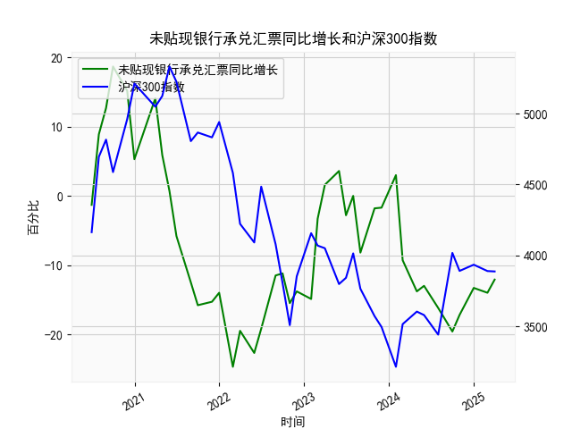

|            |   未贴现银行承兑汇票同比增长 |   沪深300指数 |
|:-----------|-----------------------------:|--------------:|
| 2022-11-30 |                        -13.8 |       3853.04 |
| 2023-01-31 |                        -14.9 |       4156.86 |
| 2023-02-28 |                         -3.3 |       4069.46 |
| 2023-03-31 |                          1.6 |       4050.93 |
| 2023-05-31 |                          3.6 |       3798.54 |
| 2023-06-30 |                         -2.8 |       3842.45 |
| 2023-07-31 |                          0   |       4014.63 |
| 2023-08-31 |                         -8.2 |       3765.27 |
| 2023-10-31 |                         -1.8 |       3572.51 |
| 2023-11-30 |                         -1.7 |       3496.2  |
| 2024-01-31 |                          3   |       3215.35 |
| 2024-02-29 |                         -9.3 |       3516.08 |
| 2024-04-30 |                        -13.8 |       3604.39 |
| 2024-05-31 |                        -13   |       3579.92 |
| 2024-07-31 |                        -16.2 |       3442.08 |
| 2024-09-30 |                        -19.6 |       4017.85 |
| 2024-10-31 |                        -17.2 |       3891.04 |
| 2024-12-31 |                        -13.3 |       3934.91 |
| 2025-02-28 |                        -14   |       3890.05 |
| 2025-03-31 |                        -12.1 |       3887.31 |

### 一、未贴现银行承兑汇票与沪深300指数的相关性及影响逻辑

#### 1. **相关性分析**  
从数据看，**未贴现银行承兑汇票同比增速与沪深300指数呈现负相关性**。具体表现为：  
- **未贴现汇票增速上升时**（如前期12.7%、18.7%等），沪深300指数通常处于震荡或下行周期（如对应月份的沪深300从4800点回落至3800点）。  
- **未贴现汇票增速下降或负增长时**（如后期-16.2%、-19.6%等），沪深300指数反而可能企稳或反弹（如末尾沪深300从3572点回升至3887点）。  

#### 2. **影响逻辑**  
（1）**经济预期传导**  
未贴现银行承兑汇票反映企业短期融资需求：  
- **增速上升**：企业因资金链紧张或经营压力增大，依赖短期票据融资，可能预示实体经济承压，导致股市风险偏好下降。  
- **增速下降**：企业融资需求减弱（或银行主动收缩表外业务），可能伴随政策宽松（如降准、信贷支持），间接利好股市流动性。  

（2）**信用周期信号**  
未贴现汇票是表外融资的重要组成部分：  
- **高增长阶段**：通常对应信用扩张期，但若增速过快（如前期18.7%），可能引发监管收紧预期，抑制市场情绪。  
- **低增长阶段**：表外融资收缩（如后期持续负增长），可能倒逼政策支持实体企业，推动股市估值修复。  

（3）**市场流动性博弈**  
未贴现汇票与股市存在资金替代效应：  
- 企业通过票据融资获取短期资金后，可能减少对股权融资的依赖，间接压制股市表现。  
- 当票据融资收缩时，部分资金可能回流至股市，形成短期流动性支撑。

---

### 二、近期投资或套利机会分析

#### 1. **潜在机会判断**  
- **短期反弹窗口**：  
  未贴现汇票增速已连续多月深度负增长（如-16.2%、-19.6%），近期小幅收窄至-12.1%，可能反映企业融资需求触底，叠加政策宽松预期升温（如LPR下调、专项再贷款工具），沪深300指数存在超跌反弹机会。  

- **行业分化机会**：  
  关注与票据融资关联度高的行业（如制造业、中小微企业集中的板块），若政策定向扶持，相关行业龙头股或受益于信用修复逻辑。

#### 2. **策略建议**  
（1）**波段操作策略**  
- **做多沪深300ETF**：在未贴现汇票增速触底回升初期（如连续2个月增速改善），可分批布局沪深300指数ETF，博弈流动性驱动的估值修复。  
- **对冲工具配合**：结合股指期货贴水收窄信号，捕捉基差收敛带来的套利空间。  

（2）**事件驱动策略**  
- **关注政策节点**：央行季度货币政策报告、社融数据发布前后，若未贴现汇票增速与社融数据背离（如社融回暖但汇票增速仍低），可押注后续政策加码，提前布局金融、周期板块。  

（3）**风险提示**  
- 若未贴现汇票持续负增长且社融数据疲软，需警惕经济下行压力超预期，建议控制仓位并配置防御性资产（如高股息、公用事业股）。  

---

### 总结  
未贴现银行承兑汇票作为信用周期的“温度计”，与沪深300指数形成“跷跷板效应”。当前数据隐含政策宽松与市场情绪修复的共振机会，建议关注信用周期拐点，灵活运用波段和事件驱动策略捕捉阶段性行情。